

  

     
    
     
    <strong>Universidad Peruana de Ciencias Aplicadas</strong>
      
    <strong>Carrera de Ingeniería de Software</strong>
      
    <strong>Ciclo 202610</strong>
      
    1ASI0572 - Desarrollo de Soluciones IOT
      
    <strong>NRC:</strong> 6770   
    <strong>Profesor:</strong> Prudencio Vidal, Javier Antonio   
    <strong>Informe de TB1</strong>
  

  

    

      <strong>Startup:</strong> LogicNodes 
       
      <strong>Producto:</strong> OmniTrack
    

  

      <strong>Relación de integrantes</strong>
        
      <table style="width: 60%; margin: 0 auto;   text-align: left">
        <thead>
          <tr>
            <th>Código</th>
            <th>Nombre</th>
          </tr>
        </thead>
        <tbody>
          <tr>
            <td>u202216698 </td>
            <td> Rodrigo Alonso, Alcántara Cruz, </td>
          </tr>
          <tr>
            <td> u20191e562 </td>
            <td> Paulo Percy, Quincho Gamarra </td>
          </tr>
          <tr>
            <td> u202210334 </td>
            <td> Adrian Emanuel, Valerio Garcia  </td>
          </tr>
          <tr>
            <td> U202011431 </td>
            <td> Luiggi Jeremy Jouvenel, Antonio Loayza </td>
          </tr>
          <tr>
            <td> u202313397 </td>
            <td> Alejandro Daniel, Oroncoy Almeyda </td>
          </tr>
        </tbody>
      </table>
      

         
        <strong>Abril 2026</strong>
      

    

  

| Versión | Fecha | Autor | Descripción de modificación |
| :--- | :--- | :--- | :--- |
|  1.0    |              |              |                    |
|  1.0.1  |              |               |                   |
|  1.0.2  |              |              |                    |
|  1.0.3    |              |              |                    |

# Project Report Collaboration Insights

En esta seccion se registra la colaboración de todo el equipo durante el desarrollo del informe del proyecto, se adjunta el enlace del repositorio 

| Repository Name | Link |
| :--- | :--- |
| **logic-nodes-report** | [https://github.com/Logic-Nodes/logic-nodes-report](https://github.com/Logic-Nodes/logic-nodes-report) |

# Contenido

_Tabla de contenidos_

- [Student Outcome]
- [Capítulo I: Introducción]
  - [1.1. Startup Profile]
    - [1.1.1. Descripción de la Startup]
    - [1.1.2. Perfiles de integrantes del equipo]
  - [1.2. Solution Profile]
    - [1.2.1. Antecedentes y problemática]
    - [1.2.2. Lean UX Process]
      - [1.2.2.1. Lean UX Problem Statements]
      - [1.2.2.2. Lean UX Assumptions]
      - [1.2.2.3. Lean UX Hypothesis Statements]
      - [1.2.2.4. Lean UX Canvas]
  - [1.3. Segmentos objetivo]
- [Capítulo II: Requirements Elicitation \& Analysis]
  - [2.1. Competidores]
    - [2.1.1. Análisis competitivo]
    - [2.1.2. Estrategias y tácticas frente a competidores]
  - [2.2. Entrevistas]
    - [2.2.1. Diseño de entrevistas]
    - [2.2.2. Registro de entrevistas]
    - [2.2.3. Análisis de entrevistas]
  - [2.3. Needfinding]
    - [2.3.1. User Personas]
    - [2.3.2. User Task Matrix]
    - [2.3.3. User Journey Mapping]
    - [2.3.4. Empathy Mapping]
  - [2.4. Big Picture EventStorming]
  - [2.5. Ubiquitous Language]
- [Capítulo III: Requirements Specification]
  - [3.1. User Stories]
  - [3.2. Impact Mapping]
  - [3.3. Product Backlog]
- [Capítulo IV: Solution Software Design]
  - [4.1. Strategic-Level Domain-Driven Design]
    - [4.1.1. Design-Level EventStorming]
      - [4.1.1.1 Candidate Context Discovery]
      - [4.1.1.2. Domain Message Flows Modeling]
      - [4.1.1.3. Bounded Context Canvases]
    - [4.1.2. Context Mapping]
    - [4.1.3. Software Architecture]
      - [4.1.3.1. Software Architecture System Landscape Diagram]
      - [4.1.3.2. Software Architecture Context Level Diagrams]
      - [4.1.3.2. Software Architecture Container Level Diagrams]
      - [4.1.3.3. Software Architecture Deployment Diagrams]
  - [4.2. Tactical-Level Domain-Driven Design]
    - [4.2.1. Bounded Context: Identity and Access Management]
      - [4.2.1.1. Domain Layer]
      - [4.2.1.2. Interface Layer]
      - [4.2.1.3. Application Layer]
      - [4.2.1.4. Infrastructure Layer]
      - [4.2.1.5. Bounded Context Software Architecture Component Level Diagrams]
      - [4.2.1.6. Bounded Context Software Architecture Code Level Diagrams]
        - [4.2.1.6.1. Bounded Context Domain Layer Class Diagrams]
        - [4.2.1.6.2. Bounded Context Database Design Diagram]
    - [4.2.2. Bounded Context: _Subscriptions and Billing_]
      - [4.2.2.1. Domain Layer]
      - [4.2.2.2. Interface Layer]
      - [4.2.2.3. Application Layer]
      - [4.2.2.4. Infrastructure Layer]
      - [4.2.2.5. Bounded Context Software Architecture Component Level Diagrams]
      - [4.2.2.6. Bounded Context Software Architecture Code Level Diagrams]
        - [4.2.2.6.1. Bounded Context Domain Layer Class Diagrams]
        - [4.2.2.6.2. Bounded Context Database Design Diagram]
    - [4.2.3. Bounded Context: _Alerts \& Resolution_]
      - [4.2.3.1. Domain Layer]
      - [4.2.3.2. Interface Layer]
      - [4.2.3.3. Application Layer]
      - [4.2.3.4. Infrastructure Layer]
      - [4.2.3.5. Bounded Context Software Architecture Component Level Diagrams]
      - [4.2.3.6. Bounded Context Software Architecture Code Level Diagrams]
        - [4.2.3.6.1. Bounded Context Domain Layer Class Diagrams]
        - [4.2.3.6.2. Bounded Context Database Design Diagram]
    - [4.2.4. Bounded Context: _Real-Time Monitoring_]
      - [4.2.4.1. Domain Layer.]
      - [4.2.4.2. Interface Layer.]
      - [4.2.4.3. Application Layer.]
      - [4.2.4.4. Infrastructure Layer.]
      - [4.2.4.5. Bounded Context Software Architecture Component Level Diagrams]
      - [4.2.4.6. Bounded Context Software Architecture Code Level Diagrams]
        - [4.2.4.6.1. Bounded Context Domain Layer Class Diagrams]
        - [4.2.4.6.2. Bounded Context Database Design Diagram]
    - [4.2.5. Bounded Context: _Trip management_]
      - [4.2.5.1. Domain Layer.]
      - [4.2.5.2. Interface Layer.]
      - [4.2.5.3. Application Layer.]
      - [4.2.5.4. Infrastructure Layer.]
      - [4.2.5.5. Bounded Context Software Architecture Component Level Diagrams.]
      - [4.2.5.6. Bounded Context Software Architecture Code Level Diagrams.]
        - [4.2.5.6.1. Bounded Context Domain Layer Class Diagrams.]
        - [4.2.5.6.2. Bounded Context Database Design Diagram.]
    - [4.2.6. Bounded Context: Fleet Management]
      - [4.2.6.1. Domain Layer]
      - [4.2.6.2. Interface Layer]
      - [Controllers principales (HTTP REST)]
      - [4.2.6.3. Application Layer]
      - [4.2.6.4. Infrastructure Layer]
      - [4.2.6.5. Bounded Context Software Architecture Component Level Diagrams.]
      - [4.2.5.6. Bounded Context Software Architecture Code Level Diagrams.]
        - [4.2.5.6.1. Bounded Context Domain Layer Class Diagrams.]
        - [4.2.5.6.2. Bounded Context Database Design Diagram.]
    - [4.2.7. Bounded Context: Profile and Preferences Management]
      - [4.2.7.1. Domain Layer.]
      - [4.2.7.2. Interface Layer.]
      - [4.2.7.3. Application Layer.]
      - [4.2.7.4. Infrastructure Layer.]
      - [4.2.7.5. Bounded Context Software Architecture Component Level Diagrams.]
      - [4.2.7.6. Bounded Context Software Architecture Code Level Diagrams.]
        - [4.2.7.6.1. Bounded Context Domain Layer Class Diagrams.]
        - [4.2.7.6.2. Bounded Context Database Design Diagram]
    - [4.2.8. Bounded Context: Visualization Analytics]
      - [4.2.8.1. Domain Layer]
      - [4.2.8.2. Interface Layer]
      - [4.2.8.3. Application Layer]
      - [4.2.8.4. Infrastructure Layer]
      - [4.2.8.5. Bounded Context Software Architecture Component Level Diagrams]
      - [4.2.8.6. Bounded Context Software Architecture Code Level Diagrams]
        - [4.2.8.6.1. Bounded Context Domain Layer Class Diagrams]
        - [4.2.8.6.2. Bounded Context Database Design Diagram]
    - [4.2.9. Bounded Context: Merchant]
      - [4.2.9.1. Domain Layer]
      - [4.2.9.2. Interface Layer]
      - [4.2.9.3. Application Layer]
      - [4.2.9.4. Infrastructure Layer]
      - [4.2.9.5. Bounded Context Software Architecture Component Level Diagrams]
      - [4.2.9.6. Bounded Context Software Architecture Code Level Diagrams]
        - [4.2.9.6.1. Bounded Context Domain Layer Class Diagrams]
        - [4.2.9.6.2. Bounded Context Database Design Diagram]

# Student Outcome

El curso cumple de manera directa el cumplimiento del Student Outcome 5 definido por ABET - EAC, asegurando que los integrantes logren alcanzar las competencias establecidas

Criterio: La capacidad de funcionar efectivamente en un
equipo cuyos miembros juntos proporcionan liderazgo, crean un entorno de
colaboración e inclusivo, establecen objetivos, planifican tareas y cumplen objetivos.

| Criterio específico | Acciones realizadas | Conclusiones |
| :--- | :--- | :--- |
| **Trabaja en equipo para proporcionar liderazgo en forma conjunta** | **Alcantara Cruz, Rodrigo Alonso**   **AV1:** [Acción]   **TB1:** [Acción]   **AV2:** [Acción]   **TB2:** [Acción]    **Quincho Gamarra, Paulo Percy**   **AV1:** [Acción]   **TB1:** [Acción]   **AV2:** [Acción]   **TB2:** [Acción]    **Valerio Garcia, Adrian Emanuel**   **AV1:** [Acción]   **TB1:** [Acción]   **AV2:** [Acción]   **TB2:** [Acción]    **Antonio Loayza, Luiggi Jeremy Jouvenel**   **AV1:** [Acción]   **TB1:** [Acción]   **AV2:** [Acción]   **TB2:** [Acción]    **Oroncoy Almeyda, Alejandro Daniel**   **AV1:** [Acción]   **TB1:** Elaboró el Impact Mapping del Capítulo III para ambos segmentos objetivo (gestores de flota y clientes finales), identificando actores, impactos esperados y entregables alineados a los objetivos de negocio de OmniTrack.   **AV2:** [Acción]   **TB2:** [Acción] | [pending...] |
| **Crea un entorno colaborativo e inclusivo, establece metas, planifica tareas y cumple objetivos.** | **Alcantara Cruz, Rodrigo Alonso**   **AV1:** [Acción]   **TB1:** [Acción]   **AV2:** [Acción]   **TB2:** [Acción]    **Quincho Gamarra, Paulo Percy**   **AV1:** [Acción]   **TB1:** [Acción]   **AV2:** [Acción]   **TB2:** [Acción]    **Valerio Garcia, Adrian Emanuel**   **AV1:** [Acción]   **TB1:** [Acción]   **AV2:** [Acción]   **TB2:** [Acción]    **Antonio Loayza, Luiggi Jeremy Jouvenel**   **AV1:** [Acción]   **TB1:** [Acción]   **AV2:** [Acción]   **TB2:** [Acción]    **Oroncoy Almeyda, Alejandro Daniel**   **AV1:** [Acción]   **TB1:** Contribuyó a la especificación de requerimientos del proyecto colaborando en la definición del Impact Mapping, estableciendo vínculos claros entre los objetivos del negocio, los comportamientos esperados de los usuarios y las funcionalidades del sistema OmniTrack.   **AV2:** [Acción]   **TB2:** [Acción] | [pending...] |

# Capítulo I: Introducción
## 1.1. Startup Profile
### 1.1.1. Descripción de la Startup

LogicNodes es una iniciativa tecnológica emergente conformada por estudiantes de Ingeniería de Software de la Universidad Peruana de Ciencias Aplicadas (UPC). Nuestra organización nace con el firme propósito de transformar la gestión logística y de seguridad mediante la implementación de soluciones basadas en el Internet de las Cosas (IoT). Nos enfocamos en el desarrollo de sistemas inteligentes que permitan a las empresas optimizar sus procesos operativos, reducir riesgos y garantizar la integridad de sus activos en tiempo real.

Como equipo, LogicNodes combina el rigor técnico con una visión innovadora para enfrentar los desafíos actuales de la industria. Nuestra misión es democratizar el acceso a tecnologías de monitoreo avanzadas, ofreciendo plataformas robustas, escalables y centradas en la experiencia del usuario.

El nombre de nuestra organización es LogicNodes. Este término refleja nuestra identidad central: la convergencia entre el pensamiento lógico de la ingeniería y la arquitectura de nodos interconectados que define a los sistemas IoT.

Bajo el respaldo de LogicNodes, presentamos OmniTrack, una solución integral diseñada para revolucionar la seguridad y el seguimiento de mercancías durante su transporte y almacenamiento. OmniTrack no es solo una herramienta de rastreo, sino un ecosistema inteligente que integra sensores de vanguardia, conectividad en la nube y una interfaz de gestión intuitiva.

El producto permite monitorear variables críticas como la ubicación exacta, el estado de las cerraduras y las condiciones ambientales de la carga. Gracias a su capacidad de respuesta inmediata y análisis de datos, OmniTrack proporciona a los usuarios un control total sobre sus operaciones, mitigando pérdidas y elevando los estándares de confianza en la cadena de suministro.

### 1.1.2. Perfiles de integrantes del equipo

| Foto | Información General |
| :---: | :--- |
|  | **Nombre y Apellidos:**   Rodrigo Alonso Alcántara Cruz    **Código:**   u202216698    **Carrera:**   Ingeniería de Software    **Información:**   Mi nombre es Rodrigo Alonso Alcantara Cruz y tengo 21 años. Soy estudiante de la carrera de Ingeniería de Software en la Universidad Peruana de Ciencias Aplicadas (UPC). Considero que soy una persona que busca el aprendizaje continuo y siempre intento resolver los problemas de forma rapida y eficaz. Tengo conocimiento en lenguajes de programación. Por lo general siempre intento mejorar mi metodo de estudio para poder expandir mi conocimiento. |

| Foto | Información General |
| :---: | :--- |
|  | **Nombre y Apellidos:**   Adrian Emanuel Valerio Garca    **Código:**   u202210334    **Carrera:**   Ingeniería de Software    **Información:**   Mi nombre es Adrian Valerio Garcia y tengo 21 años. Soy estudiante de la carrera de Ingeniería de Software en la Universidad Peruana de Ciencias Aplicadas (UPC). Me interesa el aprendizaje continuo y suelo enfocarme en resolver problemas de manera rápida y eficiente. Disfruto los videojuegos y aprender nuevas tecnologías, además de trabajar en equipo para lograr objetivos en conjunto. Tengo conocimientos en lenguajes de programación y procuro mejorar constantemente mis métodos de estudio para ampliar mis habilidades. |

| Foto | Información General |
| :---: | :--- |
|  | **Nombre y Apellidos:**   [pending...]    **Código:**   [pending...]    **Carrera:**   Ingeniería de Software    **Información:**   [pending...] |

| Foto | Información General |
| :---: | :--- |
|  | **Nombre y Apellidos:**   [pending...]    **Código:**   [pending...]    **Carrera:**   Ingeniería de Software    **Información:**   [pending...] |

| Foto | Información General |
| :---: | :--- |
|  | **Nombre y Apellidos:**   Alejandro Daniel Oroncoy Almeyda    **Código:**   u202313397    **Carrera:**   Ingeniería de Software    **Información:**   Mi nombre es Alejandro Daniel Oroncoy Almeyda y soy estudiante de Ingeniería de Software en la Universidad Peruana de Ciencias Aplicadas (UPC). Me considero una persona proactiva y orientada a la resolución de problemas, con interés en el desarrollo de software y las nuevas tecnologías. Disfruto trabajar en equipo y contribuir activamente en cada etapa de los proyectos. Cuento con conocimientos en programación y procuro mejorar continuamente mis habilidades técnicas y blandas para aportar valor a los equipos en los que participo. |

## 1.2. Solution Profile
### 1.2.1. Antecedentes y problemática

### What (¿Qué?)

El transporte de mercancías sensibles enfrenta un desafío permanente: lograr un seguimiento continuo y confiable de las condiciones reales del cargamento a lo largo de todo el recorrido. No se trata solo de conocer la ubicación del vehículo, sino de detectar eventos críticos como aperturas no autorizadas de puertas, impactos fuertes, vibraciones intensas, variaciones de humedad, exposición a temperaturas inadecuadas, desvíos inesperados o interrupciones en la custodia. La falta de datos objetivos y actualizados sobre estos incidentes provoca daños frecuentes en los productos, pérdidas económicas significativas, conflictos entre los participantes de la cadena logística y un incremento sostenido en los costos operativos. Actualmente, la visibilidad suele reducirse a puntos administrativos básicos (salida y llegada) o a sistemas de geolocalización independientes, dejando importantes áreas sin control respecto al estado físico de la carga y la integridad del embalaje, especialmente durante paradas prolongadas, transbordos o cambios entre operadores. Para industrias como el retail, agroexportación, farmacéutica, pesquera y bienes de consumo masivo, disponer de telemetría completa que incluya condiciones ambientales, eventos de seguridad y registros auditables se ha vuelto indispensable para minimizar mermas, agilizar resoluciones y cumplir con los compromisos de calidad exigidos por clientes y aseguradoras.

### Who (¿Quién?)

Esta situación afecta directamente a dos grupos principales:

Las empresas transportistas y operadores logísticos: Soportan el riesgo económico de perder mercancía, enfrentar reclamos constantes de sus clientes y sufrir deterioro en su imagen por entregas defectuosas.

Los clientes finales: Reciben productos deteriorados, vencidos o, en el caso de medicamentos, con su eficacia comprometida, lo que genera riesgos para la salud y genera desconfianza hacia el servicio.

### Where (¿Dónde?)

El problema se presenta en toda la cadena de suministro, desde el almacén de origen hasta el punto de entrega final. Resulta especialmente grave en rutas de larga distancia (terrestre, aérea o marítima) y en los momentos de transferencia entre vehículos o bodegas, donde el control manual es limitado y más propenso a fallos. La implementación de tecnologías avanzadas de monitoreo es una tendencia mundial que avanza con mayor rapidez en países con infraestructura logística consolidada y un fuerte auge del comercio electrónico.

### When (¿Cuándo?)

La demanda de visibilidad en tiempo real ha crecido de forma notable tras la pandemia de COVID-19, que expuso las debilidades de las cadenas de abastecimiento. El incremento en el traslado de productos médicos y la exigencia de los consumidores por entregas rápidas y transparentes han convertido esta capacidad en un requisito estándar del mercado. Hoy en día, la mayoría de los clientes esperan poder seguir el estado de sus pedidos en cualquier momento, haciendo que la trazabilidad completa deje de ser una opción y se convierta en una expectativa generalizada.

### Why (¿Por qué?)

La raíz del problema radica en la ausencia de información oportuna y precisa. Las empresas no disponen de datos clave sobre temperatura, humedad, vibración o posición geográfica en el instante en que ocurren las anomalías. Esta limitación impide reaccionar de inmediato con medidas correctivas, como ajustar el sistema de climatización, modificar la ruta o alertar al cliente. Sin esta capacidad, las incidencias solo se descubren al final del viaje, cuando el daño ya se ha producido y las pérdidas son inevitables.

### How (¿Cómo?)

En la práctica actual, el monitoreo se basa en métodos dispersos o poco eficientes. Muchas compañías todavía utilizan registradores de datos que solo se revisan al concluir el trayecto, o combinan herramientas separadas (GPS para ubicación y sensores aislados para temperatura) que no interactúan entre sí. Esta falta de integración reduce la capacidad de respuesta, aumenta la probabilidad de errores humanos y dificulta la optimización de rutas, la gestión de riesgos y la entrega de un servicio confiable y de alto nivel.

### How much (¿Cuánto?)
La ausencia de un monitoreo integral genera consecuencias en varios niveles: funcional, operativo y estratégico. Las empresas invierten tiempo y recursos adicionales en resolver incidencias que podrían haberse prevenido. Desde el punto de vista operativo, esto implica mayores primas de seguros y costos derivados del desperdicio de productos. A nivel estratégico, representa una oportunidad clara para diferenciarse en el mercado, fortalecer la lealtad de los clientes y construir una reputación sólida basada en confiabilidad y transparencia.

### 1.2.2. Lean UX Process
#### 1.2.2.1. Lean UX Problem Statements

#### Domain
El proyecto se desarrolla dentro del ámbito del transporte y la logística de carga, enfocándose particularmente en el seguimiento y control de las condiciones de productos sensibles mientras se desplazan de un lugar a otro. En este contexto, contar con datos actualizados y precisos sobre el estado de la mercancía es clave para mantener la trazabilidad, proteger la calidad de los bienes y cumplir con las regulaciones aplicables a la cadena de frío, medicamentos y artículos perecederos.

#### Customer Segments

Empresas transportistas y operadores logísticos: son los responsables de administrar las flotas y asegurar que los productos lleguen en buen estado.
Clientes corporativos y distribuidores de bienes sensibles: necesitan total transparencia, control y pruebas concretas de que el transporte se realizó bajo las condiciones adecuadas.

Ambos grupos requieren información confiable, actualizada en tiempo real y herramientas que les permitan intervenir rápidamente cuando surge algún problema.

#### Pain Points

Ausencia de información inmediata sobre temperatura, humedad, vibración y posición de la carga.
Pérdidas financieras provocadas por fallos en la cadena de frío o manipulaciones incorrectas.
Comunicación poco efectiva entre transportistas y clientes cuando ocurren inconvenientes.
Dificultad para generar registros digitales que permitan auditar las condiciones y determinar responsabilidades.
Dependencia de procesos manuales y desconectados que complican la operación diaria y retrasan las decisiones.

#### Gap

En la actualidad, muchas empresas del sector usan soluciones independientes, como localizadores GPS o sensores de temperatura aislados, que no se conectan entre sí. Esto crea una distancia importante entre los datos que se obtienen y la capacidad real de detectar y resolver problemas de forma oportuna y preventiva.

#### Vision / Strategy

Logic Nodes tiene como objetivo convertir el monitoreo tradicional de cargas en un sistema inteligente, proactivo y totalmente integrado. La estrategia se basa en crear OmniTrack, una plataforma IoT completa que utiliza sensores instalados en los vehículos para capturar información sobre las condiciones ambientales y enviarla a un centro de control que procesa, alerta y presenta los datos de manera clara y en tiempo real. Así, las empresas podrán anticiparse a los riesgos, minimizar pérdidas y generar mayor confianza en sus clientes a través de reportes automáticos y una trazabilidad transparente.

#### Initial Segment
La primera fase de implementación se centrará en empresas de transporte de productos perecederos y farmacéuticos que operan en la zona de Lima Metropolitana. Este grupo se seleccionó porque maneja cargas muy sensibles a cambios ambientales y muestra interés en modernizar sus procesos logísticos, lo que lo convierte en un entorno adecuado para probar tanto la tecnología como el modelo de negocio.

#### 1.2.2.2. Lean UX Assumptions

#### Business Assumptions

- Creemos que en el mercado latinoamericano existe una demanda considerable por soluciones de monitoreo asequibles que midan varios parámetros al mismo tiempo (temperatura, vibración, ubicación y nivel de energía). Lo confirmaremos cuando al menos 15 entrevistas con empresas y el 30% de las respuestas en encuestas muestren interés real en evaluar o implementar la solución.

- Creemos que las empresas estarán dispuestas a pagar una cuota mensual por una herramienta que ayude a reducir pérdidas y fortalecer la confianza de sus clientes. Lo validaremos cuando consigamos al menos 5 cartas de intención que indiquen un precio mensual aceptable.

- Creemos que sensores IoT económicos pueden ofrecer la precisión necesaria para monitorear cadena de frío, vibración, ubicación y consumo de energía. Lo validaremos cuando las pruebas en campo demuestren una exactitud de ±0.5 °C en temperatura, detección confiable de vibración y precisión de GPS dentro de 10 metros en el 95% de las mediciones.

- Creemos que el modelo de pago por suscripción mensual será más atractivo que comprar una licencia de por vida para el segmento objetivo. Lo validaremos cuando al menos el 70% de las decisiones simuladas o cotizaciones prefieran la opción de suscripción.

- Creemos que ofrecer parámetros adicionales como humedad, vibración y detección de volcado aumentará el valor percibido de la solución. Lo validaremos cuando pruebas de precios comparativos muestren que los clientes están dispuestos a pagar al menos 15% más por el paquete completo.

#### Business Outcome Assumptions

- Creemos que disminuir los incidentes relacionados con la cadena de frío reducirá los costos por productos dañados. Lo validaremos cuando se registre una baja de al menos 20% en eventos críticos por mes en comparación con el período anterior.

- Creemos que la visibilidad inmediata ayudará a reducir disputas y acortar el tiempo de cobro. Lo validaremos cuando el indicador de días pendientes de cobro (DSO) baje al menos un 10% después de dos meses de uso.

- Creemos que OmniTrack acelerará el proceso de ventas en el segmento objetivo. Lo validaremos cuando la tasa de conversión de pruebas piloto a clientes de pago supere el 40% y el ciclo promedio de venta no exceda los 60 días.

- Creemos que el servicio logrará mantener a los clientes a lo largo del tiempo. Lo validaremos cuando la tasa de retención mensual sea igual o menor al 3% y el indicador de retención de ingresos netos (NRR) sea igual o superior al 100% a los seis meses.

- Creemos que la solución podrá crecer manteniendo márgenes adecuados. Lo validaremos cuando el margen bruto del servicio alcance al menos el 60% una vez que cada cliente tenga 50 dispositivos activos o más.

#### 1.2.2.3. Lean UX Hypothesis Statements

#### Hipótesis 1

Creemos que lograremos reducir las pérdidas de mercancía en un 25% y mejorar la satisfacción de los clientes en un 30% si las empresas de transporte pueden reaccionar de inmediato ante problemas como ruptura de cadena de frío, humedad fuera de rango o detección de volcado, gracias a un sistema de alertas en tiempo real. Lo confirmaremos cuando los incidentes reportados disminuyan al menos un 25% y el indicador de satisfacción (CSAT o NPS) aumente en 15 puntos o más durante las 8 semanas de prueba piloto, con al menos el 75% de opiniones positivas.

#### Hipótesis 2

Creemos que aumentaremos la eficiencia operativa en un 35% si los gerentes de operaciones pueden identificar y priorizar incidentes en pocos minutos mediante un panel sencillo que muestre el estado completo de toda la flota. Lo confirmaremos cuando el tiempo promedio de respuesta baje de más de 4 horas a menos de 25 minutos y los usuarios logren localizar un vehículo en riesgo en menos de 8 segundos en al menos el 85% de los casos durante las primeras 4 semanas.

#### Hipótesis 3

Creemos que alcanzaremos un 12% de adopción en el mercado objetivo dentro de 12 meses si las empresas pueden seleccionar fácilmente el plan que mejor se adapte a sus necesidades gracias a un modelo de suscripción flexible por niveles. Lo confirmaremos cuando tengamos al menos 120 empresas activas, una tasa de conversión de piloto a cliente de pago superior al 35% y una tasa de cancelación mensual igual o menor al 4%.

#### 1.2.2.4. Lean UX Canvas

## 1.3. Segmentos objetivo

### Segmento 1: Empresas Clientes

Estas organizaciones se dedican principalmente a la logística, distribución y producción de bienes sensibles que requieren condiciones especiales durante su traslado. Su principal necesidad es contar con un control preciso y continuo sobre sus cargas para proteger la calidad de los productos, minimizar pérdidas económicas y optimizar sus procesos internos.

Buscan una solución que les permita tener una visión completa y en tiempo real de toda su operación, integrando toda la información relevante en una sola plataforma. De esta forma pueden mejorar la eficiencia operativa, cumplir más fácilmente con las regulaciones del sector y transmitir mayor confianza a sus propios clientes.
Características principales:

Rol: Gerentes de logística, jefes de operaciones, responsables de control de calidad o directores de distribución.

Ubicación: Empresas con sede en zonas de alta actividad logística y con disposición para adoptar herramientas digitales.

Sector de la industria: Alimentos perecederos, productos farmacéuticos, químicos, flores de exportación y otros bienes que exigen un manejo controlado de temperatura, humedad y condiciones ambientales.

### Segmento 2: Clientes Finales

Los clientes finales son las personas o empresas que reciben los productos transportados. Su principal preocupación es la transparencia y la seguridad del proceso de entrega. Necesitan la tranquilidad de saber que la mercancía ha sido manejada correctamente desde su origen hasta su destino final.

Valoran especialmente la posibilidad de verificar por sí mismos el estado de su pedido en cualquier momento, a través de una herramienta sencilla, clara y confiable que les brinde información actualizada sobre las condiciones de transporte.
Características principales:

Edad: Mayores de 18 años.

Ubicación: Principalmente en Lima, Perú.

Nivel Socioeconómico: Medio y medio-alto, con interés en productos de calidad y servicios transparentes.

# Capítulo II: Requirements Elicitation & Analysis
## 2.1. Competidores
### 2.1.1. Análisis competitivo

<table>
  <!-- Título -->
  <tr>
    <th colspan="6" valign="top"><b>Competitive Analysis Landscape</b></th>
  </tr>

  <!-- Motivación del análisis -->
  <tr>
    <td rowspan="2" colspan="1" valign="top"><b>¿Por qué llevar a cabo este análisis?</b></td>
    <td colspan="5" valign="top">
      Realizar este análisis competitivo nos permite identificar las fortalezas, debilidades y estrategias de las soluciones existentes en el mercado de monitoreo IoT para carga sensible. De esta forma, podemos entender mejor las expectativas de los clientes, detectar oportunidades de diferenciación y definir con claridad la ventaja competitiva que OmniTrack debe ofrecer para destacar frente a otras alternativas, especialmente en el contexto latinoamericano donde predominan las medianas empresas de transporte.
    </td>
  </tr>
  <tr></tr>

  <!-- Cabeceras de competidores -->
  <tr>
    <td colspan="2" valign="top"></td>
    <td align="center" valign="top">
       
      <b>Logic Nodes / Omnitrack</b>
    </td>
    <td align="center" valign="top">
       
      <b>Tive</b>
    </td>
    <td align="center" valign="top">
       
      <b>Roambee</b>
    </td>
    <td align="center" valign="top">
       
      <b>Samsara</b>
    </td>
  </tr>

  <!-- PERFIL -->
  <tr>
    <td rowspan="2" valign="top"><b>Perfil</b></td>
    <td valign="top">Overview</td>
    <td valign="top">Plataforma IoT latinoamericana enfocada en monitoreo multi-parámetro (temperatura, humedad, vibración, GPS y detección de volcado) con alertas en tiempo real y modelo de suscripción accesible.</td>
    <td valign="top">Plataforma global de trackers en tiempo real con sensores multi-parámetro para envíos de alto valor.</td>
    <td valign="top">Plataforma de visibilidad supply chain con sensores IoT y analítica predictiva.</td>
    <td valign="top">Plataforma completa de operaciones de flota con monitoreo de temperatura y telemática vehicular.</td>
  </tr>
  <tr>
    <td valign="top">¿Qué valor ofrece a los clientes?</td>
    <td valign="top">Propuesta accesible que asegura la conservación de productos, con Dashboards intuitivos y notificaciones.</td>
    <td valign="top">Alertas instantáneas y alta precisión en condiciones críticas (especialmente pharma y alimentos premium).</td>
    <td valign="top">Analítica predictiva avanzada y visibilidad end-to-end muy robusta.</td>
    <td valign="top">Integración total con gestión de flota (cámaras, seguridad del conductor y eficiencia operativa).</td>
  </tr>

  <!-- MARKETING -->
  <tr>
    <td rowspan="2" valign="top"><b>Perfil de Marketing</b></td>
    <td valign="top">Mercado objetivo</td>
    <td valign="top">Empresas de transporte, agroexportadores medianos y fármacos.</td>
    <td valign="top">Grandes shippers de pharma, alimentos premium y carga de alto valor a nivel global.</td>
    <td valign="top">Empresas grandes de logística y supply chain con operaciones internacionales.</td>
    <td valign="top">Flotas grandes de transporte y distribución que necesitan control vehicular integral.</td>
  </tr>
  <tr>
    <td valign="top">Estrategias de marketing</td>
    <td valign="top">Marketing digital formando alianzas con programas de suscripción y cámaras de seguridad.</td>
    <td valign="top">Marketing global B2B, casos de éxito en pharma y presencia en ferias internacionales.</td>
    <td valign="top">Marketing basado en datos y ROI, campañas de "visibilidad predictiva".</td>
    <td valign="top">Marketing amplio en transporte pesado, énfasis en seguridad y eficiencia de flota.</td>
  </tr>

  <!-- PRODUCTO -->
  <tr>
    <td rowspan="3" valign="top"><b>Perfil de Producto</b></td>
    <td valign="top">Productos & Servicios</td>
    <td valign="top">Sensores IoT, aplicación web y móvil, dashboards con métricas importantes y alertas en tiempo real para mayor seguridad.</td>
    <td valign="top">Trackers reutilizables con sensores de temperatura, humedad, shock y luz + plataforma en la nube.</td>
    <td valign="top">Sensores IoT + plataforma de visibilidad con IA predictiva.</td>
    <td valign="top">Dispositivos telemáticos, sensores de temperatura, cámaras y software de gestión de flota completa.</td>
  </tr>
  <tr>
    <td valign="top">Precios y costos</td>
    <td valign="top">Suscripciones y costo bajo por equipo.</td>
    <td valign="top">Precio premium por tracker + suscripción anual.</td>
    <td valign="top">Suscripción basada en volumen de envíos.</td>
    <td valign="top">Suscripción por vehículo/flota (más costosa para operaciones pequeñas).</td>
  </tr>
  <tr>
    <td valign="top">Canales de distribución</td>
    <td valign="top">Venta directa, alianzas con cámaras de seguridad y distribuidores de logística.</td>
    <td valign="top">Web + App móvil.</td>
    <td valign="top">Plataforma web principal + integraciones móviles.</td>
    <td valign="top">Web + App móvil + integración con sistemas de flota.</td>
  </tr>

  <!-- SWOT -->
  <tr>
    <td rowspan="4" valign="top"><b>Análisis SWOT</b></td>
    <td valign="top">Fortalezas</td>
    <td valign="top">• Accesibilidad y escalabilidad • Enfoque en empresas de transporte • Software amigable</td>
    <td valign="top">• Alta precisión y reputación en pharma y alimentos premium</td>
    <td valign="top">• Analítica predictiva muy avanzada</td>
    <td valign="top">• Plataforma muy completa de flota (no solo monitoreo de carga)</td>
  </tr>
  <tr>
    <td valign="top">Debilidades</td>
    <td valign="top">• Respaldo de marca frente a multinacionales • Mercado nicho especializado</td>
    <td valign="top">• Precio elevado para medianas empresas</td>
    <td valign="top">• Enfoque más corporativo y menos accesible para PYMEs</td>
    <td valign="top">• Solución más orientada a flotas grandes que a monitoreo específico de carga sensible</td>
  </tr>
  <tr>
    <td valign="top">Oportunidades</td>
    <td valign="top">• Expansión en LATAM donde grandes competidores no tienen presencia fuerte • Crecimiento del e-commerce y transporte</td>
    <td valign="top">—</td>
    <td valign="top">—</td>
    <td valign="top">—</td>
  </tr>
  <tr>
    <td valign="top">Amenazas</td>
    <td valign="top">• Fácil de replicar el modelo por competidores grandes o locales</td>
    <td valign="top">—</td>
    <td valign="top">—</td>
    <td valign="top">—</td>
  </tr>
</table>

### 2.1.2. Estrategias y tácticas frente a competidores

Para posicionar a OmniTrack de manera efectiva en el mercado y diferenciarse de competidores establecidos como Tive, Roambee y Samsara, Logic Nodes ha definido una serie de estrategias y tácticas claras enfocadas en las necesidades específicas del segmento de medianas empresas de transporte en Latinoamérica.

### 1. Estrategia de Diferenciación por Accesibilidad y Precio
A diferencia de Tive y Samsara, que tienen precios premium orientados principalmente a grandes corporaciones, OmniTrack adopta un modelo de suscripción mensual accesible y flexible. Esta estrategia permite que las medianas empresas de transporte puedan implementar la solución sin realizar grandes inversiones iniciales, reduciendo la barrera de entrada que presentan los competidores globales.
### 2. Estrategia de Enfoque Regional (LATAM-First)
Mientras que la mayoría de competidores tienen un enfoque global o se centran en mercados maduros de Estados Unidos y Europa, OmniTrack se desarrolla pensando en las particularidades del mercado latinoamericano (infraestructura logística variable, tamaño de flotas medianas y sensibilidad al precio). Se priorizará la localización del idioma, soporte en español y alianzas con cámaras de transporte y asociaciones logísticas locales.
### 3. Estrategia de Simplicidad y Facilidad de Uso
OmniTrack busca destacar por su interfaz intuitiva y onboarding sencillo, reduciendo la curva de aprendizaje. A diferencia de plataformas más complejas como Roambee o Samsara, el enfoque está en que gerentes y conductores puedan usar la plataforma de forma efectiva desde el primer día, sin necesidad de capacitaciones extensas.
### 4. Estrategia de Funcionalidades Específicas para Carga Sensible
Se priorizará el monitoreo multiparámetro (temperatura, humedad, vibración y detección de volcado) con alertas inteligentes y reportes automáticos de trazabilidad. Esta combinación responde directamente a los dolores más comunes de las empresas que transportan alimentos perecederos y productos farmacéuticos, ofreciendo un equilibrio entre profundidad técnica y practicidad que no siempre encuentran en soluciones más generales.
### 5. Estrategia de Alianzas y Ecosistema Local
Se buscará establecer alianzas estratégicas con distribuidores de sensores, empresas de logística y cámaras de comercio en Perú y otros países de LATAM. Esta táctica permitirá acelerar la adopción y generar confianza en el mercado local, algo que los competidores globales suelen tener más dificultad para lograr rápidamente.
### 6. Estrategia de Marketing y Posicionamiento
Se implementará un marketing digital enfocado en casos de éxito locales, demostraciones prácticas y contenido educativo sobre la importancia del monitoreo de cadena de frío. El mensaje principal será: “Monitoreo profesional accesible para empresas medianas que quieren competir con los grandes”

## 2.2. Entrevistas
### 2.2.1. Diseño de entrevistas

### 1. Preguntas generales

¿Cuál es tu nombre y cuál es tu cargo actual?

¿Qué edad tienes?

¿En qué sector o industria trabajas? (alimentos, farmacéutica, logística, entre otros)

### 2. Preguntas — Segmento: Empresa (Gestores de transporte)

¿Cómo controlas actualmente la temperatura de tus productos durante el transporte?

¿Qué dispositivos o sistemas utilizas para el monitoreo de la cadena de frío? ¿Por qué los elegiste?

¿Cómo organizas y registras los viajes de transporte? ¿Qué información consideras más importante registrar?

¿Qué dificultades enfrentas cuando se rompe la cadena de frío? ¿Cómo afecta esto a tus costos y tiempos de operación?

¿Cómo te das cuenta cuando ocurre un problema de temperatura? ¿Qué tan rápido puedes reaccionar ante este tipo de situaciones?

¿Qué tipo de reportes necesitas preparar para tus clientes o para las autoridades regulatorias?

¿Cuál ha sido tu experiencia al gestionar el mantenimiento y configuración de sensores o dispositivos de monitoreo? ¿Qué dificultades has encontrado?

Si pudieras diseñar la plataforma ideal para tu trabajo, ¿qué funciones serían absolutamente necesarias para ti?

¿Qué modelo de pago preferirías para este tipo de servicio? ¿Qué factores influyen en esa decisión?

### 3. Preguntas — Segmento: Clientes Finales (Consumidores finales)

¿Cómo verificas actualmente que los productos que recibes llegaron en las condiciones de temperatura adecuadas?

¿Qué nivel de confianza tienes en los reportes de temperatura que te entregan tus proveedores? ¿Qué elementos aumentarían o reducirían esa confianza?

¿Qué tipo de información te resulta más útil conocer sobre el transporte de tus productos? ¿Cómo te ayudaría esa información en tu día a día?

¿Puedes compartir alguna experiencia en la que hayas tenido que rechazar productos por problemas relacionados con la cadena de frío? ¿Cómo detectaste el problema y qué impacto tuvo?

¿Cómo prefieres recibir y consultar la información sobre tus pedidos? ¿Qué canales o métodos de comunicación te resultan más prácticos?

¿Qué tipo de notificaciones durante el transporte de tus productos serían más útiles para ti y en qué momentos te gustaría recibirlas?

¿Qué tan importante es para ti que la información técnica se presente de forma clara y fácil de entender? ¿Qué características valoras en las interfaces que utilizas?

¿Qué funcionalidades crees que aportarían mayor valor a tu proceso de recepción y validación de productos?

¿Qué beneficios esperas obtener de un sistema de monitoreo basado en IoT para tus compras de productos sensibles a la temperatura? ¿Qué preocupaciones o dudas tienes al respecto?

### 2.2.2. Registro de entrevistas

### SEGMENTO EMPRESA (GESTORES DE TRANSPORTE)

#### ENTREVISTA 1

Entrevistado: Elmer Alcántara (58 años)

Cargo: Gerente de Operaciones en empresa de transporte refrigerado.

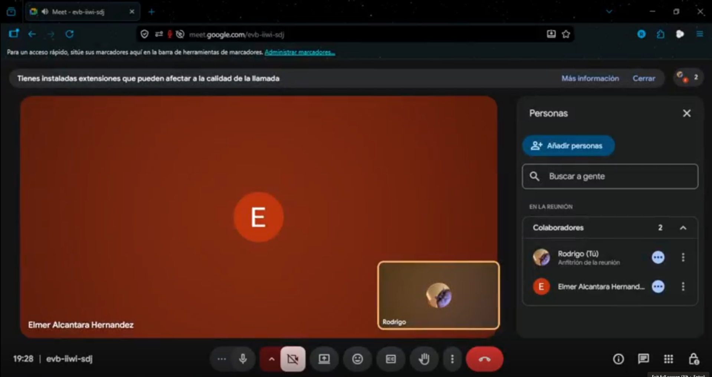

https://upcedupe-my.sharepoint.com/:v:/g/personal/u202216698_upc_edu_pe/IQCab9COVFqDRZj4fEqtB9h5AfwV7nuQDBlWWBDq9TOKXSU?nav=eyJyZWZlcnJhbEluZm8iOnsicmVmZXJyYWxBcHAiOiJPbmVEcml2ZUZvckJ1c2luZXNzIiwicmVmZXJyYWxBcHBQbGF0Zm9ybSI6IldlYiIsInJlZmVycmFsTW9kZSI6InZpZXciLCJyZWZlcnJhbFZpZXciOiJNeUZpbGVzTGlua0NvcHkifX0&e=sJeec7

### SEGMENTO CLIENTES FINALES

#### ENTREVISTA 1

Entrevistada: Angélica Cruz (54 años)

Cargo: Dueña y administradora de tienda minorista de productos perecederos.

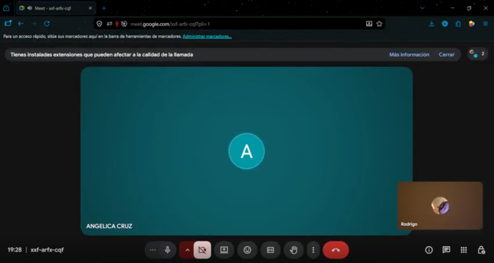

https://upcedupe-my.sharepoint.com/:v:/g/personal/u202216698_upc_edu_pe/IQAiZh8wMly5SbTbqBcDgSRqAQdUbRp4lYrVhYckLbH6_Q0?nav=eyJyZWZlcnJhbEluZm8iOnsicmVmZXJyYWxBcHAiOiJPbmVEcml2ZUZvckJ1c2luZXNzIiwicmVmZXJyYWxBcHBQbGF0Zm9ybSI6IldlYiIsInJlZmVycmFsTW9kZSI6InZpZXciLCJyZWZlcnJhbFZpZXciOiJNeUZpbGVzTGlua0NvcHkifX0&e=KXhZ7q

### 2.2.3. Análisis de entrevistas

### SEGMENTO EMPRESA (GESTORES DE TRANSPORTE)

#### ENTREVISTA 1

Entrevistado: Elmer Alcántara, 58 años, Gerente de Operaciones.

Desde la perspectiva de la gestión operativa, Elmer Alcántara describe un entorno de trabajo dominado por métodos tradicionales y fragmentados que limitan la capacidad de respuesta de la empresa. La dependencia de bitácoras físicas en papel y de la comunicación verbal con los conductores genera "puntos ciegos" durante el trayecto, lo que provoca que los problemas de temperatura suelan detectarse de forma reactiva, usualmente cuando el cliente ya está rechazando la carga. Esta falta de monitoreo integrado no solo eleva los costos operativos por el envío de unidades de emergencia, sino que también desgasta la relación con el cliente al no contar con evidencia objetiva en caso de disputas. Elmer identifica como una carga administrativa pesada la elaboración de reportes de cumplimiento, ya que consolidar datos de fuentes desintegradas es un proceso lento y tedioso. Su necesidad principal se centra en la centralización y la automatización: requiere un dashboard intuitivo que monitoree múltiples parámetros (temperatura, humedad y vibración) y que genere reportes automáticos. Finalmente, su decisión de adoptar una nueva tecnología está condicionada por la facilidad de uso ("conectar y usar") y un modelo de pago por suscripción mensual que no exija una inversión inicial elevada, facilitando así la digitalización de su equipo de trabajo.

### SEGMENTO CLIENTES FINALES

#### ENTREVISTA 1

Entrevistada: Angélica Cruz, 54 años, dueña de tienda minorista.

El análisis de la entrevista revela que Angélica Cruz enfrenta una vulnerabilidad crítica debido a la falta de herramientas objetivas para validar la calidad de sus suministros. Actualmente, su proceso de recepción depende enteramente de una inspección sensorial (vista y tacto) de los empaques, lo que resulta insuficiente para detectar rupturas sutiles en la cadena de frío que afectan la vida útil del producto. Esta carencia se traduce en una confianza "moderada" hacia sus proveedores, alimentada por la entrega de reportes que ella califica como genéricos o incompletos. Para Angélica, el impacto de una mala gestión logística no es solo operativo, sino económico, ya que ha sufrido la pérdida directa de ventas y ha encontrado serias dificultades para sustentar reclamos ante sus proveedores al no poseer pruebas verificables. Por ello, su plataforma ideal debe eliminar la incertidumbre mediante visibilidad transparente en tiempo real y alertas que le permitan anticiparse a la llegada de mercadería dañada. Valora la simplicidad extrema en la interfaz, buscando evitar procesos técnicos complejos o capacitaciones largas, y espera que el sistema IoT le brinde la seguridad necesaria para aceptar o rechazar pedidos basándose en datos reales.

## 2.3. Needfinding
### 2.3.1. User Personas

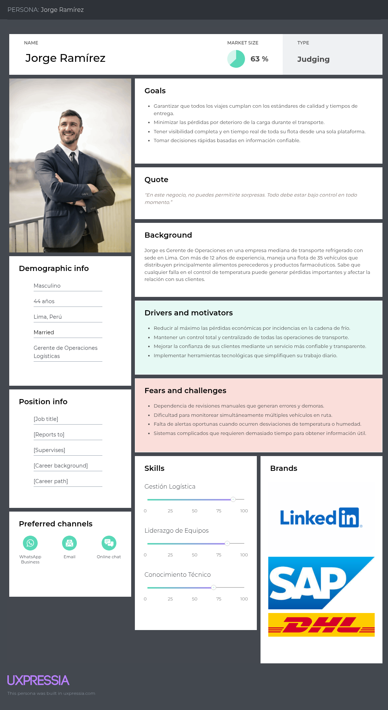

Jorge Ramírez es un Gerente de Operaciones experimentado de 44 años que trabaja en una empresa mediana de transporte refrigerado con sede en Lima. Con más de 12 años en el sector logístico, es responsable de gestionar una flota de 35 vehículos dedicados principalmente al traslado de alimentos perecederos y productos farmacéuticos.
Es un profesional práctico y orientado a resultados, que valora el control total de sus operaciones. Su principal preocupación es evitar cualquier tipo de pérdida económica causada por fallos en la cadena de frío. Jorge necesita herramientas simples pero potentes que le permitan monitorear toda su flota en tiempo real, recibir alertas inmediatas y tomar decisiones rápidas sin complicaciones. Aunque está abierto a la tecnología, prefiere soluciones fáciles de implementar que no requieran largas capacitaciones ni procesos complejos.

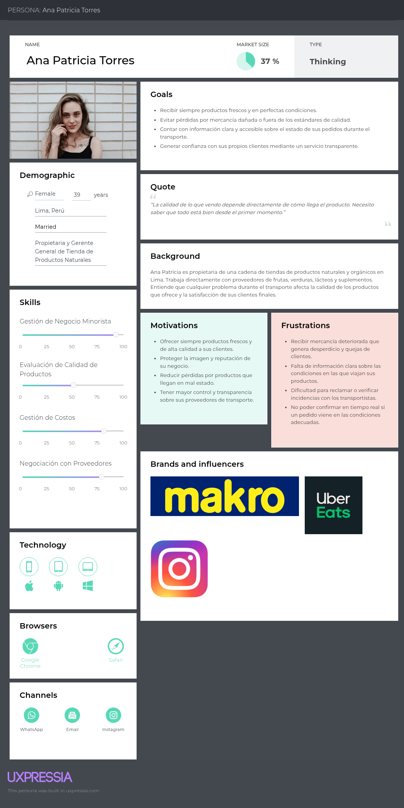

Ana Patricia Torres, de 39 años, es propietaria y gerente de una cadena de tiendas de productos naturales y orgánicos en Lima. Con un enfoque muy cuidadoso en la calidad, depende completamente de proveedores confiables para mantener la frescura de sus frutas, verduras, lácteos y suplementos.
Es una persona detallista y consciente de la importancia de la transparencia en toda la cadena de suministro. Ana Patricia busca tranquilidad al saber que sus productos viajan en condiciones óptimas, ya que cualquier incidente con la temperatura o el manejo de la carga afecta directamente la satisfacción de sus clientes y la rentabilidad de su negocio. Valora enormemente la posibilidad de verificar el estado de sus pedidos de forma sencilla y en tiempo real, ya que esto le permite generar mayor confianza con sus compradores finales y reducir riesgos innecesarios.

### 2.3.2. User Task Matrix

### Segmento: Empresas Clientes

| Tarea | Frecuencia | Importancia |
|-------|-----------|-------------|
| Llamar a conductores para verificar condiciones de carga manualmente | Alta | Alta |
| Revisar múltiples parámetros (temperatura, humedad, vibración) al final del viaje | Alta | Alta |
| Completar bitácoras en papel con datos de condiciones del cargamento | Alta | Media |
| Buscar información de viajes en múltiples sistemas desintegrados | Alta | Media |
| Coordinar por teléfono cuando hay incidencias en las condiciones de transporte | Media | Alta |
| Recopilar firmas y documentos físicos de entregas | Alta | Media |
| Armar reportes manuales combinando datos de diferentes fuentes | Media | Alta |
| Enviar unidades de emergencia cuando se detecta falla en el transporte | Baja | Alta |
| Atender consultas de clientes por falta de visibilidad en tiempo real | Media | Alta |
| Revisar rutas en GPS básico sin integración con sensores de carga | Alta | Media |
| Capacitar conductores en procedimientos de verificación de carga | Baja | Media |
| Verificar manualmente el funcionamiento de sistemas de conservación | Alta | Alta |
| Consolidar información de múltiples dispositivos y plataformas | Alta | Alta |

### Segmento: Clientes Finales

| Tarea | Frecuencia | Importancia |
|-------|-----------|-------------|
| Verificar productos visualmente al recibirlos | Alta | Alta |
| Inspeccionar condiciones físicas de productos sensibles | Alta | Alta |
| Llamar al proveedor para preguntar estado del envío | Media | Media |
| Examinar empaques buscando señales de deterioro o daños | Alta | Alta |
| Rechazar productos que muestran signos de mal manejo | Media | Alta |
| Solicitar reportes de trazabilidad que suelen ser genéricos o incompletos | Media | Alta |
| Esperar sin información sobre el estado real de sus pedidos | Media | Alta |
| Revisar fechas de vencimiento y condiciones de almacenamiento | Alta | Alta |
| Registrar incidencias de productos que llegan en mal estado | Baja | Alta |
| Aceptar productos sin evidencia objetiva de las condiciones de transporte | Alta | Media |
| Realizar reclamos por productos deteriorados o fuera de especificación | Baja | Alta |
| Archivar documentación física de entregas | Media | Baja |
| Validar cumplimiento de condiciones especiales sin datos verificables | Alta | Alta |

### 2.3.3. User Journey Mapping

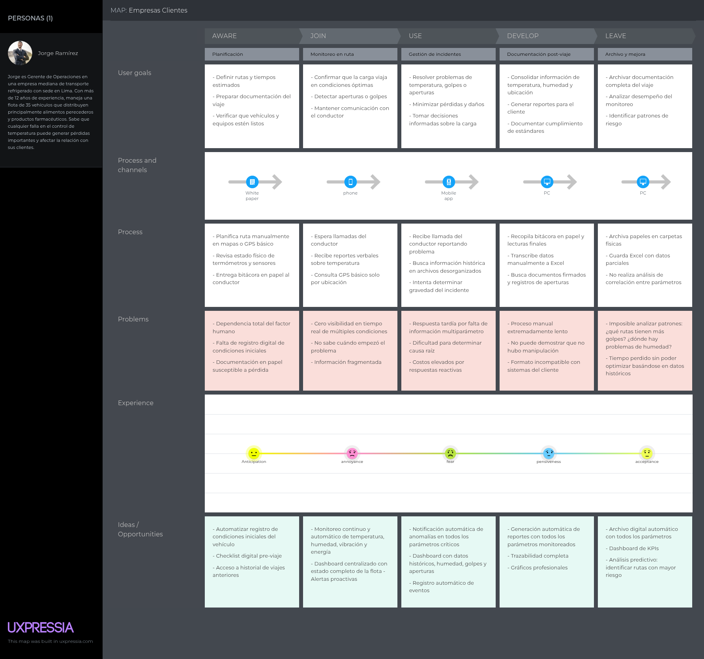

Este journey representa el proceso diario de Jorge Ramírez, Gerente de Operaciones de una empresa mediana de transporte refrigerado. Muestra cómo actualmente planifica, monitorea y documenta sus viajes de carga sensible. Se evidencia una fuerte dependencia de métodos manuales y comunicación verbal, lo que genera falta de visibilidad en tiempo real, respuestas reactivas ante incidentes y dificultad para analizar patrones de riesgo. OmniTrack busca transformar este flujo en un proceso digital, proactivo y centralizado.

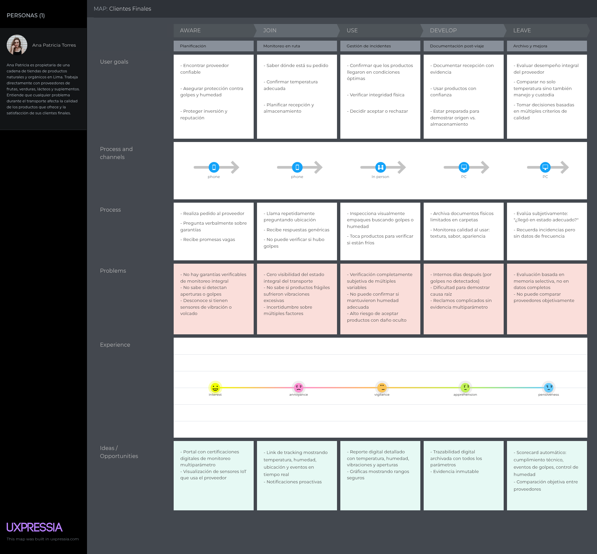

Este journey representa el proceso de Ana Patricia Torres, propietaria de una cadena de tiendas de productos naturales. Muestra cómo actualmente solicita, sigue y recibe sus pedidos de insumos sensibles. Actualmente depende de promesas verbales y verificaciones subjetivas, lo que genera incertidumbre, riesgo de recibir productos en mal estado y dificultad para reclamar. OmniTrack le permitiría tener visibilidad transparente y evidencia objetiva, aumentando su confianza en los proveedores.

### 2.3.4. Empathy Mapping

A continuación se presentan los Empathy Maps de ambos segmentos objetivo. Cada mapa resume lo que el usuario dice, piensa, hace y siente en su interacción diaria con el proceso de transporte de carga sensible.

### Empathy Map 1 - Segmento: Empresas Clientes

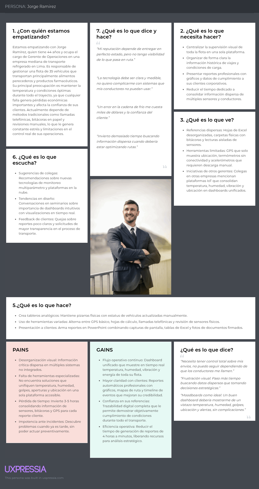

### Empathy Map 2 - Segmento: Clientes Finales

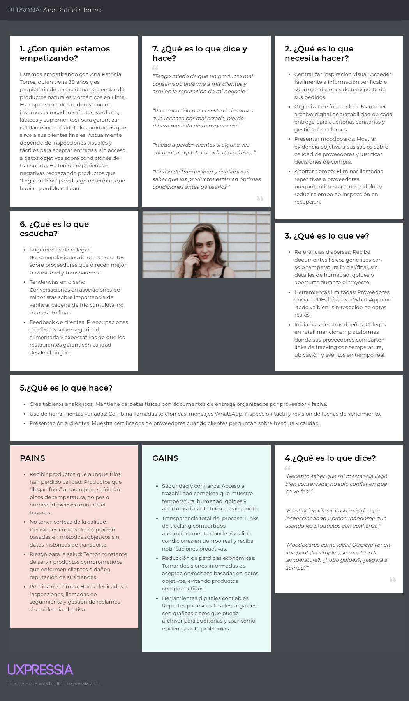

## 2.4. Big Picture EventStorming

El Big Picture Event Storming es una técnica de taller colaborativo que ayudó al equipo a entender de forma visual y conjunta el dominio completo del negocio de monitoreo de transporte de carga sensible. Esta actividad permitió mapear los procesos principales, identificar los eventos más importantes, analizar cómo interactúan los diferentes actores y sistemas, y descubrir oportunidades clave de mejora que servirán de base para el diseño de OmniTrack.

Link del Big Picture Event Storming: https://miro.com/app/board/uXjVGhhI3ec=/?share_link_id=985657624736

#### 1. Preparación del Espacio

Siguiendo el material entregado en el blackboard, el equipo comenzó la sesión organizando un tablero compartido en Miro. Se definió claramente el objetivo de la actividad: analizar todo el ciclo de vida del servicio de transporte de carga sensible, desde la solicitud inicial hasta la entrega y evaluación posterior.

#### 2. Motivación de los Participantes

Para generar mayor compromiso, se realizaron dinámicas de integración y se mostraron ejemplos prácticos de eventos de negocio, con el fin de que todos entendieran cómo esta técnica ayuda a construir una visión compartida del sistema.

#### 3. Explicación de la Agenda

Se presentó el alcance de la sesión:

Explorar la interacción entre gestores de flota, conductores, personal de muelle y clientes finales.
Identificar los eventos clave desde que se solicita un servicio hasta la entrega y cierre de la operación.
Reconocer los actores principales y los sistemas externos involucrados.

#### 4. Generación de Eventos de Dominio

Los participantes propusieron libremente todos los eventos que consideraron relevantes, anotándolos en tarjetas sin preocuparse por el orden en ese momento.

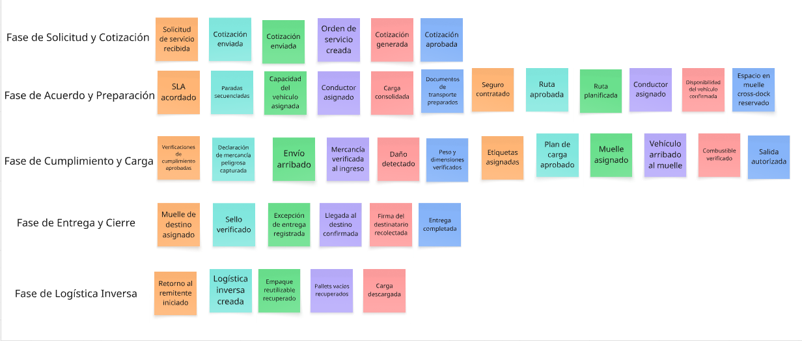

#### 5. Ordenamiento de Eventos de Dominio

Se organizaron los eventos siguiendo una secuencia lógica de tiempo, desde el inicio del proceso (solicitud de envío) hasta su finalización (cierre de la operación). Esta organización permitió visualizar el flujo completo y detectar posibles puntos de fricción o actividades redundantes.

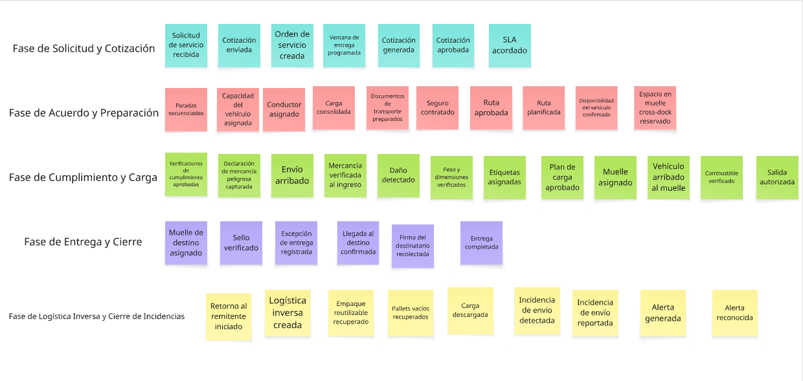

#### 6. Incorporación de Actores y Sistemas Externos

Se identificaron los actores clave que participan en los eventos y los sistemas externos que intervienen:
Actores:

Gestor de Flota: Responsable de gestionar operaciones, rutas, costos y acuerdos de nivel de servicio (SLA).

Personal del Muelle: Encargado de la carga, descarga y verificación física de la mercancía.

Conductor: Responsable de ejecutar el viaje y responder a las alertas durante el trayecto.

Personal Logístico: Coordina el flujo de mercancías, gestiona inventario, almacenamiento y documentación.

Sistemas Externos:

Sistema de Planificación de Rutas: Encargado de calcular las rutas más eficientes considerando distancia, tiempo estimado, ventanas de entrega, capacidad del vehículo y costos.

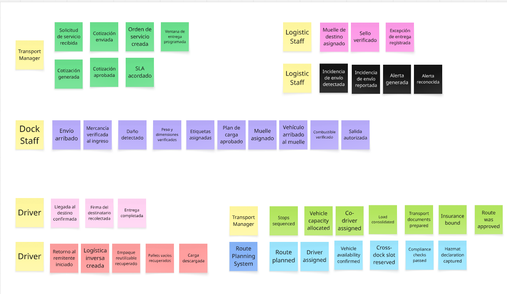

#### 7. Narrativa (Storytelling)

El equipo contó la historia del proceso desde dos puntos de vista principales:

#### Desde la perspectiva del Gestor de Flota:

Recibe una solicitud, genera una cotización, acuerda un SLA y planifica la ruta. Asigna vehículo y conductor, prepara documentación y reserva espacios en muelles. Durante el viaje, depende principalmente de llamadas del conductor para conocer el estado de la carga. Si surge un problema, suele enterarse cuando ya ha ocurrido.

#### Desde la perspectiva del Cliente Final:

No recibe información actualizada del envío. Al momento de la entrega, solo puede inspeccionar visualmente la mercancía. La falta de datos objetivos hace que la verificación sea subjetiva y que cualquier reclamo sea lento y complicado.

#### 8. Narrativa Inversa (Reverse Storytelling)

Se recorrió el proceso en sentido contrario, comenzando desde el cierre de la operación (recepción de la mercancía) hasta la solicitud inicial. Esta técnica ayudó a validar que no se omitiera ningún evento importante y a confirmar que los principales problemas (falta de visibilidad en tiempo real y dependencia del papeleo) eran consistentes.

#### 9. Cierre de la Sesión

Se resumieron los aprendizajes más relevantes y las principales oportunidades de mejora:

La fuerte dependencia de comunicación manual y papeleo genera puntos ciegos importantes durante el transporte.

Es necesario contar con visibilidad en tiempo real de parámetros críticos para poder actuar de forma proactiva.

La trazabilidad actual es insuficiente, ya que la inspección visual al final del trayecto no garantiza el cumplimiento de condiciones durante todo el viaje.

Se requieren políticas claras sobre umbrales de temperatura, tiempos de respuesta y manejo de desviaciones para evitar disputas.

El cliente final tiene una experiencia limitada debido a la falta de transparencia, lo que afecta la confianza en el servicio.

La resolución de incidencias y el cumplimiento normativo se ven perjudicados por la ausencia de reportes automáticos y datos históricos confiables.

## 2.5. Ubiquitous Language

## 1. Términos del Dominio Central
 
| Término | Definición |
|---------|-----------|
| **Cadena de Frío** | Proceso logístico que mantiene los productos perecederos dentro de rangos específicos de temperatura desde el origen hasta el destino final, preservando su calidad e integridad. |
| **Envío** | Conjunto de productos o carga que se transporta desde un punto de origen hacia un destino bajo una misma guía o registro. |
| **Transportista** | Persona o empresa responsable de trasladar los productos y garantizar que se cumplan las condiciones de transporte acordadas. |
| **Plan de Ruta** | Itinerario detallado que define el recorrido, tiempos estimados, puntos de parada y condiciones necesarias para completar la entrega. |
| **Rango de Temperatura** | Intervalo de grados aceptable dentro del cual debe mantenerse el producto durante todo el transporte. |
| **Desviación de Temperatura** | Diferencia entre la temperatura real de la carga y el rango permitido, que puede comprometer la calidad del producto. |
 
---
 
## 2. Términos de Actores
 
| Término | Definición |
|---------|-----------|
| **Gestor de Flota** | Usuario responsable de configurar dispositivos, establecer parámetros de viaje, monitorear múltiples transportes y generar reportes para clientes. |
| **Conductor** | Usuario operativo que recibe alertas durante el trayecto y ejecuta acciones correctivas cuando se detectan problemas en las condiciones de la carga. |
| **Cliente Final** | Receptor de la mercancía que requiere visibilidad del estado del transporte y documentación de cumplimiento térmico para aceptar o rechazar los productos. |
 
---
 
## 3. Términos de Procesos de Negocio
 
| Término | Definición |
|---------|-----------|
| **Configuración de Viaje** | Proceso de definir parámetros específicos antes del inicio del transporte: rangos de temperatura, duración estimada, tipo de carga y responsables. |
| **Acción Correctiva** | Medidas tomadas por el conductor o el operador para resolver violaciones de temperatura, como ajustar refrigeración, cambiar ruta o notificar supervisores. |
| **Calibración de Sensores** | Proceso periódico de verificación y ajuste de los sensores para garantizar precisión en las mediciones según estándares de calidad. |
| **Cumplimiento de Cadena de Frío** | Estado que certifica que un viaje se completó dentro de todos los parámetros térmicos requeridos, cumpliendo con regulaciones y estándares de calidad. |
 
---
 
## 4. Contexto de Métricas y KPIs
 
| Término | Definición |
|---------|-----------|
| **Excursión de Temperatura** | Período durante el cual la temperatura de la carga estuvo fuera del rango permitido, medido en minutos u horas según la criticidad del producto. |
| **Tasa de Cumplimiento** | Porcentaje de viajes que se completaron sin violaciones de temperatura en un período determinado. Es uno de los KPIs principales del servicio. |
| **Tiempo de Respuesta a Alertas** | Métrica que mide el tiempo transcurrido entre la generación de una alerta y la ejecución de acciones correctivas por parte del equipo operativo. |

# Capítulo III: Requirements Specification
## 3.1. User Stories
## 3.2. Impact Mapping
## 3.3. Product Backlog
# Capítulo IV: Solution Software Design
## 4.1. Strategic-Level Domain-Driven Design
### 4.1.1. Design-Level EventStorming
#### 4.1.1.1 Candidate Context Discovery
#### 4.1.1.2. Domain Message Flows Modeling
#### 4.1.1.3. Bounded Context Canvases
### 4.1.2. Context Mapping
### 4.1.3. Software Architecture
#### 4.1.3.1. Software Architecture System Landscape Diagram
#### 4.1.3.2. Software Architecture Context Level Diagrams
#### 4.1.3.2. Software Architecture Container Level Diagrams
#### 4.1.3.3. Software Architecture Deployment Diagrams
## 4.2. Tactical-Level Domain-Driven Design
### 4.2.1. Bounded Context: Identity and Access Management
#### 4.2.1.1. Domain Layer
#### 4.2.1.2. Interface Layer
#### 4.2.1.3. Application Layer
#### 4.2.1.4. Infrastructure Layer
#### 4.2.1.5. Bounded Context Software Architecture Component Level Diagrams
#### 4.2.1.6. Bounded Context Software Architecture Code Level Diagrams
##### 4.2.1.6.1. Bounded Context Domain Layer Class Diagrams
##### 4.2.1.6.2. Bounded Context Database Design Diagram
### 4.2.2. Bounded Context: Subscriptions and Billing
#### 4.2.2.1. Domain Layer
#### 4.2.2.2. Interface Layer
#### 4.2.2.3. Application Layer
#### 4.2.2.4. Infrastructure Layer
#### 4.2.2.5. Bounded Context Software Architecture Component Level Diagrams
#### 4.2.2.6. Bounded Context Software Architecture Code Level Diagrams
#### 4.2.2.6.1. Bounded Context Domain Layer Class Diagrams
#### 4.2.2.6.2. Bounded Context Database Design Diagram
### 4.2.3. Bounded Context: Alerts & Resolution
#### 4.2.3.1. Domain Layer
#### 4.2.3.2. Interface Layer
#### 4.2.3.3. Application Layer
#### 4.2.3.4. Infrastructure Layer
#### 4.2.3.5. Bounded Context Software Architecture Component Level Diagrams
#### 4.2.3.6. Bounded Context Software Architecture Code Level Diagrams
##### 4.2.3.6.1. Bounded Context Domain Layer Class Diagrams
##### 4.2.3.6.2. Bounded Context Database Design Diagram
### 4.2.4. Bounded Context: Real-Time Monitoring
#### 4.2.4.1. Domain Layer.
#### 4.2.4.2. Interface Layer.
#### 4.2.4.3. Application Layer.
#### 4.2.4.4. Infrastructure Layer.
#### 4.2.4.5. Bounded Context Software Architecture Component Level Diagrams
#### 4.2.4.6. Bounded Context Software Architecture Code Level Diagrams
##### 4.2.4.6.1. Bounded Context Domain Layer Class Diagrams
##### 4.2.4.6.2. Bounded Context Database Design Diagram
### 4.2.5. Bounded Context: Trip management
#### 4.2.5.1. Domain Layer.
#### 4.2.5.2. Interface Layer.
#### 4.2.5.3. Application Layer.
#### 4.2.5.4. Infrastructure Layer.
#### 4.2.5.5. Bounded Context Software Architecture Component Level Diagrams.
#### 4.2.5.6. Bounded Context Software Architecture Code Level Diagrams.
##### 4.2.5.6.1. Bounded Context Domain Layer Class Diagrams.
##### 4.2.5.6.2. Bounded Context Database Design Diagram.
### 4.2.6. Bounded Context: Fleet Management
#### 4.2.6.1. Domain Layer
#### 4.2.6.2. Interface Layer
#### 4.2.6.3. Application Layer
#### 4.2.6.4. Infrastructure Layer
#### 4.2.6.5. Bounded Context Software Architecture Component Level Diagrams.
#### 4.2.5.6. Bounded Context Software Architecture Code Level Diagrams.
##### 4.2.5.6.1. Bounded Context Domain Layer Class Diagrams.
##### 4.2.5.6.2. Bounded Context Database Design Diagram.
### 4.2.7. Bounded Context: Profile and Preferences Management
#### 4.2.7.1. Domain Layer.
#### 4.2.7.2. Interface Layer.
#### 4.2.7.3. Application Layer.
#### 4.2.7.4. Infrastructure Layer.
#### 4.2.7.5. Bounded Context Software Architecture Component Level Diagrams.
#### 4.2.7.6. Bounded Context Software Architecture Code Level Diagrams.
##### 4.2.7.6.1. Bounded Context Domain Layer Class Diagrams.
##### 4.2.7.6.2. Bounded Context Database Design Diagram
### 4.2.8. Bounded Context: Visualization Analytics
#### 4.2.8.1. Domain Layer
#### 4.2.8.2. Interface Layer
#### 4.2.8.3. Application Layer
#### 4.2.8.4. Infrastructure Layer
#### 4.2.8.5. Bounded Context Software Architecture Component Level Diagrams
#### 4.2.8.6. Bounded Context Software Architecture Code Level Diagrams
##### 4.2.8.6.1. Bounded Context Domain Layer Class Diagrams
##### 4.2.8.6.2. Bounded Context Database Design Diagram
### 4.2.9. Bounded Context: Merchant
#### 4.2.9.1. Domain Layer
#### 4.2.9.2. Interface Layer
#### 4.2.9.3. Application Layer
#### 4.2.9.4. Infrastructure Layer
#### 4.2.9.5. Bounded Context Software Architecture Component Level Diagrams
#### 4.2.9.6. Bounded Context Software Architecture Code Level Diagrams
##### 4.2.9.6.1. Bounded Context Domain Layer Class Diagrams
##### 4.2.9.6.2. Bounded Context Database Design Diagram
