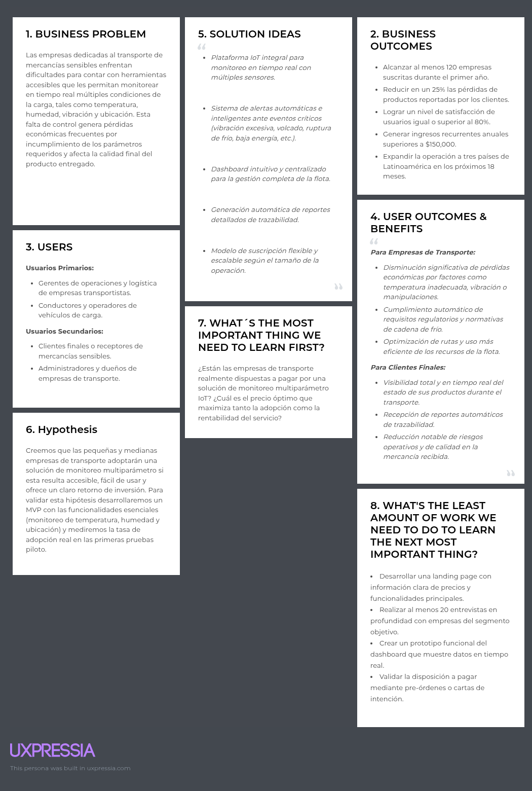

  

     
    
     
    <strong>Universidad Peruana de Ciencias Aplicadas</strong>
      
    <strong>Carrera de Ingeniería de Software</strong>
      
    <strong>Ciclo 202610</strong>
      
    1ASI0572 - Desarrollo de Soluciones IOT
      
    <strong>NRC:</strong> 6770   
    <strong>Profesor:</strong> Prudencio Vidal, Javier Antonio   
    <strong>Informe de TB1</strong>
  

  

    

      <strong>Startup:</strong> LogicNodes 
       
      <strong>Producto:</strong> OmniTrack
    

  

      <strong>Relación de integrantes</strong>
        
      <table style="width: 60%; margin: 0 auto;   text-align: left">
        <thead>
          <tr>
            <th>Código</th>
            <th>Nombre</th>
          </tr>
        </thead>
        <tbody>
          <tr>
            <td>u202216698 </td>
            <td> Rodrigo Alonso, Alcántara Cruz, </td>
          </tr>
          <tr>
            <td> u20191e562 </td>
            <td> Paulo Percy, Quincho Gamarra </td>
          </tr>
          <tr>
            <td> u202210334 </td>
            <td> Adrian Emanuel, Valerio Garcia  </td>
          </tr>
          <tr>
            <td> U202011431 </td>
            <td> Luiggi Jeremy Jouvenel, Antonio Loayza </td>
          </tr>
          <tr>
            <td> u202313397 </td>
            <td> Alejandro Daniel, Oroncoy Almeyda </td>
          </tr>
        </tbody>
      </table>
      

         
        <strong>Abril 2026</strong>
      

    

  

| Versión | Fecha | Autor | Descripción de modificación |
| :--- | :--- | :--- | :--- |
|  1.0    |              |              |                    |
|  1.0.1  |              |               |                   |
|  1.0.2  |              |              |                    |
|  1.0.3    |              |              |                    |

# Project Report Collaboration Insights

En esta seccion se registra la colaboración de todo el equipo durante el desarrollo del informe del proyecto, se adjunta el enlace del repositorio 

| Repository Name | Link |
| :--- | :--- |
| **logic-nodes-report** | [https://github.com/Logic-Nodes/logic-nodes-report](https://github.com/Logic-Nodes/logic-nodes-report) |

# Contenido

_Tabla de contenidos_

- [Student Outcome]
- [Capítulo I: Introducción]
  - [1.1. Startup Profile]
    - [1.1.1. Descripción de la Startup]
    - [1.1.2. Perfiles de integrantes del equipo]
  - [1.2. Solution Profile]
    - [1.2.1. Antecedentes y problemática]
    - [1.2.2. Lean UX Process]
      - [1.2.2.1. Lean UX Problem Statements]
      - [1.2.2.2. Lean UX Assumptions]
      - [1.2.2.3. Lean UX Hypothesis Statements]
      - [1.2.2.4. Lean UX Canvas]
  - [1.3. Segmentos objetivo]
- [Capítulo II: Requirements Elicitation \& Analysis]
  - [2.1. Competidores]
    - [2.1.1. Análisis competitivo]
    - [2.1.2. Estrategias y tácticas frente a competidores]
  - [2.2. Entrevistas]
    - [2.2.1. Diseño de entrevistas]
    - [2.2.2. Registro de entrevistas]
    - [2.2.3. Análisis de entrevistas]
  - [2.3. Needfinding]
    - [2.3.1. User Personas]
    - [2.3.2. User Task Matrix]
    - [2.3.3. User Journey Mapping]
    - [2.3.4. Empathy Mapping]
  - [2.4. Big Picture EventStorming]
  - [2.5. Ubiquitous Language]
- [Capítulo III: Requirements Specification]
  - [3.1. User Stories]
  - [3.2. Impact Mapping]
  - [3.3. Product Backlog]
- [Capítulo IV: Solution Software Design]
  - [4.1. Strategic-Level Domain-Driven Design]
    - [4.1.1. Design-Level EventStorming]
      - [4.1.1.1 Candidate Context Discovery]
      - [4.1.1.2. Domain Message Flows Modeling]
      - [4.1.1.3. Bounded Context Canvases]
    - [4.1.2. Context Mapping]
    - [4.1.3. Software Architecture]
      - [4.1.3.1. Software Architecture System Landscape Diagram]
      - [4.1.3.2. Software Architecture Context Level Diagrams]
      - [4.1.3.2. Software Architecture Container Level Diagrams]
      - [4.1.3.3. Software Architecture Deployment Diagrams]
  - [4.2. Tactical-Level Domain-Driven Design]
    - [4.2.1. Bounded Context: Identity and Access Management]
      - [4.2.1.1. Domain Layer]
      - [4.2.1.2. Interface Layer]
      - [4.2.1.3. Application Layer]
      - [4.2.1.4. Infrastructure Layer]
      - [4.2.1.5. Bounded Context Software Architecture Component Level Diagrams]
      - [4.2.1.6. Bounded Context Software Architecture Code Level Diagrams]
        - [4.2.1.6.1. Bounded Context Domain Layer Class Diagrams]
        - [4.2.1.6.2. Bounded Context Database Design Diagram]
    - [4.2.2. Bounded Context: _Subscriptions and Billing_]
      - [4.2.2.1. Domain Layer]
      - [4.2.2.2. Interface Layer]
      - [4.2.2.3. Application Layer]
      - [4.2.2.4. Infrastructure Layer]
      - [4.2.2.5. Bounded Context Software Architecture Component Level Diagrams]
      - [4.2.2.6. Bounded Context Software Architecture Code Level Diagrams]
        - [4.2.2.6.1. Bounded Context Domain Layer Class Diagrams]
        - [4.2.2.6.2. Bounded Context Database Design Diagram]
    - [4.2.3. Bounded Context: _Alerts \& Resolution_]
      - [4.2.3.1. Domain Layer]
      - [4.2.3.2. Interface Layer]
      - [4.2.3.3. Application Layer]
      - [4.2.3.4. Infrastructure Layer]
      - [4.2.3.5. Bounded Context Software Architecture Component Level Diagrams]
      - [4.2.3.6. Bounded Context Software Architecture Code Level Diagrams]
        - [4.2.3.6.1. Bounded Context Domain Layer Class Diagrams]
        - [4.2.3.6.2. Bounded Context Database Design Diagram]
    - [4.2.4. Bounded Context: _Real-Time Monitoring_]
      - [4.2.4.1. Domain Layer.]
      - [4.2.4.2. Interface Layer.]
      - [4.2.4.3. Application Layer.]
      - [4.2.4.4. Infrastructure Layer.]
      - [4.2.4.5. Bounded Context Software Architecture Component Level Diagrams]
      - [4.2.4.6. Bounded Context Software Architecture Code Level Diagrams]
        - [4.2.4.6.1. Bounded Context Domain Layer Class Diagrams]
        - [4.2.4.6.2. Bounded Context Database Design Diagram]
    - [4.2.5. Bounded Context: _Trip management_]
      - [4.2.5.1. Domain Layer.]
      - [4.2.5.2. Interface Layer.]
      - [4.2.5.3. Application Layer.]
      - [4.2.5.4. Infrastructure Layer.]
      - [4.2.5.5. Bounded Context Software Architecture Component Level Diagrams.]
      - [4.2.5.6. Bounded Context Software Architecture Code Level Diagrams.]
        - [4.2.5.6.1. Bounded Context Domain Layer Class Diagrams.]
        - [4.2.5.6.2. Bounded Context Database Design Diagram.]
    - [4.2.6. Bounded Context: Fleet Management]
      - [4.2.6.1. Domain Layer]
      - [4.2.6.2. Interface Layer]
      - [Controllers principales (HTTP REST)]
      - [4.2.6.3. Application Layer]
      - [4.2.6.4. Infrastructure Layer]
      - [4.2.6.5. Bounded Context Software Architecture Component Level Diagrams.]
      - [4.2.5.6. Bounded Context Software Architecture Code Level Diagrams.]
        - [4.2.5.6.1. Bounded Context Domain Layer Class Diagrams.]
        - [4.2.5.6.2. Bounded Context Database Design Diagram.]
    - [4.2.7. Bounded Context: Profile and Preferences Management]
      - [4.2.7.1. Domain Layer.]
      - [4.2.7.2. Interface Layer.]
      - [4.2.7.3. Application Layer.]
      - [4.2.7.4. Infrastructure Layer.]
      - [4.2.7.5. Bounded Context Software Architecture Component Level Diagrams.]
      - [4.2.7.6. Bounded Context Software Architecture Code Level Diagrams.]
        - [4.2.7.6.1. Bounded Context Domain Layer Class Diagrams.]
        - [4.2.7.6.2. Bounded Context Database Design Diagram]
    - [4.2.8. Bounded Context: Visualization Analytics]
      - [4.2.8.1. Domain Layer]
      - [4.2.8.2. Interface Layer]
      - [4.2.8.3. Application Layer]
      - [4.2.8.4. Infrastructure Layer]
      - [4.2.8.5. Bounded Context Software Architecture Component Level Diagrams]
      - [4.2.8.6. Bounded Context Software Architecture Code Level Diagrams]
        - [4.2.8.6.1. Bounded Context Domain Layer Class Diagrams]
        - [4.2.8.6.2. Bounded Context Database Design Diagram]
    - [4.2.9. Bounded Context: Merchant]
      - [4.2.9.1. Domain Layer]
      - [4.2.9.2. Interface Layer]
      - [4.2.9.3. Application Layer]
      - [4.2.9.4. Infrastructure Layer]
      - [4.2.9.5. Bounded Context Software Architecture Component Level Diagrams]
      - [4.2.9.6. Bounded Context Software Architecture Code Level Diagrams]
        - [4.2.9.6.1. Bounded Context Domain Layer Class Diagrams]
        - [4.2.9.6.2. Bounded Context Database Design Diagram]

# Student Outcome

El curso cumple de manera directa el cumplimiento del Student Outcome 5 definido por ABET - EAC, asegurando que los integrantes logren alcanzar las competencias establecidas

Criterio: La capacidad de funcionar efectivamente en un
equipo cuyos miembros juntos proporcionan liderazgo, crean un entorno de
colaboración e inclusivo, establecen objetivos, planifican tareas y cumplen objetivos.

| Criterio específico | Acciones realizadas | Conclusiones |
| :--- | :--- | :--- |
| **Trabaja en equipo para proporcionar liderazgo en forma conjunta** | **Alcantara Cruz, Rodrigo Alonso**   **AV1:** [Acción]   **TB1:** [Acción]   **AV2:** [Acción]   **TB2:** [Acción]    **Quincho Gamarra, Paulo Percy**   **AV1:** [Acción]   **TB1:** [Acción]   **AV2:** [Acción]   **TB2:** [Acción]    **Valerio Garcia, Adrian Emanuel**   **AV1:** [Acción]   **TB1:** [Acción]   **AV2:** [Acción]   **TB2:** [Acción]    **Antonio Loayza, Luiggi Jeremy Jouvenel**   **AV1:** [Acción]   **TB1:** [Acción]   **AV2:** [Acción]   **TB2:** [Acción]    **Oroncoy Almeyda, Alejandro Daniel**   **AV1:** [Acción]   **TB1:** [Acción]   **AV2:** [Acción]   **TB2:** [Acción] | [pending...] |
| **Crea un entorno colaborativo e inclusivo, establece metas, planifica tareas y cumple objetivos.** | **Alcantara Cruz, Rodrigo Alonso**   **AV1:** [Acción]   **TB1:** [Acción]   **AV2:** [Acción]   **TB2:** [Acción]    **Quincho Gamarra, Paulo Percy**   **AV1:** [Acción]   **TB1:** [Acción]   **AV2:** [Acción]   **TB2:** [Acción]    **Valerio Garcia, Adrian Emanuel**   **AV1:** [Acción]   **TB1:** [Acción]   **AV2:** [Acción]   **TB2:** [Acción]    **Antonio Loayza, Luiggi Jeremy Jouvenel**   **AV1:** [Acción]   **TB1:** [Acción]   **AV2:** [Acción]   **TB2:** [Acción]    **Oroncoy Almeyda, Alejandro Daniel**   **AV1:** [Acción]   **TB1:** [Acción]   **AV2:** [Acción]   **TB2:** [Acción] | [pending...] |

# Capítulo I: Introducción
## 1.1. Startup Profile
### 1.1.1. Descripción de la Startup

LogicNodes es una iniciativa tecnológica emergente conformada por estudiantes de Ingeniería de Software de la Universidad Peruana de Ciencias Aplicadas (UPC). Nuestra organización nace con el firme propósito de transformar la gestión logística y de seguridad mediante la implementación de soluciones basadas en el Internet de las Cosas (IoT). Nos enfocamos en el desarrollo de sistemas inteligentes que permitan a las empresas optimizar sus procesos operativos, reducir riesgos y garantizar la integridad de sus activos en tiempo real.

Como equipo, LogicNodes combina el rigor técnico con una visión innovadora para enfrentar los desafíos actuales de la industria. Nuestra misión es democratizar el acceso a tecnologías de monitoreo avanzadas, ofreciendo plataformas robustas, escalables y centradas en la experiencia del usuario.

El nombre de nuestra organización es LogicNodes. Este término refleja nuestra identidad central: la convergencia entre el pensamiento lógico de la ingeniería y la arquitectura de nodos interconectados que define a los sistemas IoT.

Bajo el respaldo de LogicNodes, presentamos OmniTrack, una solución integral diseñada para revolucionar la seguridad y el seguimiento de mercancías durante su transporte y almacenamiento. OmniTrack no es solo una herramienta de rastreo, sino un ecosistema inteligente que integra sensores de vanguardia, conectividad en la nube y una interfaz de gestión intuitiva.

El producto permite monitorear variables críticas como la ubicación exacta, el estado de las cerraduras y las condiciones ambientales de la carga. Gracias a su capacidad de respuesta inmediata y análisis de datos, OmniTrack proporciona a los usuarios un control total sobre sus operaciones, mitigando pérdidas y elevando los estándares de confianza en la cadena de suministro.

### 1.1.2. Perfiles de integrantes del equipo

| Foto | Información General |
| :---: | :--- |
|  | **Nombre y Apellidos:**   Rodrigo Alonso Alcántara Cruz    **Código:**   u202216698    **Carrera:**   Ingeniería de Software    **Información:**   Mi nombre es Rodrigo Alonso Alcantara Cruz y tengo 21 años. Soy estudiante de la carrera de Ingeniería de Software en la Universidad Peruana de Ciencias Aplicadas (UPC). Considero que soy una persona que busca el aprendizaje continuo y siempre intento resolver los problemas de forma rapida y eficaz. Tengo conocimiento en lenguajes de programación. Por lo general siempre intento mejorar mi metodo de estudio para poder expandir mi conocimiento. |

| Foto | Información General |
| :---: | :--- |
|  | **Nombre y Apellidos:**   Adrian Emanuel Valerio Garca    **Código:**   u202210334    **Carrera:**   Ingeniería de Software    **Información:**   Mi nombre es Adrian Valerio Garcia y tengo 21 años. Soy estudiante de la carrera de Ingeniería de Software en la Universidad Peruana de Ciencias Aplicadas (UPC). Me interesa el aprendizaje continuo y suelo enfocarme en resolver problemas de manera rápida y eficiente. Disfruto los videojuegos y aprender nuevas tecnologías, además de trabajar en equipo para lograr objetivos en conjunto. Tengo conocimientos en lenguajes de programación y procuro mejorar constantemente mis métodos de estudio para ampliar mis habilidades. |

| Foto | Información General |
| :---: | :--- |
|  | **Nombre y Apellidos:**   [pending...]    **Código:**   [pending...]    **Carrera:**   Ingeniería de Software    **Información:**   [pending...] |

| Foto | Información General |
| :---: | :--- |
|  | **Nombre y Apellidos:**   [pending...]    **Código:**   [pending...]    **Carrera:**   Ingeniería de Software    **Información:**   [pending...] |

| Foto | Información General |
| :---: | :--- |
|  | **Nombre y Apellidos:**   [pending...]    **Código:**   [pending...]    **Carrera:**   Ingeniería de Software    **Información:**   [pending...] |

## 1.2. Solution Profile
### 1.2.1. Antecedentes y problemática

### What (¿Qué?)

El transporte de mercancías sensibles enfrenta un desafío permanente: lograr un seguimiento continuo y confiable de las condiciones reales del cargamento a lo largo de todo el recorrido. No se trata solo de conocer la ubicación del vehículo, sino de detectar eventos críticos como aperturas no autorizadas de puertas, impactos fuertes, vibraciones intensas, variaciones de humedad, exposición a temperaturas inadecuadas, desvíos inesperados o interrupciones en la custodia. La falta de datos objetivos y actualizados sobre estos incidentes provoca daños frecuentes en los productos, pérdidas económicas significativas, conflictos entre los participantes de la cadena logística y un incremento sostenido en los costos operativos. Actualmente, la visibilidad suele reducirse a puntos administrativos básicos (salida y llegada) o a sistemas de geolocalización independientes, dejando importantes áreas sin control respecto al estado físico de la carga y la integridad del embalaje, especialmente durante paradas prolongadas, transbordos o cambios entre operadores. Para industrias como el retail, agroexportación, farmacéutica, pesquera y bienes de consumo masivo, disponer de telemetría completa que incluya condiciones ambientales, eventos de seguridad y registros auditables se ha vuelto indispensable para minimizar mermas, agilizar resoluciones y cumplir con los compromisos de calidad exigidos por clientes y aseguradoras.

### Who (¿Quién?)

Esta situación afecta directamente a dos grupos principales:

Las empresas transportistas y operadores logísticos: Soportan el riesgo económico de perder mercancía, enfrentar reclamos constantes de sus clientes y sufrir deterioro en su imagen por entregas defectuosas.

Los clientes finales: Reciben productos deteriorados, vencidos o, en el caso de medicamentos, con su eficacia comprometida, lo que genera riesgos para la salud y genera desconfianza hacia el servicio.

### Where (¿Dónde?)

El problema se presenta en toda la cadena de suministro, desde el almacén de origen hasta el punto de entrega final. Resulta especialmente grave en rutas de larga distancia (terrestre, aérea o marítima) y en los momentos de transferencia entre vehículos o bodegas, donde el control manual es limitado y más propenso a fallos. La implementación de tecnologías avanzadas de monitoreo es una tendencia mundial que avanza con mayor rapidez en países con infraestructura logística consolidada y un fuerte auge del comercio electrónico.

### When (¿Cuándo?)

La demanda de visibilidad en tiempo real ha crecido de forma notable tras la pandemia de COVID-19, que expuso las debilidades de las cadenas de abastecimiento. El incremento en el traslado de productos médicos y la exigencia de los consumidores por entregas rápidas y transparentes han convertido esta capacidad en un requisito estándar del mercado. Hoy en día, la mayoría de los clientes esperan poder seguir el estado de sus pedidos en cualquier momento, haciendo que la trazabilidad completa deje de ser una opción y se convierta en una expectativa generalizada.

### Why (¿Por qué?)

La raíz del problema radica en la ausencia de información oportuna y precisa. Las empresas no disponen de datos clave sobre temperatura, humedad, vibración o posición geográfica en el instante en que ocurren las anomalías. Esta limitación impide reaccionar de inmediato con medidas correctivas, como ajustar el sistema de climatización, modificar la ruta o alertar al cliente. Sin esta capacidad, las incidencias solo se descubren al final del viaje, cuando el daño ya se ha producido y las pérdidas son inevitables.

### How (¿Cómo?)

En la práctica actual, el monitoreo se basa en métodos dispersos o poco eficientes. Muchas compañías todavía utilizan registradores de datos que solo se revisan al concluir el trayecto, o combinan herramientas separadas (GPS para ubicación y sensores aislados para temperatura) que no interactúan entre sí. Esta falta de integración reduce la capacidad de respuesta, aumenta la probabilidad de errores humanos y dificulta la optimización de rutas, la gestión de riesgos y la entrega de un servicio confiable y de alto nivel.

### How much (¿Cuánto?)
La ausencia de un monitoreo integral genera consecuencias en varios niveles: funcional, operativo y estratégico. Las empresas invierten tiempo y recursos adicionales en resolver incidencias que podrían haberse prevenido. Desde el punto de vista operativo, esto implica mayores primas de seguros y costos derivados del desperdicio de productos. A nivel estratégico, representa una oportunidad clara para diferenciarse en el mercado, fortalecer la lealtad de los clientes y construir una reputación sólida basada en confiabilidad y transparencia.

### 1.2.2. Lean UX Process
#### 1.2.2.1. Lean UX Problem Statements

#### Domain
El proyecto se desarrolla dentro del ámbito del transporte y la logística de carga, enfocándose particularmente en el seguimiento y control de las condiciones de productos sensibles mientras se desplazan de un lugar a otro. En este contexto, contar con datos actualizados y precisos sobre el estado de la mercancía es clave para mantener la trazabilidad, proteger la calidad de los bienes y cumplir con las regulaciones aplicables a la cadena de frío, medicamentos y artículos perecederos.

#### Customer Segments

Empresas transportistas y operadores logísticos: son los responsables de administrar las flotas y asegurar que los productos lleguen en buen estado.
Clientes corporativos y distribuidores de bienes sensibles: necesitan total transparencia, control y pruebas concretas de que el transporte se realizó bajo las condiciones adecuadas.

Ambos grupos requieren información confiable, actualizada en tiempo real y herramientas que les permitan intervenir rápidamente cuando surge algún problema.

#### Pain Points

Ausencia de información inmediata sobre temperatura, humedad, vibración y posición de la carga.
Pérdidas financieras provocadas por fallos en la cadena de frío o manipulaciones incorrectas.
Comunicación poco efectiva entre transportistas y clientes cuando ocurren inconvenientes.
Dificultad para generar registros digitales que permitan auditar las condiciones y determinar responsabilidades.
Dependencia de procesos manuales y desconectados que complican la operación diaria y retrasan las decisiones.

#### Gap

En la actualidad, muchas empresas del sector usan soluciones independientes, como localizadores GPS o sensores de temperatura aislados, que no se conectan entre sí. Esto crea una distancia importante entre los datos que se obtienen y la capacidad real de detectar y resolver problemas de forma oportuna y preventiva.

#### Vision / Strategy

Logic Nodes tiene como objetivo convertir el monitoreo tradicional de cargas en un sistema inteligente, proactivo y totalmente integrado. La estrategia se basa en crear OmniTrack, una plataforma IoT completa que utiliza sensores instalados en los vehículos para capturar información sobre las condiciones ambientales y enviarla a un centro de control que procesa, alerta y presenta los datos de manera clara y en tiempo real. Así, las empresas podrán anticiparse a los riesgos, minimizar pérdidas y generar mayor confianza en sus clientes a través de reportes automáticos y una trazabilidad transparente.

#### Initial Segment
La primera fase de implementación se centrará en empresas de transporte de productos perecederos y farmacéuticos que operan en la zona de Lima Metropolitana. Este grupo se seleccionó porque maneja cargas muy sensibles a cambios ambientales y muestra interés en modernizar sus procesos logísticos, lo que lo convierte en un entorno adecuado para probar tanto la tecnología como el modelo de negocio.

#### 1.2.2.2. Lean UX Assumptions

#### Business Assumptions

- Creemos que en el mercado latinoamericano existe una demanda considerable por soluciones de monitoreo asequibles que midan varios parámetros al mismo tiempo (temperatura, vibración, ubicación y nivel de energía). Lo confirmaremos cuando al menos 15 entrevistas con empresas y el 30% de las respuestas en encuestas muestren interés real en evaluar o implementar la solución.

- Creemos que las empresas estarán dispuestas a pagar una cuota mensual por una herramienta que ayude a reducir pérdidas y fortalecer la confianza de sus clientes. Lo validaremos cuando consigamos al menos 5 cartas de intención que indiquen un precio mensual aceptable.

- Creemos que sensores IoT económicos pueden ofrecer la precisión necesaria para monitorear cadena de frío, vibración, ubicación y consumo de energía. Lo validaremos cuando las pruebas en campo demuestren una exactitud de ±0.5 °C en temperatura, detección confiable de vibración y precisión de GPS dentro de 10 metros en el 95% de las mediciones.

- Creemos que el modelo de pago por suscripción mensual será más atractivo que comprar una licencia de por vida para el segmento objetivo. Lo validaremos cuando al menos el 70% de las decisiones simuladas o cotizaciones prefieran la opción de suscripción.

- Creemos que ofrecer parámetros adicionales como humedad, vibración y detección de volcado aumentará el valor percibido de la solución. Lo validaremos cuando pruebas de precios comparativos muestren que los clientes están dispuestos a pagar al menos 15% más por el paquete completo.

#### Business Outcome Assumptions

- Creemos que disminuir los incidentes relacionados con la cadena de frío reducirá los costos por productos dañados. Lo validaremos cuando se registre una baja de al menos 20% en eventos críticos por mes en comparación con el período anterior.

- Creemos que la visibilidad inmediata ayudará a reducir disputas y acortar el tiempo de cobro. Lo validaremos cuando el indicador de días pendientes de cobro (DSO) baje al menos un 10% después de dos meses de uso.

- Creemos que OmniTrack acelerará el proceso de ventas en el segmento objetivo. Lo validaremos cuando la tasa de conversión de pruebas piloto a clientes de pago supere el 40% y el ciclo promedio de venta no exceda los 60 días.

- Creemos que el servicio logrará mantener a los clientes a lo largo del tiempo. Lo validaremos cuando la tasa de retención mensual sea igual o menor al 3% y el indicador de retención de ingresos netos (NRR) sea igual o superior al 100% a los seis meses.

- Creemos que la solución podrá crecer manteniendo márgenes adecuados. Lo validaremos cuando el margen bruto del servicio alcance al menos el 60% una vez que cada cliente tenga 50 dispositivos activos o más.

#### 1.2.2.3. Lean UX Hypothesis Statements

#### Hipótesis 1

Creemos que lograremos reducir las pérdidas de mercancía en un 25% y mejorar la satisfacción de los clientes en un 30% si las empresas de transporte pueden reaccionar de inmediato ante problemas como ruptura de cadena de frío, humedad fuera de rango o detección de volcado, gracias a un sistema de alertas en tiempo real. Lo confirmaremos cuando los incidentes reportados disminuyan al menos un 25% y el indicador de satisfacción (CSAT o NPS) aumente en 15 puntos o más durante las 8 semanas de prueba piloto, con al menos el 75% de opiniones positivas.

#### Hipótesis 2

Creemos que aumentaremos la eficiencia operativa en un 35% si los gerentes de operaciones pueden identificar y priorizar incidentes en pocos minutos mediante un panel sencillo que muestre el estado completo de toda la flota. Lo confirmaremos cuando el tiempo promedio de respuesta baje de más de 4 horas a menos de 25 minutos y los usuarios logren localizar un vehículo en riesgo en menos de 8 segundos en al menos el 85% de los casos durante las primeras 4 semanas.

#### Hipótesis 3

Creemos que alcanzaremos un 12% de adopción en el mercado objetivo dentro de 12 meses si las empresas pueden seleccionar fácilmente el plan que mejor se adapte a sus necesidades gracias a un modelo de suscripción flexible por niveles. Lo confirmaremos cuando tengamos al menos 120 empresas activas, una tasa de conversión de piloto a cliente de pago superior al 35% y una tasa de cancelación mensual igual o menor al 4%.

#### 1.2.2.4. Lean UX Canvas

## 1.3. Segmentos objetivo

### Segmento 1: Empresas Clientes

Estas organizaciones se dedican principalmente a la logística, distribución y producción de bienes sensibles que requieren condiciones especiales durante su traslado. Su principal necesidad es contar con un control preciso y continuo sobre sus cargas para proteger la calidad de los productos, minimizar pérdidas económicas y optimizar sus procesos internos.

Buscan una solución que les permita tener una visión completa y en tiempo real de toda su operación, integrando toda la información relevante en una sola plataforma. De esta forma pueden mejorar la eficiencia operativa, cumplir más fácilmente con las regulaciones del sector y transmitir mayor confianza a sus propios clientes.
Características principales:

Rol: Gerentes de logística, jefes de operaciones, responsables de control de calidad o directores de distribución.

Ubicación: Empresas con sede en zonas de alta actividad logística y con disposición para adoptar herramientas digitales.

Sector de la industria: Alimentos perecederos, productos farmacéuticos, químicos, flores de exportación y otros bienes que exigen un manejo controlado de temperatura, humedad y condiciones ambientales.

### Segmento 2: Clientes Finales

Los clientes finales son las personas o empresas que reciben los productos transportados. Su principal preocupación es la transparencia y la seguridad del proceso de entrega. Necesitan la tranquilidad de saber que la mercancía ha sido manejada correctamente desde su origen hasta su destino final.

Valoran especialmente la posibilidad de verificar por sí mismos el estado de su pedido en cualquier momento, a través de una herramienta sencilla, clara y confiable que les brinde información actualizada sobre las condiciones de transporte.
Características principales:

Edad: Mayores de 18 años.

Ubicación: Principalmente en Lima, Perú.

Nivel Socioeconómico: Medio y medio-alto, con interés en productos de calidad y servicios transparentes.

# Capítulo II: Requirements Elicitation & Analysis
## 2.1. Competidores
### 2.1.1. Análisis competitivo
### 2.1.2. Estrategias y tácticas frente a competidores
## 2.2. Entrevistas
### 2.2.1. Diseño de entrevistas
### 2.2.2. Registro de entrevistas
### 2.2.3. Análisis de entrevistas
## 2.3. Needfinding
### 2.3.1. User Personas
### 2.3.2. User Task Matrix
### 2.3.3. User Journey Mapping
### 2.3.4. Empathy Mapping
## 2.4. Big Picture EventStorming
## 2.5. Ubiquitous Language
# Capítulo III: Requirements Specification
## 3.1. User Stories
## 3.2. Impact Mapping
## 3.3. Product Backlog
# Capítulo IV: Solution Software Design
## 4.1. Strategic-Level Domain-Driven Design
### 4.1.1. Design-Level EventStorming
#### 4.1.1.1 Candidate Context Discovery
#### 4.1.1.2. Domain Message Flows Modeling
#### 4.1.1.3. Bounded Context Canvases
### 4.1.2. Context Mapping
### 4.1.3. Software Architecture
#### 4.1.3.1. Software Architecture System Landscape Diagram
#### 4.1.3.2. Software Architecture Context Level Diagrams
#### 4.1.3.2. Software Architecture Container Level Diagrams
#### 4.1.3.3. Software Architecture Deployment Diagrams
## 4.2. Tactical-Level Domain-Driven Design
### 4.2.1. Bounded Context: Identity and Access Management
#### 4.2.1.1. Domain Layer
#### 4.2.1.2. Interface Layer
#### 4.2.1.3. Application Layer
#### 4.2.1.4. Infrastructure Layer
#### 4.2.1.5. Bounded Context Software Architecture Component Level Diagrams
#### 4.2.1.6. Bounded Context Software Architecture Code Level Diagrams
##### 4.2.1.6.1. Bounded Context Domain Layer Class Diagrams
##### 4.2.1.6.2. Bounded Context Database Design Diagram
### 4.2.2. Bounded Context: Subscriptions and Billing
#### 4.2.2.1. Domain Layer
#### 4.2.2.2. Interface Layer
#### 4.2.2.3. Application Layer
#### 4.2.2.4. Infrastructure Layer
#### 4.2.2.5. Bounded Context Software Architecture Component Level Diagrams
#### 4.2.2.6. Bounded Context Software Architecture Code Level Diagrams
#### 4.2.2.6.1. Bounded Context Domain Layer Class Diagrams
#### 4.2.2.6.2. Bounded Context Database Design Diagram
### 4.2.3. Bounded Context: Alerts & Resolution
#### 4.2.3.1. Domain Layer
#### 4.2.3.2. Interface Layer
#### 4.2.3.3. Application Layer
#### 4.2.3.4. Infrastructure Layer
#### 4.2.3.5. Bounded Context Software Architecture Component Level Diagrams
#### 4.2.3.6. Bounded Context Software Architecture Code Level Diagrams
##### 4.2.3.6.1. Bounded Context Domain Layer Class Diagrams
##### 4.2.3.6.2. Bounded Context Database Design Diagram
### 4.2.4. Bounded Context: Real-Time Monitoring
#### 4.2.4.1. Domain Layer.
#### 4.2.4.2. Interface Layer.
#### 4.2.4.3. Application Layer.
#### 4.2.4.4. Infrastructure Layer.
#### 4.2.4.5. Bounded Context Software Architecture Component Level Diagrams
#### 4.2.4.6. Bounded Context Software Architecture Code Level Diagrams
##### 4.2.4.6.1. Bounded Context Domain Layer Class Diagrams
##### 4.2.4.6.2. Bounded Context Database Design Diagram
### 4.2.5. Bounded Context: Trip management
#### 4.2.5.1. Domain Layer.
#### 4.2.5.2. Interface Layer.
#### 4.2.5.3. Application Layer.
#### 4.2.5.4. Infrastructure Layer.
#### 4.2.5.5. Bounded Context Software Architecture Component Level Diagrams.
#### 4.2.5.6. Bounded Context Software Architecture Code Level Diagrams.
##### 4.2.5.6.1. Bounded Context Domain Layer Class Diagrams.
##### 4.2.5.6.2. Bounded Context Database Design Diagram.
### 4.2.6. Bounded Context: Fleet Management
#### 4.2.6.1. Domain Layer
#### 4.2.6.2. Interface Layer
#### 4.2.6.3. Application Layer
#### 4.2.6.4. Infrastructure Layer
#### 4.2.6.5. Bounded Context Software Architecture Component Level Diagrams.
#### 4.2.5.6. Bounded Context Software Architecture Code Level Diagrams.
##### 4.2.5.6.1. Bounded Context Domain Layer Class Diagrams.
##### 4.2.5.6.2. Bounded Context Database Design Diagram.
### 4.2.7. Bounded Context: Profile and Preferences Management
#### 4.2.7.1. Domain Layer.
#### 4.2.7.2. Interface Layer.
#### 4.2.7.3. Application Layer.
#### 4.2.7.4. Infrastructure Layer.
#### 4.2.7.5. Bounded Context Software Architecture Component Level Diagrams.
#### 4.2.7.6. Bounded Context Software Architecture Code Level Diagrams.
##### 4.2.7.6.1. Bounded Context Domain Layer Class Diagrams.
##### 4.2.7.6.2. Bounded Context Database Design Diagram
### 4.2.8. Bounded Context: Visualization Analytics
#### 4.2.8.1. Domain Layer
#### 4.2.8.2. Interface Layer
#### 4.2.8.3. Application Layer
#### 4.2.8.4. Infrastructure Layer
#### 4.2.8.5. Bounded Context Software Architecture Component Level Diagrams
#### 4.2.8.6. Bounded Context Software Architecture Code Level Diagrams
##### 4.2.8.6.1. Bounded Context Domain Layer Class Diagrams
##### 4.2.8.6.2. Bounded Context Database Design Diagram
### 4.2.9. Bounded Context: Merchant
#### 4.2.9.1. Domain Layer
#### 4.2.9.2. Interface Layer
#### 4.2.9.3. Application Layer
#### 4.2.9.4. Infrastructure Layer
#### 4.2.9.5. Bounded Context Software Architecture Component Level Diagrams
#### 4.2.9.6. Bounded Context Software Architecture Code Level Diagrams
##### 4.2.9.6.1. Bounded Context Domain Layer Class Diagrams
##### 4.2.9.6.2. Bounded Context Database Design Diagram
