

  

     
    
     
    <strong>Universidad Peruana de Ciencias Aplicadas</strong>
      
    <strong>Carrera de Ingeniería de Software</strong>
      
    <strong>Ciclo 202610</strong>
      
    1ASI0572 - Desarrollo de Soluciones IOT
      
    <strong>NRC:</strong> 6770   
    <strong>Profesor:</strong> Prudencio Vidal, Javier Antonio   
    <strong>Informe de TB1</strong>
  

  

    

      <strong>Startup:</strong> LogicNodes 
       
      <strong>Producto:</strong> OmniTrack
    

  

      <strong>Relación de integrantes</strong>
        
      <table style="width: 60%; margin: 0 auto;   text-align: left">
        <thead>
          <tr>
            <th>Código</th>
            <th>Nombre</th>
          </tr>
        </thead>
        <tbody>
          <tr>
            <td>u202216698 </td>
            <td> Rodrigo Alonso, Alcántara Cruz, </td>
          </tr>
          <tr>
            <td> u20191e562 </td>
            <td> Paulo Percy, Quincho Gamarra </td>
          </tr>
          <tr>
            <td> u202210334 </td>
            <td> Adrian Emanuel, Valerio Garcia  </td>
          </tr>
          <tr>
            <td> U202011431 </td>
            <td> Luiggi Jeremy Jouvenel, Antonio Loayza </td>
          </tr>
          <tr>
            <td> u202313397 </td>
            <td> Alejandro Daniel, Oroncoy Almeyda </td>
          </tr>
        </tbody>
      </table>
      

         
        <strong>Abril 2026</strong>
      

    

  

| Versión | Fecha | Autor | Descripción de modificación |
| :--- | :--- | :--- | :--- |
|  1.0    |              |              |                    |
|  1.0.1  |              |               |                   |
|  1.0.2  |              |              |                    |
|  1.0.3    |              |              |                    |

# Project Report Collaboration Insights

En esta seccion se registra la colaboración de todo el equipo durante el desarrollo del informe del proyecto, se adjunta el enlace del repositorio 

| Repository Name | Link |
| :--- | :--- |
| **logic-nodes-report** | [https://github.com/Logic-Nodes/logic-nodes-report](https://github.com/Logic-Nodes/logic-nodes-report) |

# Contenido

_Tabla de contenidos_

- [Student Outcome]
- [Capítulo I: Introducción]
  - [1.1. Startup Profile]
    - [1.1.1. Descripción de la Startup]
    - [1.1.2. Perfiles de integrantes del equipo]
  - [1.2. Solution Profile]
    - [1.2.1. Antecedentes y problemática]
    - [1.2.2. Lean UX Process]
      - [1.2.2.1. Lean UX Problem Statements]
      - [1.2.2.2. Lean UX Assumptions]
      - [1.2.2.3. Lean UX Hypothesis Statements]
      - [1.2.2.4. Lean UX Canvas]
  - [1.3. Segmentos objetivo]
- [Capítulo II: Requirements Elicitation \& Analysis]
  - [2.1. Competidores]
    - [2.1.1. Análisis competitivo]
    - [2.1.2. Estrategias y tácticas frente a competidores]
  - [2.2. Entrevistas]
    - [2.2.1. Diseño de entrevistas]
    - [2.2.2. Registro de entrevistas]
    - [2.2.3. Análisis de entrevistas]
  - [2.3. Needfinding]
    - [2.3.1. User Personas]
    - [2.3.2. User Task Matrix]
    - [2.3.3. User Journey Mapping]
    - [2.3.4. Empathy Mapping]
  - [2.4. Big Picture EventStorming]
  - [2.5. Ubiquitous Language]
- [Capítulo III: Requirements Specification]
  - [3.1. User Stories]
  - [3.2. Impact Mapping]
  - [3.3. Product Backlog]
- [Capítulo IV: Solution Software Design]
  - [4.1. Strategic-Level Domain-Driven Design]
    - [4.1.1. Design-Level EventStorming]
      - [4.1.1.1 Candidate Context Discovery]
      - [4.1.1.2. Domain Message Flows Modeling]
      - [4.1.1.3. Bounded Context Canvases]
    - [4.1.2. Context Mapping]
    - [4.1.3. Software Architecture]
      - [4.1.3.1. Software Architecture System Landscape Diagram]
      - [4.1.3.2. Software Architecture Context Level Diagrams]
      - [4.1.3.2. Software Architecture Container Level Diagrams]
      - [4.1.3.3. Software Architecture Deployment Diagrams]
  - [4.2. Tactical-Level Domain-Driven Design]
    - [4.2.1. Bounded Context: AccessControl]
      - [4.2.1.1. Domain Layer]
      - [4.2.1.2. Interface Layer]
      - [4.2.1.3. Application Layer]
      - [4.2.1.4. Infrastructure Layer]
      - [4.2.1.5. Bounded Context Software Architecture Component Level Diagrams]
      - [4.2.1.6. Bounded Context Software Architecture Code Level Diagrams]
        - [4.2.1.6.1. Bounded Context Domain Layer Class Diagrams]
        - [4.2.1.6.2. Bounded Context Database Design Diagram]
    - [4.2.2. Bounded Context: _Subscriptions and Billing_]
      - [4.2.2.1. Domain Layer]
      - [4.2.2.2. Interface Layer]
      - [4.2.2.3. Application Layer]
      - [4.2.2.4. Infrastructure Layer]
      - [4.2.2.5. Bounded Context Software Architecture Component Level Diagrams]
      - [4.2.2.6. Bounded Context Software Architecture Code Level Diagrams]
        - [4.2.2.6.1. Bounded Context Domain Layer Class Diagrams]
        - [4.2.2.6.2. Bounded Context Database Design Diagram]
    - [4.2.3. Bounded Context: EventWatch]
      - [4.2.3.1. Domain Layer]
      - [4.2.3.2. Interface Layer]
      - [4.2.3.3. Application Layer]
      - [4.2.3.4. Infrastructure Layer]
      - [4.2.3.5. Bounded Context Software Architecture Component Level Diagrams]
      - [4.2.3.6. Bounded Context Software Architecture Code Level Diagrams]
        - [4.2.3.6.1. Bounded Context Domain Layer Class Diagrams]
        - [4.2.3.6.2. Bounded Context Database Design Diagram]
    - [4.2.4. Bounded Context: LiveTracking]
      - [4.2.4.1. Domain Layer.]
      - [4.2.4.2. Interface Layer.]
      - [4.2.4.3. Application Layer.]
      - [4.2.4.4. Infrastructure Layer.]
      - [4.2.4.5. Bounded Context Software Architecture Component Level Diagrams]
      - [4.2.4.6. Bounded Context Software Architecture Code Level Diagrams]
        - [4.2.4.6.1. Bounded Context Domain Layer Class Diagrams]
        - [4.2.4.6.2. Bounded Context Database Design Diagram]
    - [4.2.5. Bounded Context: RouteControl]
      - [4.2.5.1. Domain Layer.]
      - [4.2.5.2. Interface Layer.]
      - [4.2.5.3. Application Layer.]
      - [4.2.5.4. Infrastructure Layer.]
      - [4.2.5.5. Bounded Context Software Architecture Component Level Diagrams.]
      - [4.2.5.6. Bounded Context Software Architecture Code Level Diagrams.]
        - [4.2.5.6.1. Bounded Context Domain Layer Class Diagrams.]
        - [4.2.5.6.2. Bounded Context Database Design Diagram.]
    - [4.2.6. Bounded Context: AssetRegistry]
      - [4.2.6.1. Domain Layer]
      - [4.2.6.2. Interface Layer]
      - [Controllers principales (HTTP REST)]
      - [4.2.6.3. Application Layer]
      - [4.2.6.4. Infrastructure Layer]
      - [4.2.6.5. Bounded Context Software Architecture Component Level Diagrams.]
      - [4.2.5.6. Bounded Context Software Architecture Code Level Diagrams.]
        - [4.2.5.6.1. Bounded Context Domain Layer Class Diagrams.]
        - [4.2.5.6.2. Bounded Context Database Design Diagram.]
    - [4.2.7. Bounded Context: UserSettings]
      - [4.2.7.1. Domain Layer.]
      - [4.2.7.2. Interface Layer.]
      - [4.2.7.3. Application Layer.]
      - [4.2.7.4. Infrastructure Layer.]
      - [4.2.7.5. Bounded Context Software Architecture Component Level Diagrams.]
      - [4.2.7.6. Bounded Context Software Architecture Code Level Diagrams.]
        - [4.2.7.6.1. Bounded Context Domain Layer Class Diagrams.]
        - [4.2.7.6.2. Bounded Context Database Design Diagram]
    - [4.2.8. Bounded Context: InsightsDash]
      - [4.2.8.1. Domain Layer]
      - [4.2.8.2. Interface Layer]
      - [4.2.8.3. Application Layer]
      - [4.2.8.4. Infrastructure Layer]
      - [4.2.8.5. Bounded Context Software Architecture Component Level Diagrams]
      - [4.2.8.6. Bounded Context Software Architecture Code Level Diagrams]
        - [4.2.8.6.1. Bounded Context Domain Layer Class Diagrams]
        - [4.2.8.6.2. Bounded Context Database Design Diagram]
    - [4.2.9. Bounded Context: PartnerHub]
      - [4.2.9.1. Domain Layer]
      - [4.2.9.2. Interface Layer]
      - [4.2.9.3. Application Layer]
      - [4.2.9.4. Infrastructure Layer]
      - [4.2.9.5. Bounded Context Software Architecture Component Level Diagrams]
      - [4.2.9.6. Bounded Context Software Architecture Code Level Diagrams]
        - [4.2.9.6.1. Bounded Context Domain Layer Class Diagrams]
        - [4.2.9.6.2. Bounded Context Database Design Diagram]

# Student Outcome

El curso cumple de manera directa el cumplimiento del Student Outcome 5 definido por ABET - EAC, asegurando que los integrantes logren alcanzar las competencias establecidas

Criterio: La capacidad de funcionar efectivamente en un
equipo cuyos miembros juntos proporcionan liderazgo, crean un entorno de
colaboración e inclusivo, establecen objetivos, planifican tareas y cumplen objetivos.

| Criterio específico | Acciones realizadas | Conclusiones |
| :--- | :--- | :--- |
| **Trabaja en equipo para proporcionar liderazgo en forma conjunta** | **Alcantara Cruz, Rodrigo Alonso**   **AV1:** [Acción]   **TB1:** [Acción]   **AV2:** [Acción]   **TB2:** [Acción]    **Quincho Gamarra, Paulo Percy**   **AV1:** [Acción]   **TB1:** [Acción]   **AV2:** [Acción]   **TB2:** [Acción]    **Valerio Garcia, Adrian Emanuel**   **AV1:** [Acción]   **TB1:** [Acción]   **AV2:** [Acción]   **TB2:** [Acción]    **Antonio Loayza, Luiggi Jeremy Jouvenel**   **AV1:** [Acción]   **TB1:** [Acción]   **AV2:** [Acción]   **TB2:** [Acción]    **Oroncoy Almeyda, Alejandro Daniel**   **AV1:** [Acción]   **TB1:** [Acción]   **AV2:** [Acción]   **TB2:** [Acción] | [pending...] |
| **Crea un entorno colaborativo e inclusivo, establece metas, planifica tareas y cumple objetivos.** | **Alcantara Cruz, Rodrigo Alonso**   **AV1:** [Acción]   **TB1:** [Acción]   **AV2:** [Acción]   **TB2:** [Acción]    **Quincho Gamarra, Paulo Percy**   **AV1:** [Acción]   **TB1:** [Acción]   **AV2:** [Acción]   **TB2:** [Acción]    **Valerio Garcia, Adrian Emanuel**   **AV1:** [Acción]   **TB1:** [Acción]   **AV2:** [Acción]   **TB2:** [Acción]    **Antonio Loayza, Luiggi Jeremy Jouvenel**   **AV1:** [Acción]   **TB1:** [Acción]   **AV2:** [Acción]   **TB2:** [Acción]    **Oroncoy Almeyda, Alejandro Daniel**   **AV1:** [Acción]   **TB1:** [Acción]   **AV2:** [Acción]   **TB2:** [Acción] | [pending...] |

# Capítulo I: Introducción
## 1.1. Startup Profile
### 1.1.1. Descripción de la Startup
### 1.1.2. Perfiles de integrantes del equipo
## 1.2. Solution Profile
### 1.2.1. Antecedentes y problemática
### 1.2.2. Lean UX Process
#### 1.2.2.1. Lean UX Problem Statements
#### 1.2.2.2. Lean UX Assumptions
#### 1.2.2.3. Lean UX Hypothesis Statements
#### 1.2.2.4. Lean UX Canvas
## 1.3. Segmentos objetivo
# Capítulo II: Requirements Elicitation & Analysis
## 2.1. Competidores
### 2.1.1. Análisis competitivo
### 2.1.2. Estrategias y tácticas frente a competidores
## 2.2. Entrevistas
### 2.2.1. Diseño de entrevistas
### 2.2.2. Registro de entrevistas
### 2.2.3. Análisis de entrevistas
## 2.3. Needfinding
### 2.3.1. User Personas
### 2.3.2. User Task Matrix
### 2.3.3. User Journey Mapping
### 2.3.4. Empathy Mapping
## 2.4. Big Picture EventStorming
## 2.5. Ubiquitous Language
# Capítulo III: Requirements Specification
## 3.1. User Stories
## 3.2. Impact Mapping
## 3.3. Product Backlog
# Capítulo IV: Solution Software Design
## 4.1. Strategic-Level Domain-Driven Design
### 4.1.1. Design-Level EventStorming
#### 4.1.1.1 Candidate Context Discovery
#### 4.1.1.2. Domain Message Flows Modeling
#### 4.1.1.3. Bounded Context Canvases
### 4.1.2. Context Mapping

En esta etapa se definió el **Context Map** de OmniTrack a partir de los ocho *bounded contexts* previamente identificados. El objetivo principal fue modelar las **relaciones estructurales** entre ellos utilizando patrones de *Domain-Driven Design* como *Customer/Supplier*, *Conformist* y *Anti-Corruption Layer (ACL)*.

### Resultado

El mapa construido permitió:

1. **Entender las dependencias entre contextos**, identificando qué módulos exponen información y cuáles la consumen.
2. **Diferenciar los contextos según su rol**, distinguiendo los núcleos del negocio (RouteControl, LiveTracking, EventWatch), los de soporte (AssetRegistry, UserSettings, InsightsDash) y los genéricos (AccessControl, Billing).
3. **Clasificar los tipos de relación**:
   - Predominio de *Customer/Supplier* en flujos operativos (Billing → IAM, Trip → Monitoring, Monitoring → Alerts).
   - Uso de *Conformist* en el consumo de datos por Analytics.
   - Aplicación de *Anti-Corruption Layer* en la interacción entre Analytics y Profiles.

Este mapeo proporciona una visión global del sistema, evidenciando cómo los distintos contextos se articulan para soportar las capacidades del negocio.

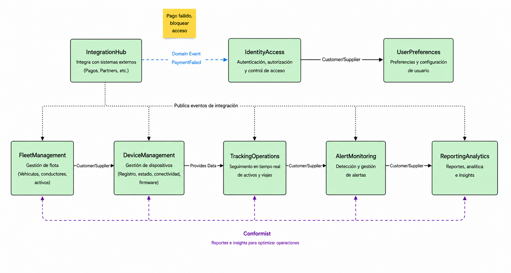

---

### 4.1.3. Software Architecture

#### 4.1.3.1. Software Architecture System Landscape Diagram

El **System Landscape Diagram** ofrece una visión general del **ecosistema empresarial** en el que opera OmniTrack. No se limita a un único sistema, sino que incluye los actores y plataformas relevantes, tanto internos como externos, involucrados en la operación logística.

### Propósito

Este diagrama tiene como finalidad:

1. Delimitar el alcance organizacional y la interacción entre sistemas.
2. Identificar a las **personas, sistemas internos, servicios SaaS y proveedores externos** involucrados.
3. Mostrar cómo **OmniTrack (SaaS)** se integra dentro de este entorno.

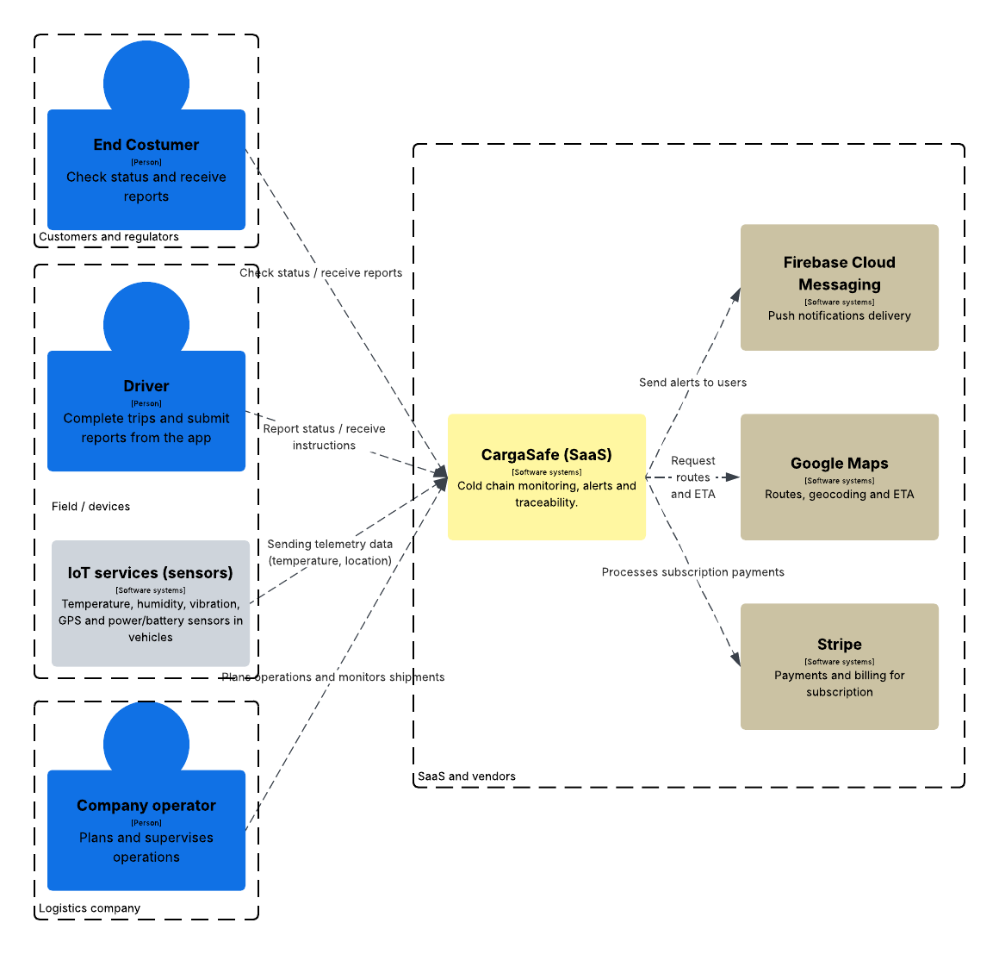

### Elementos incluidos

- **Actores**: Company Operator, Driver, End Customer  
- **Sistemas internos**: Logistics Planning, Power BI Data  
- **Servicios externos**: OmniTrack (SaaS), Stripe, Google Maps, Notification Services, IoT Devices  
- **Agrupaciones**:
  - Logistics company  
  - Field / Devices  
  - Customers and Regulators  
  - SaaS and Vendors  

### Relaciones principales

- Logistics Planning → OmniTrack: envío de planes y asignaciones  
- IoT Devices → OmniTrack: transmisión de telemetría (temperatura, humedad, vibración, inclinación, GPS, batería)  
- OmniTrack → Google Maps: consulta de rutas y tiempos estimados  
- OmniTrack → Notification Services: envío de alertas  
- OmniTrack → Stripe: procesamiento de pagos  
- OmniTrack → Power BI Data: exportación de datos consolidados  
- Company Operator / Driver ↔ OmniTrack: interacción operativa  
- End Customer ← OmniTrack: acceso a estado y reportes  

### Resultado

El diagrama posiciona a OmniTrack como el punto central de integración entre operaciones logísticas, dispositivos IoT y servicios externos, además de alimentar plataformas analíticas.

---

#### 4.1.3.2. Software Architecture Context Level Diagrams

El **Context Diagram** presenta una vista de alto nivel del sistema y sus interacciones con usuarios y servicios externos.

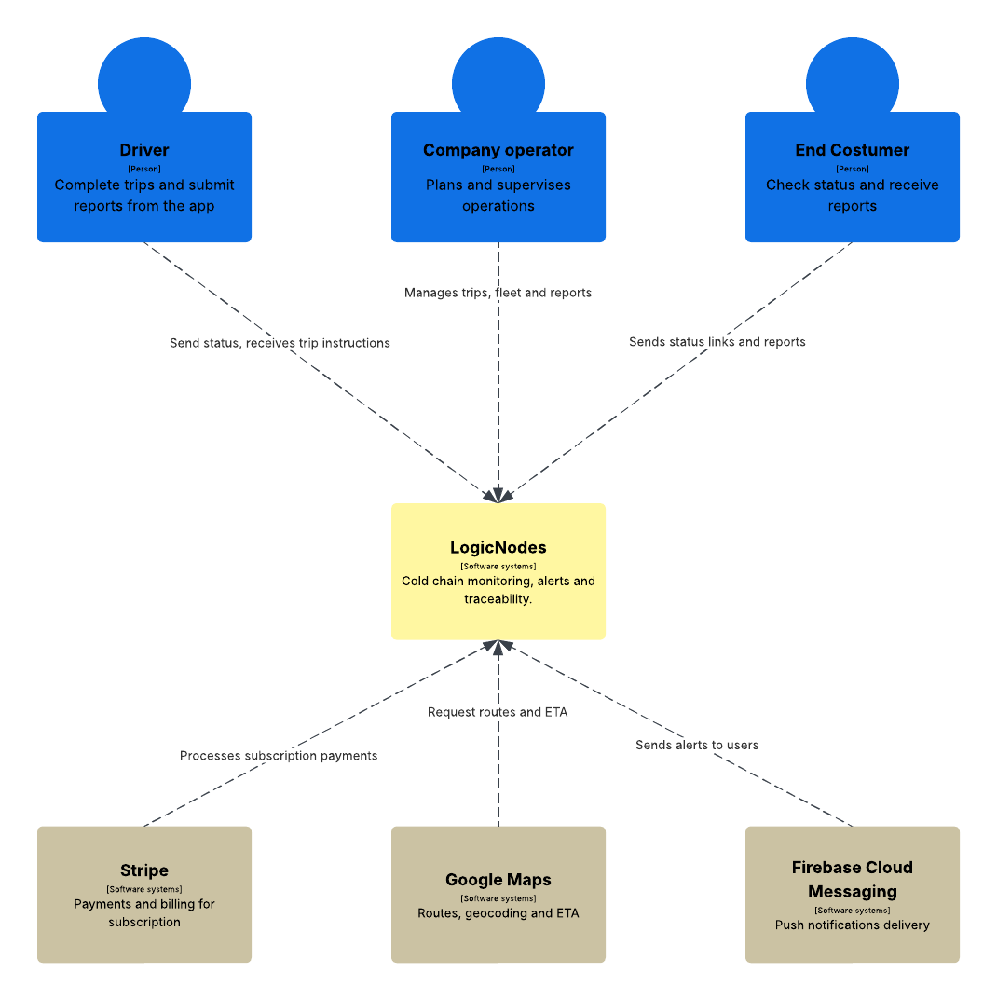

OmniTrack (SaaS) se ubica en el centro como el sistema encargado del monitoreo, la trazabilidad y la generación de alertas.

### Actores principales

- **Company Operator**: gestiona viajes, flota y reportes  
- **Driver**: ejecuta viajes y reporta información  
- **End Customer**: consulta estados y reportes  

### Sistemas externos

- Google Maps: rutas, geocodificación y ETA  
- Firebase Cloud Messaging: notificaciones push  
- Stripe: pagos y facturación  

Este diagrama permite identificar responsabilidades y flujos de interacción entre actores y servicios.

---

#### 4.1.3.2. Software Architecture Container Level Diagrams

En esta sección se detalla la estructura interna de **OmniTrack (SaaS)**, mostrando sus contenedores, tecnologías y comunicación.

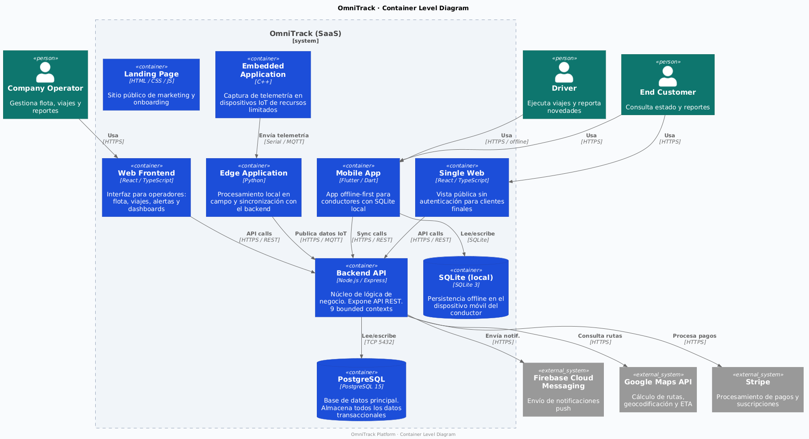

### Contenedores principales

- **Landing Page**: sitio público orientado a marketing  
- **Web Frontend**: interfaz para operadores  
- **Single Web**: vista pública para clientes sin autenticación  
- **Mobile App**: aplicación para conductores con enfoque offline-first y almacenamiento en SQLite  
- **Backend API**: núcleo de la lógica de negocio  
- **PostgreSQL**: base de datos principal  
- **Edge Application (Python)**: procesamiento local y sincronización  
- **Embedded Application (C++)**: captura de datos en dispositivos limitados  

### Interacción con usuarios

- Company Operator → Web Frontend  
- Driver → Mobile App  
- End Customer → Single Web / Mobile App  

### Integraciones externas

- Google Maps  
- Stripe  
- Firebase Cloud Messaging (FCM)  

Este nivel refleja una arquitectura modular que soporta operación tanto en línea como sin conectividad.

---

#### 4.1.3.3. Software Architecture Deployment Diagrams

El **Deployment Diagram** describe cómo se implementa OmniTrack en un entorno productivo, incluyendo infraestructura y comunicación entre componentes.

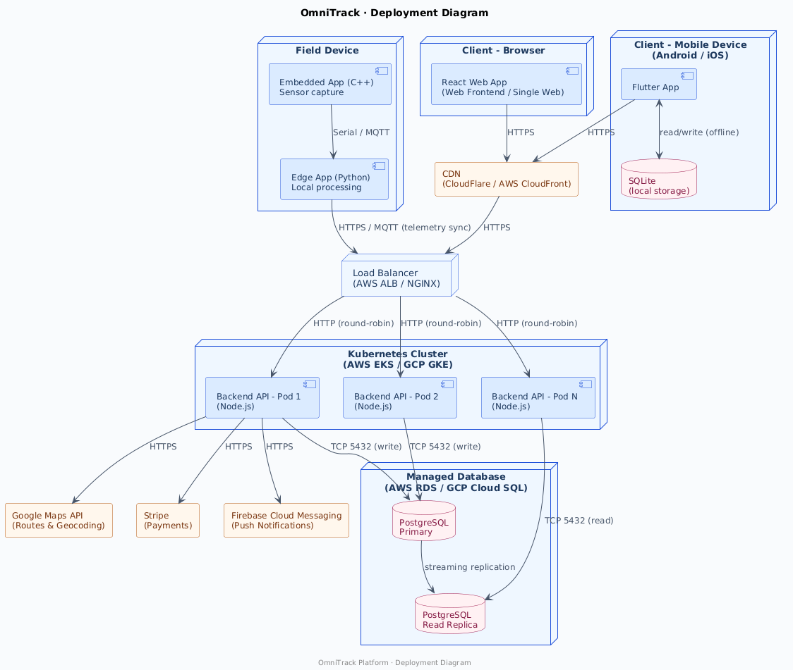

### Clientes

- Acceso web mediante CDNs (CloudFlare / AWS CloudFront)  
- Aplicación móvil Flutter con base de datos SQLite local  
- Comunicación vía HTTPS hacia un Load Balancer  

### Backend

- API desplegada en un clúster de Kubernetes con múltiples instancias  
- Gestión centralizada de lógica de negocio y procesamiento en tiempo real  

### Base de datos

- PostgreSQL gestionado (AWS RDS / Google Cloud SQL)  
- Instancia principal y réplicas de lectura  
- Persistencia local en SQLite para operación offline  

### Integraciones externas

- Google Maps: rutas y geolocalización  
- Stripe: pagos  
- Firebase Cloud Messaging: notificaciones push  

### Resultado

La arquitectura de despliegue refleja un enfoque *cloud-native* con:

- Separación de responsabilidades  
- Soporte offline en dispositivos móviles  
- Orquestación mediante Kubernetes  
- Distribución eficiente mediante CDNs  
- Base de datos escalable con replicación  
- Notificaciones en tiempo real  

Este diseño permite escalabilidad, resiliencia y continuidad operativa, incluso en escenarios con conectividad limitada.
## 4.2. Tactical-Level Domain-Driven Design
### 4.2.1. Bounded Context: AccessControl
#### 4.2.1.1. Domain Layer
_Entidades Principales_

**User (Aggregate Root)**

- **Propósito**: Representa al usuario autenticado dentro del sistema OmniTrack y administra su identidad, credenciales y roles de acceso.
- **Atributos principales**: `userId`, `username`, `email`, `passwordHash`, `firstName`, `lastName`, `enabled`, `roles`, `createdAt`, `updatedAt`.
- **Métodos principales**: creación mediante `RegisterUserCommand`; `assignRole(role)`, `revokeRole(role)`, `enable()`, `disable()`.

**Role (Entity)**

- **Propósito**: Define un conjunto de permisos asociados a un tipo de usuario dentro de la plataforma.
- **Atributos principales**: `roleId`, `name`, `permissions`.
- **Métodos principales**: Creación mediante `CreateRoleCommand`; `addPermission()`, `removePermission()`.

**Session (Value Object)**

- **Propósito**: Encapsula el contexto de autenticación activa de un usuario (token JWT y metadatos).
- **Atributos principales**: `token`, `issuedAt`, `expiresAt`, `userId`.

_Commands_

- `RegisterUserCommand`
- `LoginCommand`
- `LogoutCommand`
- `UpdateUserCommand`
- `ChangePasswordCommand`
- `AssignRoleCommand`

_Queries_

- `GetUserByIdQuery`
- `GetUserByEmailQuery`
- `GetAllUsersQuery`
- `GetRolesByUserQuery`

_Events_

- `UserRegisteredEvent`
- `UserLoggedInEvent`
- `UserRoleAssignedEvent`

#### 4.2.1.2. Interface Layer
**AuthController**

- `POST /api/v1/auth/register` — Registra un nuevo usuario en el sistema.
- `POST /api/v1/auth/login` — Autentica al usuario y retorna un token JWT.
- `POST /api/v1/auth/logout` — Invalida la sesión activa del usuario.
- `POST /api/v1/auth/refresh` — Renueva el token de acceso usando un refresh token.

**UserController**

- `GET /api/v1/users` — Lista todos los usuarios (solo administradores).
- `GET /api/v1/users/{userId}` — Obtiene el detalle de un usuario por ID.
- `PUT /api/v1/users/{userId}` — Actualiza los datos de un usuario.
- `DELETE /api/v1/users/{userId}` — Elimina un usuario del sistema.
- `PATCH /api/v1/users/{userId}/roles` — Asigna o revoca roles a un usuario.

#### 4.2.1.3. Application Layer
**Command Services**

- **AuthCommandService**: gestiona el registro, login y logout de usuarios; genera y valida tokens JWT; aplica hashing seguro de contraseñas.
- **UserCommandService**: orquesta la actualización de datos de usuario y la asignación de roles; valida unicidad de email y username.

**Query Services**

- **UserQueryService**: recupera usuarios por ID o email; lista todos los usuarios con filtros de paginación.
- **AuthQueryService**: verifica la validez de tokens; obtiene el usuario asociado a una sesión activa.

**Event Handlers**

- **UserRegisteredEventHandler**: envía correo de bienvenida al registrar un nuevo usuario.
- **UserLoggedInEventHandler**: registra el historial de accesos.

#### 4.2.1.4. Infrastructure Layer
**Repositories**

- **UserRepository**: persistencia de usuarios (`findByEmail`, `findByUsername`, `existsByEmail`).
- **RoleRepository**: gestión de roles (`findByName`, `findAll`).
- **TokenRevocationRepository**: almacena tokens invalidados para prevenir reutilización.

**Persistence & Configuration**

- **Base de datos**: PostgreSQL — almacena usuarios, roles, permisos y sesiones.
- **Seguridad**: BCrypt para hashing de contraseñas; JWT para autenticación stateless.
- **Variables de entorno**: `JWT_SECRET`, `JWT_EXPIRATION_MS`, `DB_URL`, `DB_USERNAME`, `DB_PASSWORD`.

#### AccessControl – Component Level Diagrams

##### Backend

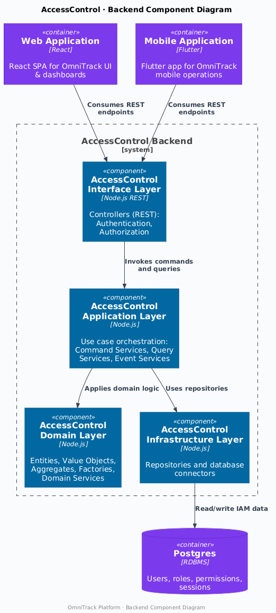

##### Mobile

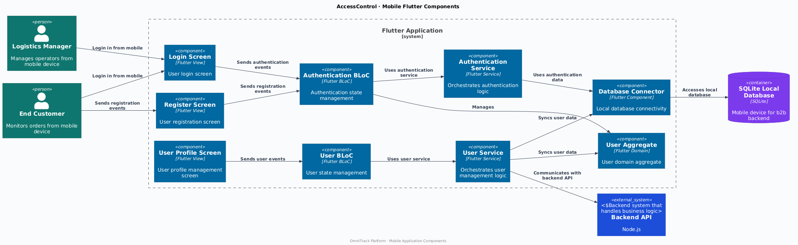

##### WebApp

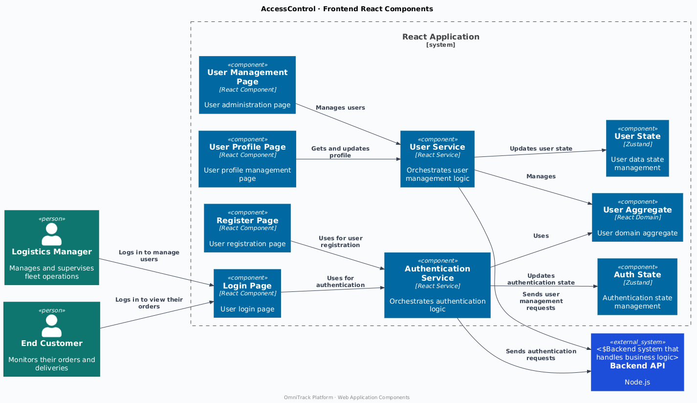

#### 4.2.1.6. Bounded Context Software Architecture Code Level Diagrams
##### 4.2.1.6.1. Bounded Context Domain Layer Class Diagrams

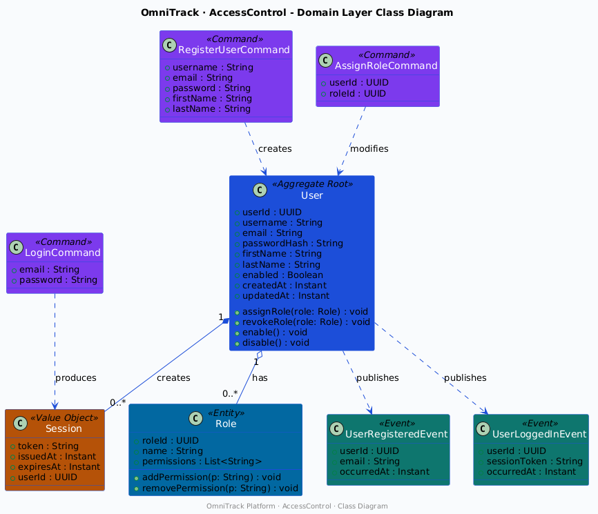

##### 4.2.1.6.2. Bounded Context Database Design Diagram

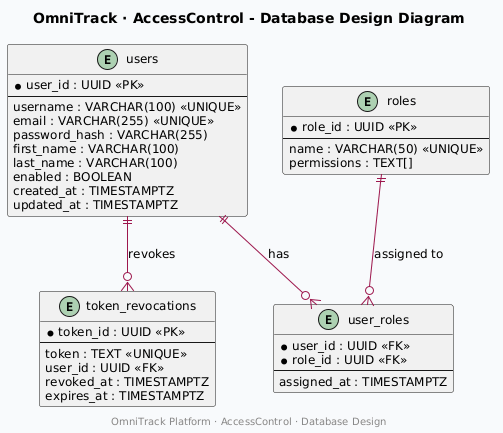
### 4.2.2. Bounded Context: Subscriptions and Billing
#### 4.2.2.1. Domain Layer
#### 4.2.2.2. Interface Layer
#### 4.2.2.3. Application Layer
#### 4.2.2.4. Infrastructure Layer

#### 4.2.2.5. Bounded Context Software Architecture Component Level Diagrams
## Diagrama de componentes – Backend – Subscriptions and Billing

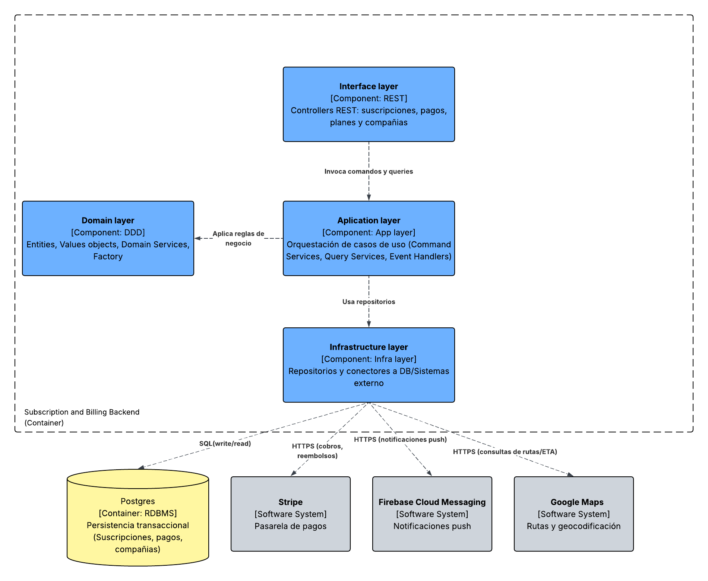

El backend correspondiente al bounded context de Suscripciones y Pagos se estructura en cuatro capas principales:

- **Interface Layer**: contiene los controladores REST encargados de atender solicitudes relacionadas con suscripciones, pagos, planes y compañías. Actúa como punto de acceso para usuarios y sistemas externos que consumen la API.
- **Application Layer**: gestiona la ejecución de los casos de uso mediante Command Services, Query Services y Event Handlers. En esta capa se coordinan las operaciones y se invocan las reglas de negocio necesarias.
- **Domain Layer**: reúne la lógica central del negocio, incluyendo entidades, objetos de valor, servicios de dominio y fábricas. Define las reglas que gobiernan el ciclo de vida de las suscripciones y los pagos.
- **Infrastructure Layer**: proporciona implementaciones concretas de repositorios y conectores hacia bases de datos y servicios externos. Se encarga de la persistencia y la integración técnica.

Las integraciones externas consideradas son:

- Postgres, utilizado para la persistencia transaccional de datos como suscripciones, pagos y compañías.
- Stripe, empleado para la gestión y procesamiento de pagos.
- Firebase Cloud Messaging (FCM), utilizado para el envío de notificaciones push.
- Google Maps, usado para consultas de rutas y estimaciones de tiempo (ETA).

---

## Diagrama de componentes – Application Web – Subscriptions and Billing

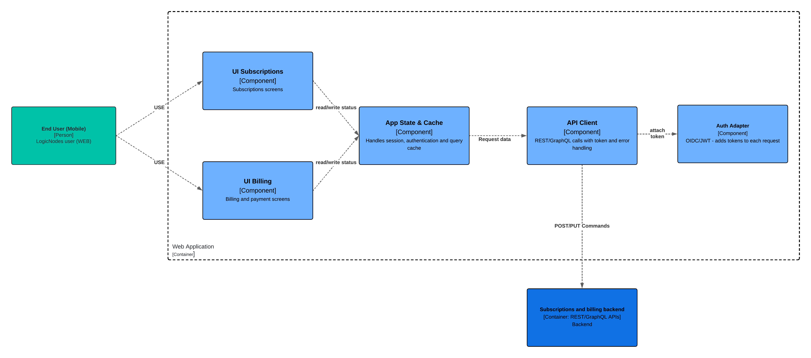

La aplicación web interactúa con el bounded context **Subscriptions & Billing** exclusivamente mediante APIs:

- _Subscriptions API_: utilizada para ejecutar acciones como crear o cancelar suscripciones.
- _Query API_: destinada a la consulta de información como planes o facturas.

En el cliente, la aplicación se organiza en tres componentes principales:

- **UI (interfaz de usuario)**: incluye las vistas relacionadas con suscripciones, pagos y facturación.
- **Estado de la aplicación**: administra la sesión del usuario, el almacenamiento en caché de consultas y la autenticación.
- **Servicios de datos**: implementa el cliente HTTP encargado de consumir las APIs, añadir el token de seguridad y manejar reintentos o errores.

La lógica de negocio no reside en el frontend; su función se limita a presentar información y enviar las acciones del usuario al backend. Las validaciones, reglas y persistencia se gestionan completamente en el servidor.

---

## Diagrama de componentes – Mobile Application – Subscriptions and Billing

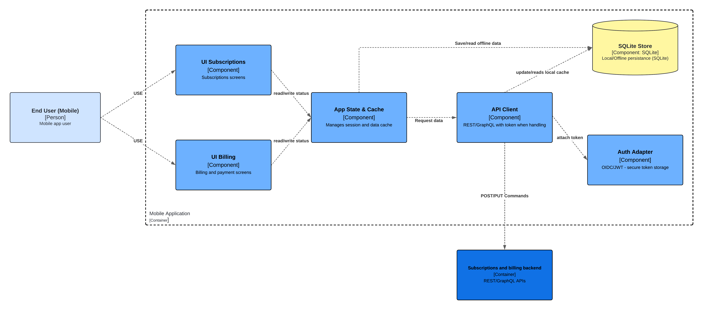

La aplicación móvil de **Subscriptions & Billing** sigue una arquitectura similar a la versión web, ya que también se comunica con el backend mediante:

- _Subscriptions API_
- _Query API_

Como diferencia principal, incorpora una base de datos local (SQLite), lo que permite operar en modo offline: la aplicación puede almacenar datos localmente y continuar funcionando sin conexión, sincronizando la información cuando se restablece el acceso a internet.

Su estructura incluye:

- Pantallas orientadas a suscripciones y facturación.
- Un estado de aplicación que controla la sesión y el caché.
- Un cliente de API que gestiona las solicitudes al backend incorporando el token de autenticación.

Al igual que en la versión web, toda la lógica de negocio se mantiene en el backend; el cliente únicamente se encarga de la visualización de datos y del envío de las acciones realizadas por el usuario.

#### 4.2.2.6. Bounded Context Software Architecture Code Level Diagrams
#### 4.2.2.6.1. Bounded Context Domain Layer Class Diagrams
#### 4.2.2.6.2. Bounded Context Database Design Diagram
### 4.2.3. Bounded Context: EventWatch
#### 4.2.3.1. Domain Layer
_Entidades Principales_

**Alert (Aggregate Root)**

- **Propósito**: Representa una alerta generada por un dispositivo IoT o por el sistema ante una condición anómala detectada durante el monitoreo.
- **Atributos principales**: `alertId`, `deviceId`, `tripId`, `type` (TEMPERATURE, HUMIDITY, VIBRATION, GPS), `severity` (LOW, MEDIUM, HIGH, CRITICAL), `status` (OPEN, ACKNOWLEDGED, RESOLVED), `message`, `triggeredAt`, `resolvedAt`.
- **Métodos principales**: creación mediante `CreateAlertCommand`; `acknowledge()`, `resolve(resolution)`.

**Incident (Entity)**

- **Propósito**: Agrupa una o más alertas relacionadas en un evento de mayor impacto que requiere seguimiento operativo.
- **Atributos principales**: `incidentId`, `alertIds`, `assignedTo`, `status` (OPEN, IN_PROGRESS, CLOSED), `description`, `createdAt`, `closedAt`.
- **Métodos principales**: creación mediante `CreateIncidentCommand`; `assignTo(userId)`, `close(summary)`.

**Notification (Entity)**

- **Propósito**: Registra las notificaciones enviadas a los usuarios ante la generación o actualización de alertas.
- **Atributos principales**: `notificationId`, `userId`, `alertId`, `channel` (PUSH, EMAIL, SMS), `sentAt`, `delivered`.

_Commands_

- `CreateAlertCommand`
- `AcknowledgeAlertCommand`
- `ResolveAlertCommand`
- `CreateIncidentCommand`
- `CloseIncidentCommand`
- `SendNotificationCommand`

_Queries_

- `GetAlertByIdQuery`
- `GetAlertsByDeviceQuery`
- `GetAlertsByTripQuery`
- `GetActiveIncidentsQuery`
- `GetNotificationsByUserQuery`

_Events_

- `AlertCreatedEvent`
- `AlertResolvedEvent`
- `IncidentCreatedEvent`

#### 4.2.3.2. Interface Layer
**AlertController**

- `POST /api/v1/alerts` — Registra una nueva alerta en el sistema.
- `GET /api/v1/alerts` — Lista todas las alertas con filtros por estado y severidad.
- `GET /api/v1/alerts/{alertId}` — Obtiene el detalle de una alerta.
- `PATCH /api/v1/alerts/{alertId}/acknowledge` — Marca la alerta como reconocida.
- `PATCH /api/v1/alerts/{alertId}/resolve` — Marca la alerta como resuelta.

**IncidentController**

- `POST /api/v1/incidents` — Crea un nuevo incidente agrupando alertas.
- `GET /api/v1/incidents` — Lista incidentes activos.
- `GET /api/v1/incidents/{incidentId}` — Obtiene el detalle de un incidente.
- `PATCH /api/v1/incidents/{incidentId}/close` — Cierra un incidente con resumen de resolución.

**NotificationController**

- `GET /api/v1/notifications/user/{userId}` — Lista notificaciones enviadas a un usuario.

#### 4.2.3.3. Application Layer
**Command Services**

- **AlertCommandService**: crea alertas validando el tipo y severidad; actualiza su estado mediante acknowledge y resolve; publica `AlertCreatedEvent` y `AlertResolvedEvent`.
- **IncidentCommandService**: agrupa alertas en incidentes; gestiona asignación y cierre; publica `IncidentCreatedEvent`.
- **NotificationCommandService**: envía notificaciones a través del canal configurado (push, email, SMS) al crearse o actualizarse una alerta.

**Query Services**

- **AlertQueryService**: recupera alertas por ID, dispositivo o viaje; filtra por estado y severidad.
- **IncidentQueryService**: lista incidentes activos o históricos; recupera por ID.
- **NotificationQueryService**: lista notificaciones por usuario.

**Event Handlers**

- **AlertCreatedEventHandler**: dispara el envío de notificaciones push vía Firebase Cloud Messaging al crearse una alerta crítica.

#### 4.2.3.4. Infrastructure Layer
**Repositories**

- **AlertRepository**: persistencia de alertas (`findByDeviceId`, `findByTripId`, `findByStatus`).
- **IncidentRepository**: gestión de incidentes (`findByStatus`, `findByAssignedTo`).
- **NotificationRepository**: registro de notificaciones enviadas (`findByUserId`).

**Persistence & Configuration**

- **Base de datos**: PostgreSQL — almacena alertas, incidentes y el historial de notificaciones.
- **Mensajería**: Firebase Cloud Messaging (FCM) para envío de notificaciones push.
- **Variables de entorno**: `FCM_SERVER_KEY`, `FCM_PROJECT_ID`, `DB_URL`.

#### EventWatch – Component Level Diagrams

##### Backend

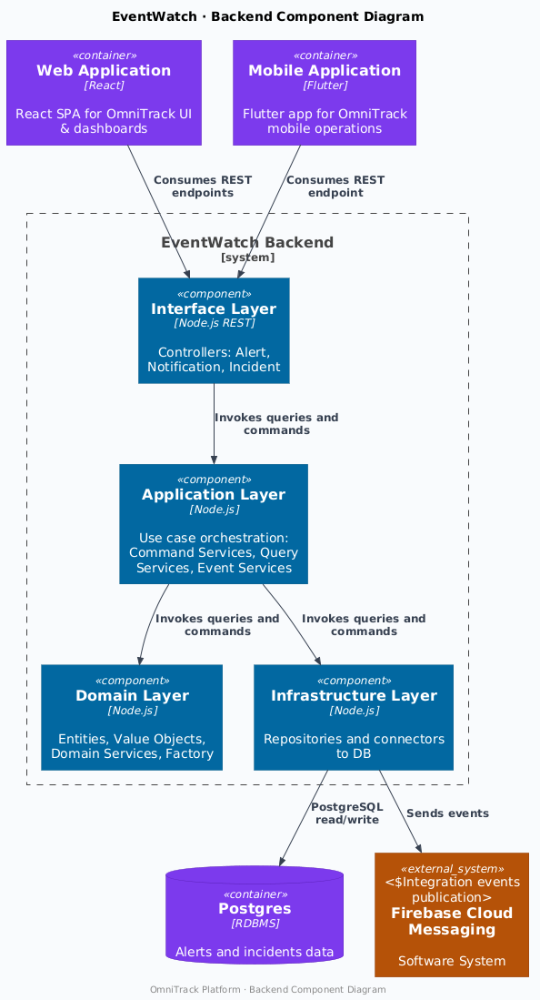

##### Mobile Application

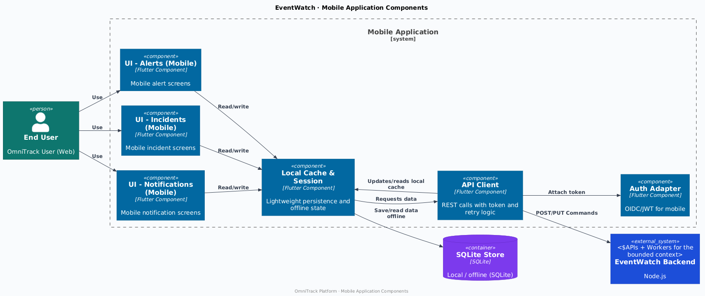

##### Web Application

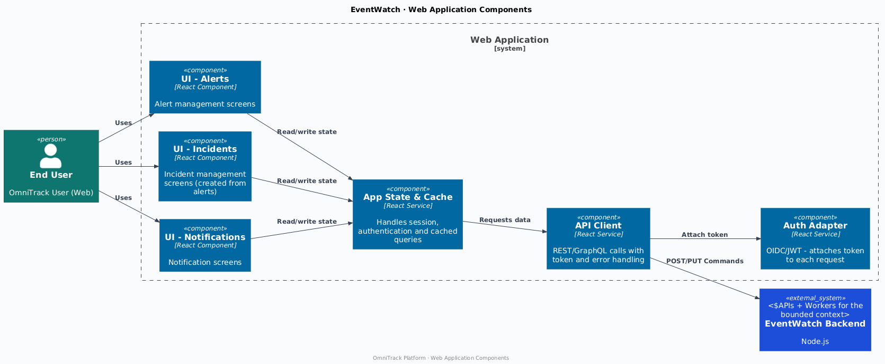

#### 4.2.3.6. Bounded Context Software Architecture Code Level Diagrams
##### 4.2.3.6.1. Bounded Context Domain Layer Class Diagrams

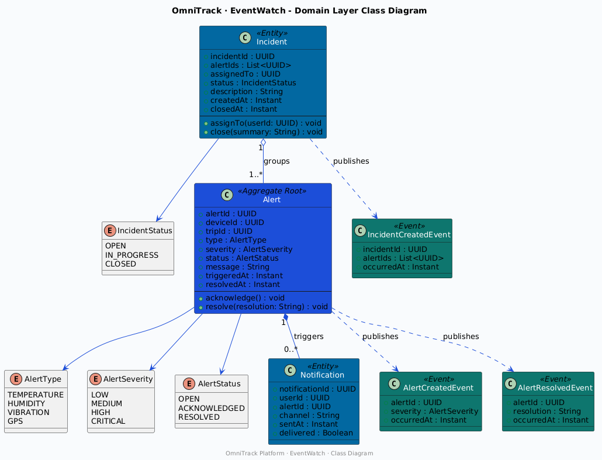

##### 4.2.3.6.2. Bounded Context Database Design Diagram

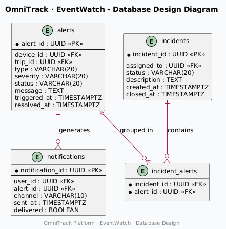
### 4.2.4. Bounded Context: LiveTracking
#### 4.2.4.1. Domain Layer.
_Entidades Principales_

**MonitoringSession (Aggregate Root)**

- **Propósito**: Representa una sesión activa de monitoreo asociada a un viaje y su vehículo, durante la cual se recopilan datos de telemetría en tiempo real.
- **Atributos principales**: `sessionId`, `tripId`, `vehicleId`, `deviceId`, `status` (ACTIVE, PAUSED, CLOSED), `startedAt`, `closedAt`.
- **Métodos principales**: creación mediante `StartSessionCommand`; `pause()`, `resume()`, `close()`.

**TelemetryRecord (Entity)**

- **Propósito**: Almacena una lectura puntual de los sensores IoT del dispositivo en un instante dado.
- **Atributos principales**: `recordId`, `sessionId`, `temperature`, `humidity`, `vibration`, `inclination`, `batteryLevel`, `latitude`, `longitude`, `recordedAt`.
- **Métodos principales**: creación mediante `RecordTelemetryCommand`.

**SensorThreshold (Value Object)**

- **Propósito**: Define los rangos aceptables para cada tipo de sensor, usados para evaluar si se debe generar una alerta.
- **Atributos principales**: `sensorType`, `minValue`, `maxValue`, `unit`.

_Commands_

- `StartSessionCommand`
- `PauseSessionCommand`
- `ResumeSessionCommand`
- `CloseSessionCommand`
- `RecordTelemetryCommand`

_Queries_

- `GetSessionByTripQuery`
- `GetSessionByVehicleQuery`
- `GetTelemetryBySessionQuery`
- `GetLatestTelemetryQuery`

_Events_

- `SessionStartedEvent`
- `TelemetryRecordedEvent`
- `ThresholdExceededEvent`

#### 4.2.4.2. Interface Layer.
**MonitoringController**

- `POST /api/v1/monitoring/sessions` — Inicia una nueva sesión de monitoreo.
- `GET /api/v1/monitoring/sessions/{sessionId}` — Obtiene el estado de una sesión.
- `GET /api/v1/monitoring/sessions/trip/{tripId}` — Recupera la sesión activa de un viaje.
- `PATCH /api/v1/monitoring/sessions/{sessionId}/close` — Cierra una sesión de monitoreo.

**TelemetryConsumer** _(event consumer)_

- Consume eventos de telemetría publicados por dispositivos IoT via message broker.
- Procesa y persiste lecturas de sensores en tiempo real.

**TripEventConsumer** _(event consumer)_

- Consume eventos de inicio y fin de viaje para gestionar el ciclo de vida de las sesiones.

#### 4.2.4.3. Application Layer.
**Command Services**

- **MonitoringSessionCommandService**: crea, pausa, reanuda y cierra sesiones de monitoreo; valida que un viaje no tenga más de una sesión activa.
- **TelemetryCommandService**: persiste registros de telemetría; evalúa umbrales y publica `ThresholdExceededEvent` si se detecta una condición anómala.

**Query Services**

- **MonitoringSessionQueryService**: recupera sesiones por viaje, vehículo o estado.
- **TelemetryQueryService**: obtiene el historial de telemetría de una sesión; retorna la última lectura disponible.

**Event Handlers**

- **ThresholdExceededEventHandler**: delega al bounded context EventWatch la creación de una alerta al superar un umbral de sensor.

#### 4.2.4.4. Infrastructure Layer.
**Repositories**

- **MonitoringSessionRepository**: persistencia de sesiones (`findByTripId`, `findByVehicleId`, `findByStatus`).
- **TelemetryRecordRepository**: almacenamiento de lecturas (`findBySessionId`, `findLatestBySessionId`).

**Persistence & Configuration**

- **Base de datos**: PostgreSQL — almacena sesiones de monitoreo y registros de telemetría.
- **Consumers**: listeners de eventos IoT para ingesta de telemetría en tiempo real.
- **Variables de entorno**: `DB_URL`, `BROKER_URL`, `BROKER_TOPIC_TELEMETRY`.

#### LiveTracking – Component Level Diagrams

##### Backend

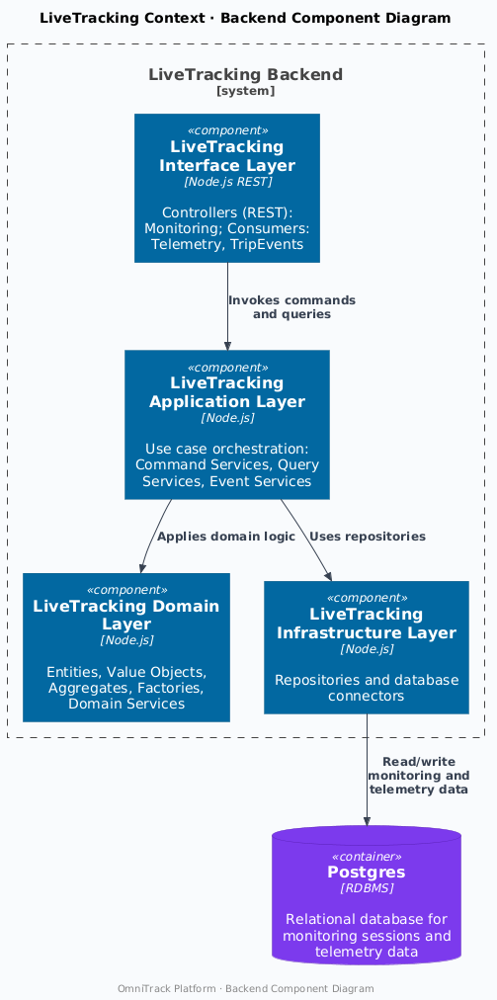

##### Mobile Application

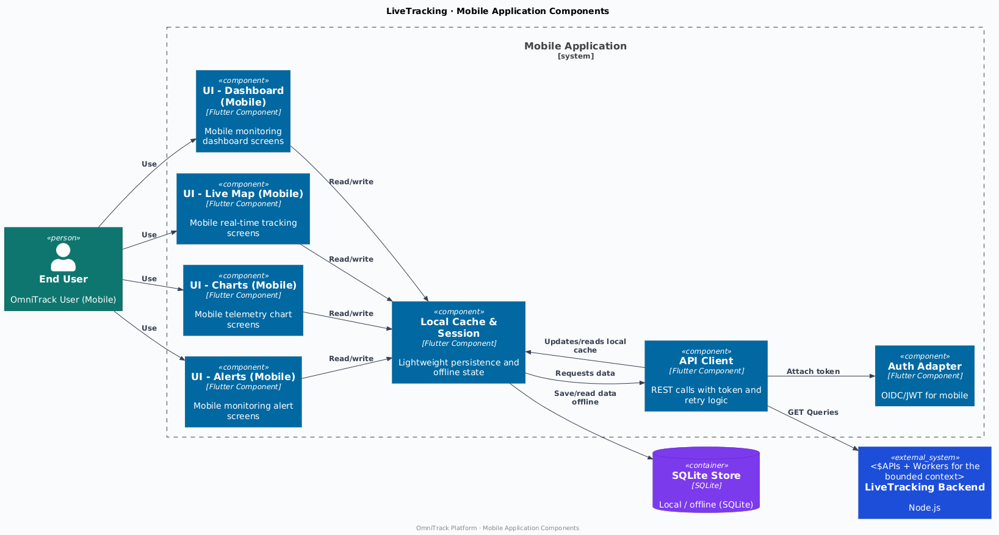

##### Web Application

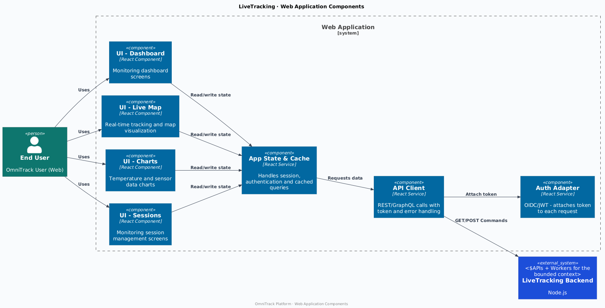

#### 4.2.4.6. Bounded Context Software Architecture Code Level Diagrams
##### 4.2.4.6.1. Bounded Context Domain Layer Class Diagrams

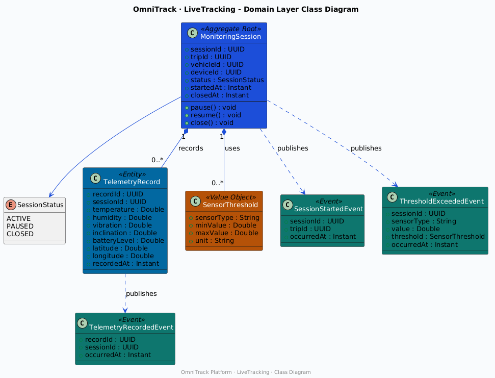

##### 4.2.4.6.2. Bounded Context Database Design Diagram

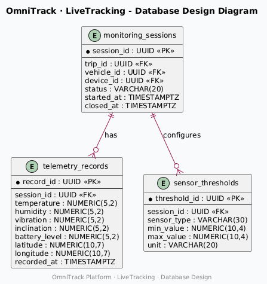
### 4.2.5. Bounded Context: RouteControl
#### 4.2.5.1. Domain Layer.
_Entidades Principales_

**Trip (Aggregate Root)**

- **Propósito**: Representa un viaje logístico desde su planificación hasta su conclusión, incluyendo la ruta asignada, el conductor y el vehículo.
- **Atributos principales**: `tripId`, `vehicleId`, `driverId`, `routeId`, `status` (PLANNED, IN_PROGRESS, COMPLETED, CANCELLED), `scheduledAt`, `startedAt`, `completedAt`, `cargo`.
- **Métodos principales**: creación mediante `CreateTripCommand`; `start()`, `complete(report)`, `cancel(reason)`.

**Route (Entity)**

- **Propósito**: Define la ruta geográfica de un viaje, incluyendo origen, destino y puntos de paso intermedios.
- **Atributos principales**: `routeId`, `origin`, `destination`, `waypoints`, `estimatedDuration`, `distanceKm`, `polyline`.
- **Métodos principales**: creación mediante `CreateRouteCommand`; `addWaypoint()`.

**Checkpoint (Value Object)**

- **Propósito**: Representa un punto de control en la ruta donde se espera que el conductor confirme su presencia.
- **Atributos principales**: `location`, `expectedArrival`, `confirmedAt`.

_Commands_

- `CreateTripCommand`
- `StartTripCommand`
- `CompleteTripCommand`
- `CancelTripCommand`
- `CreateRouteCommand`
- `ConfirmCheckpointCommand`

_Queries_

- `GetTripByIdQuery`
- `GetTripsByVehicleQuery`
- `GetTripsByDriverQuery`
- `GetActiveTripsQuery`
- `GetRouteByIdQuery`

_Events_

- `TripCreatedEvent`
- `TripStartedEvent`
- `TripCompletedEvent`

#### 4.2.5.2. Interface Layer.
**TripController**

- `POST /api/v1/trips` — Crea un nuevo viaje planificado.
- `GET /api/v1/trips` — Lista viajes con filtros por estado, conductor o vehículo.
- `GET /api/v1/trips/{tripId}` — Obtiene el detalle de un viaje.
- `PATCH /api/v1/trips/{tripId}/start` — Inicia un viaje planificado.
- `PATCH /api/v1/trips/{tripId}/complete` — Completa un viaje con reporte final.
- `PATCH /api/v1/trips/{tripId}/cancel` — Cancela un viaje indicando la razón.

**RouteController**

- `POST /api/v1/routes` — Crea una nueva ruta con origen, destino y waypoints.
- `GET /api/v1/routes/{routeId}` — Obtiene los detalles de una ruta.
- `GET /api/v1/routes/trip/{tripId}` — Recupera la ruta asignada a un viaje.

#### 4.2.5.3. Application Layer.
**Command Services**

- **TripCommandService**: crea, inicia, completa y cancela viajes; valida disponibilidad del vehículo y el conductor; publica `TripCreatedEvent`, `TripStartedEvent` y `TripCompletedEvent`.
- **RouteCommandService**: crea rutas calculando distancia y duración estimada a través del adaptador de Google Maps.

**Query Services**

- **TripQueryService**: recupera viajes por ID, conductor, vehículo o estado; soporta paginación.
- **RouteQueryService**: obtiene rutas por ID o por viaje asociado.

**Event Handlers**

- **TripStartedEventHandler**: notifica al bounded context LiveTracking para iniciar la sesión de monitoreo correspondiente.
- **TripCompletedEventHandler**: cierra la sesión de monitoreo activa al finalizar el viaje.

#### 4.2.5.4. Infrastructure Layer.
**Repositories**

- **TripRepository**: persistencia de viajes (`findByVehicleId`, `findByDriverId`, `findByStatus`).
- **RouteRepository**: almacenamiento de rutas (`findByTripId`).

**Persistence & Configuration**

- **Base de datos**: PostgreSQL — almacena viajes, rutas y checkpoints.
- **Integración externa**: Google Maps API para cálculo de rutas, distancias y tiempos estimados.
- **Variables de entorno**: `GOOGLE_MAPS_API_KEY`, `DB_URL`.

#### RouteControl – Component Level Diagrams

##### Backend

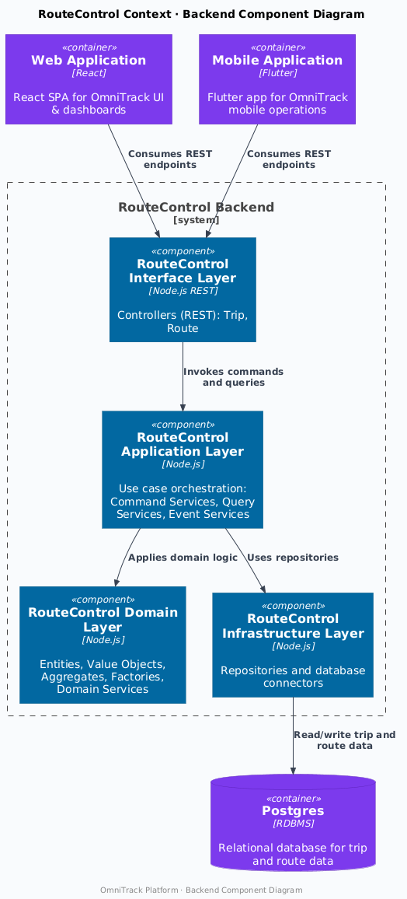

##### Mobile Application

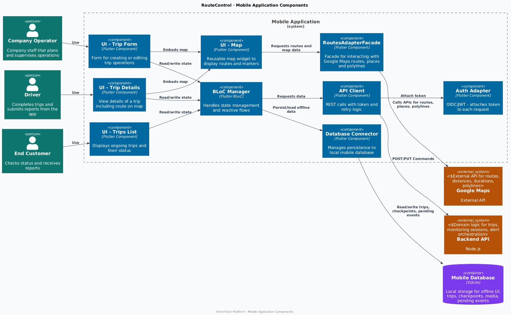

##### Web Application

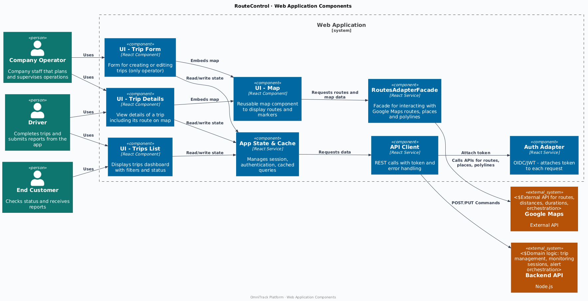

#### 4.2.5.6. Bounded Context Software Architecture Code Level Diagrams.
##### 4.2.5.6.1. Bounded Context Domain Layer Class Diagrams.

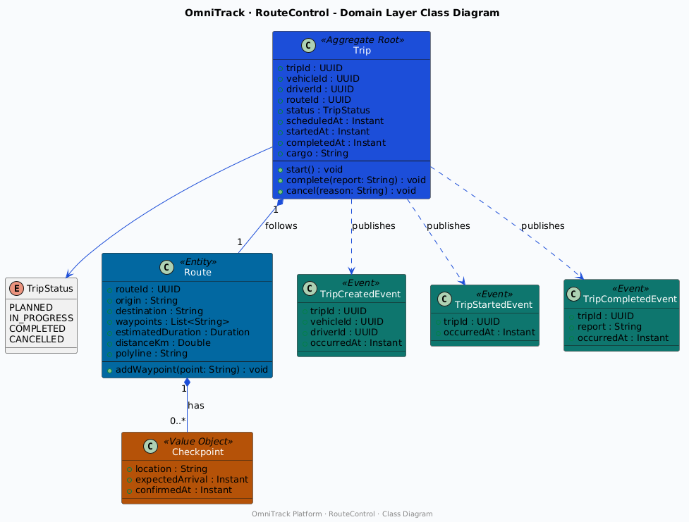

##### 4.2.5.6.2. Bounded Context Database Design Diagram.

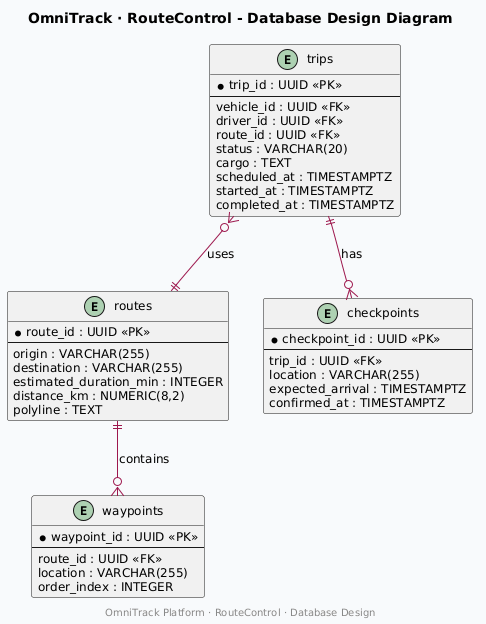
### 4.2.6. Bounded Context: AssetRegistry
#### 4.2.6.1. Domain Layer
_Entidades Principales_

**Vehicle (Aggregate Root)**

- **Propósito**: Representa un vehículo de la flota logística, incluyendo su información técnica, estado operativo y el dispositivo IoT asociado.
- **Atributos principales**: `vehicleId`, `plate`, `brand`, `model`, `year`, `status` (ACTIVE, INACTIVE, MAINTENANCE), `deviceId`, `assignedDriverId`, `createdAt`.
- **Métodos principales**: creación mediante `RegisterVehicleCommand`; `activate()`, `deactivate()`, `assignDevice(deviceId)`, `removeDevice()`.

**Device (Entity)**

- **Propósito**: Representa un dispositivo IoT instalable en un vehículo para la captura de telemetría en campo.
- **Atributos principales**: `deviceId`, `serialNumber`, `model`, `firmwareVersion`, `status` (AVAILABLE, ATTACHED, OFFLINE), `vehicleId`, `lastPingAt`.
- **Métodos principales**: creación mediante `RegisterDeviceCommand`; `attach(vehicleId)`, `detach()`, `markOffline()`.

**DeviceAttachment (Value Object)**

- **Propósito**: Registra el historial de vinculaciones entre dispositivos y vehículos.
- **Atributos principales**: `deviceId`, `vehicleId`, `attachedAt`, `detachedAt`.

_Commands_

- `RegisterVehicleCommand`
- `UpdateVehicleCommand`
- `ActivateVehicleCommand`
- `DeactivateVehicleCommand`
- `RegisterDeviceCommand`
- `AttachDeviceCommand`
- `DetachDeviceCommand`

_Queries_

- `GetVehicleByIdQuery`
- `GetAllVehiclesQuery`
- `GetDeviceByIdQuery`
- `GetDevicesByVehicleQuery`
- `GetAvailableDevicesQuery`

_Events_

- `VehicleRegisteredEvent`
- `DeviceAttachedEvent`
- `DeviceDetachedEvent`

#### 4.2.6.2. Interface Layer
**VehicleController**

- `POST /api/v1/vehicles` — Registra un nuevo vehículo en la flota.
- `GET /api/v1/vehicles` — Lista todos los vehículos con filtros por estado.
- `GET /api/v1/vehicles/{vehicleId}` — Obtiene el detalle de un vehículo.
- `PUT /api/v1/vehicles/{vehicleId}` — Actualiza la información de un vehículo.
- `PATCH /api/v1/vehicles/{vehicleId}/activate` — Activa un vehículo.
- `PATCH /api/v1/vehicles/{vehicleId}/deactivate` — Desactiva un vehículo.

**DeviceController**

- `POST /api/v1/devices` — Registra un nuevo dispositivo IoT.
- `GET /api/v1/devices` — Lista todos los dispositivos disponibles.
- `GET /api/v1/devices/{deviceId}` — Obtiene el detalle de un dispositivo.
- `POST /api/v1/devices/{deviceId}/attach` — Vincula un dispositivo a un vehículo.
- `POST /api/v1/devices/{deviceId}/detach` — Desvincula un dispositivo de su vehículo actual.

#### 4.2.6.3. Application Layer
**Command Services**

- **VehicleCommandService**: registra y actualiza vehículos; gestiona activación/desactivación; valida unicidad de placa.
- **DeviceCommandService**: registra dispositivos; gestiona la vinculación/desvinculación a vehículos; valida que un dispositivo solo esté asociado a un vehículo a la vez; publica `DeviceAttachedEvent` y `DeviceDetachedEvent`.

**Query Services**

- **VehicleQueryService**: recupera vehículos por ID o estado; soporta filtros por conductor asignado.
- **DeviceQueryService**: lista dispositivos disponibles; recupera dispositivos por vehículo o por estado.

#### 4.2.6.4. Infrastructure Layer
**Repositories**

- **VehicleRepository**: persistencia de vehículos (`findByPlate`, `findByStatus`, `findByAssignedDriverId`).
- **DeviceRepository**: gestión de dispositivos (`findBySerialNumber`, `findByVehicleId`, `findByStatus`).

**Persistence & Configuration**

- **Base de datos**: PostgreSQL — almacena vehículos, dispositivos y el historial de vinculaciones.
- **Integración interna**: IAMClient adapter para validar que el conductor asignado exista en el bounded context AccessControl.
- **Variables de entorno**: `DB_URL`, `IAM_SERVICE_URL`.

#### AssetRegistry – Component Level Diagrams

##### Backend

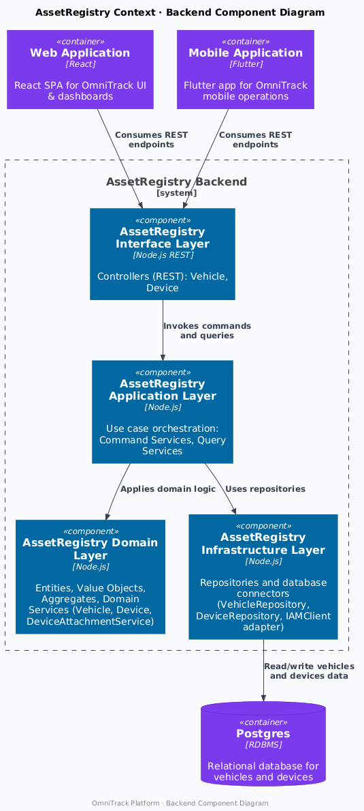

##### Mobile Application

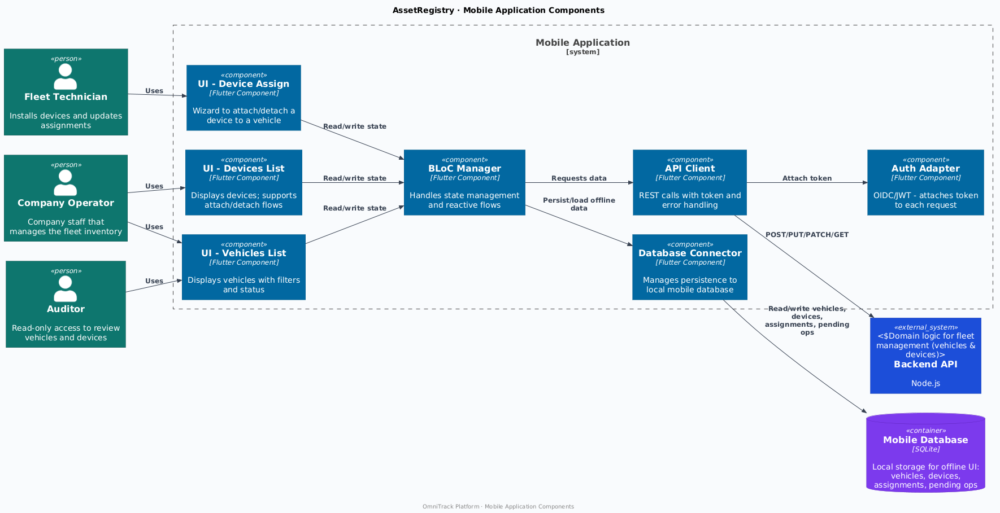

##### Web Application

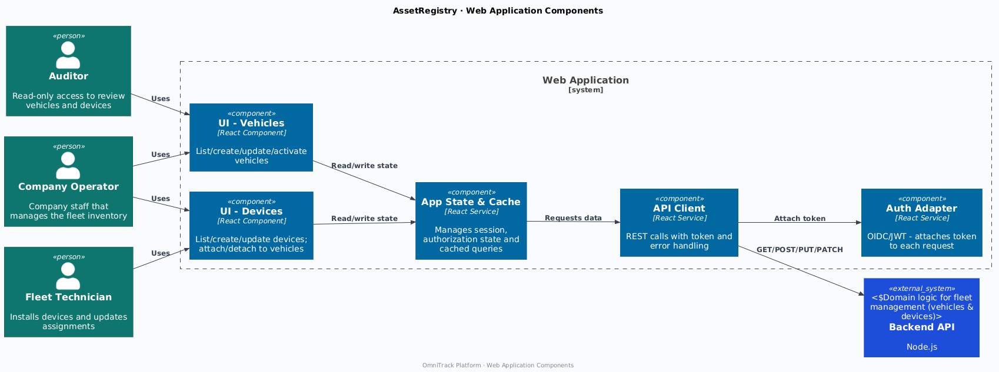

#### 4.2.5.6. Bounded Context Software Architecture Code Level Diagrams.
##### 4.2.5.6.1. Bounded Context Domain Layer Class Diagrams.

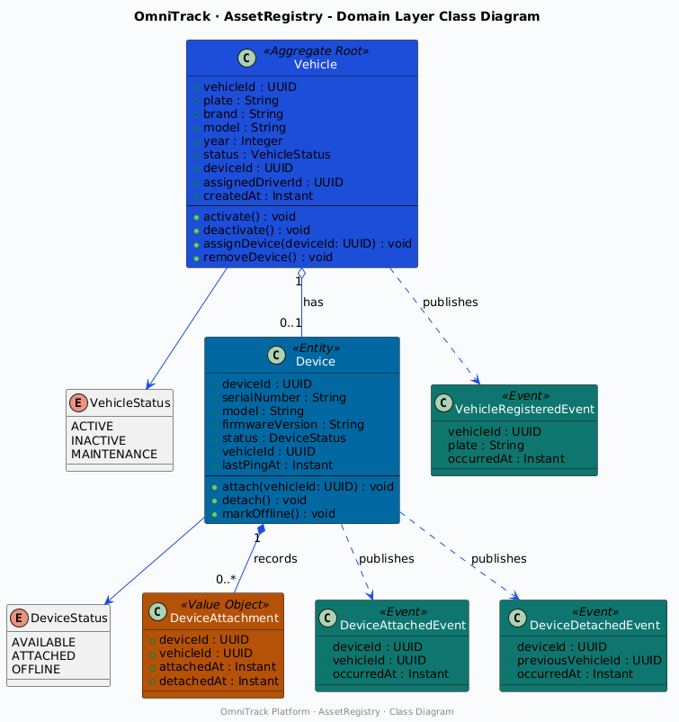

##### 4.2.5.6.2. Bounded Context Database Design Diagram.

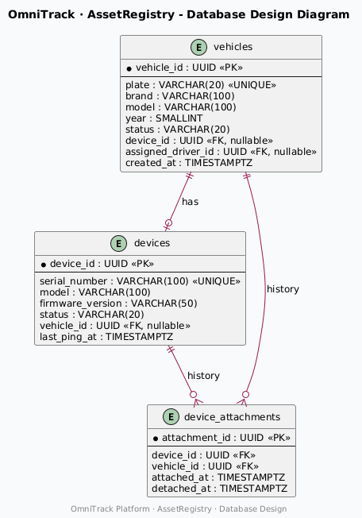

### 4.2.7. Bounded Context: UserSettings
#### 4.2.7.1. Domain Layer.
_Entidades Principales_

**UserProfile (Aggregate Root)**

- **Propósito**: Representa el perfil público y los datos personales de un usuario registrado en OmniTrack.
- **Atributos principales**: `profileId`, `userId`, `firstName`, `lastName`, `phone`, `avatarUrl`, `companyName`, `createdAt`, `updatedAt`.
- **Métodos principales**: creación mediante `CreateProfileCommand`; `update(data)`, `updateAvatar(url)`.

**Preferences (Entity)**

- **Propósito**: Almacena las preferencias de notificación y configuración de la interfaz de cada usuario.
- **Atributos principales**: `preferencesId`, `userId`, `emailNotifications`, `pushNotifications`, `smsNotifications`, `language`, `timezone`.
- **Métodos principales**: creación mediante `CreatePreferencesCommand`; `updateNotifications(settings)`, `updateLocale(language, timezone)`.

_Commands_

- `CreateProfileCommand`
- `UpdateProfileCommand`
- `UpdateAvatarCommand`
- `CreatePreferencesCommand`
- `UpdatePreferencesCommand`

_Queries_

- `GetProfileByUserIdQuery`
- `GetPreferencesByUserIdQuery`

_Events_

- `ProfileUpdatedEvent`
- `PreferencesUpdatedEvent`

#### 4.2.7.2. Interface Layer.
**ProfileController**

- `POST /api/v1/profiles` — Crea el perfil de un usuario.
- `GET /api/v1/profiles/user/{userId}` — Obtiene el perfil de un usuario por su ID.
- `PUT /api/v1/profiles/{profileId}` — Actualiza los datos del perfil.
- `PATCH /api/v1/profiles/{profileId}/avatar` — Actualiza la foto de perfil.

**PreferencesController**

- `POST /api/v1/preferences` — Crea las preferencias de notificación de un usuario.
- `GET /api/v1/preferences/user/{userId}` — Recupera las preferencias de un usuario.
- `PUT /api/v1/preferences/{preferencesId}` — Actualiza las preferencias de notificación e idioma.

#### 4.2.7.3. Application Layer.
**Command Services**

- **ProfileCommandService**: crea y actualiza perfiles de usuario; gestiona la actualización del avatar; publica `ProfileUpdatedEvent`.
- **PreferencesCommandService**: crea y actualiza preferencias de notificación y configuración regional; publica `PreferencesUpdatedEvent`.

**Query Services**

- **ProfileQueryService**: recupera el perfil de un usuario por su `userId`.
- **PreferencesQueryService**: recupera las preferencias de notificación y locales de un usuario.

#### 4.2.7.4. Infrastructure Layer.
**Repositories**

- **UserProfileRepository**: persistencia de perfiles (`findByUserId`, `existsByUserId`).
- **PreferencesRepository**: gestión de preferencias (`findByUserId`, `existsByUserId`).

**Persistence & Configuration**

- **Base de datos**: PostgreSQL — almacena perfiles de usuario y sus preferencias de notificación.
- **Almacenamiento de avatares**: integración con servicio de almacenamiento de objetos (S3 o equivalente) para imágenes de perfil.
- **Variables de entorno**: `DB_URL`, `STORAGE_BUCKET_URL`, `STORAGE_ACCESS_KEY`.

#### UserSettings – Component Level Diagrams

##### Backend

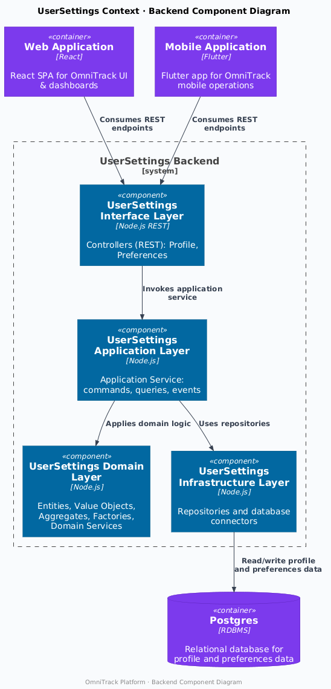

##### Mobile Application

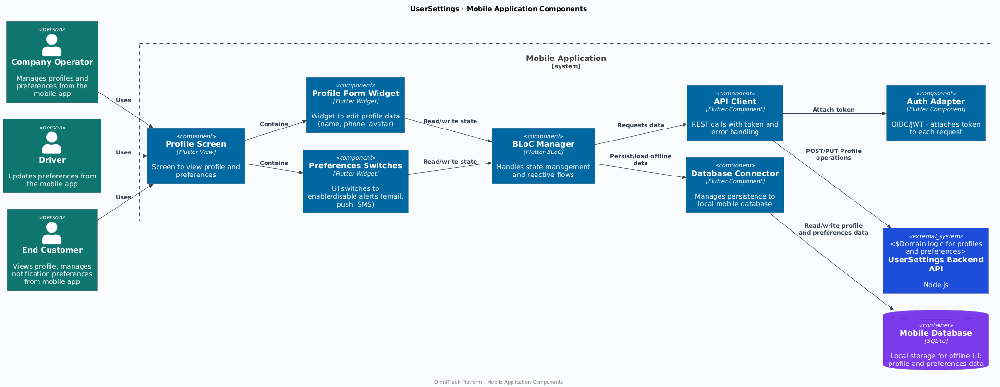

##### Web Application

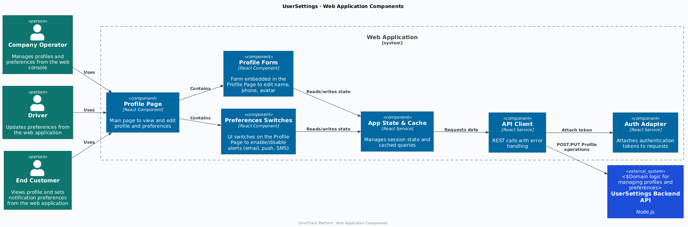

#### 4.2.7.6. Bounded Context Software Architecture Code Level Diagrams.
##### 4.2.7.6.1. Bounded Context Domain Layer Class Diagrams.

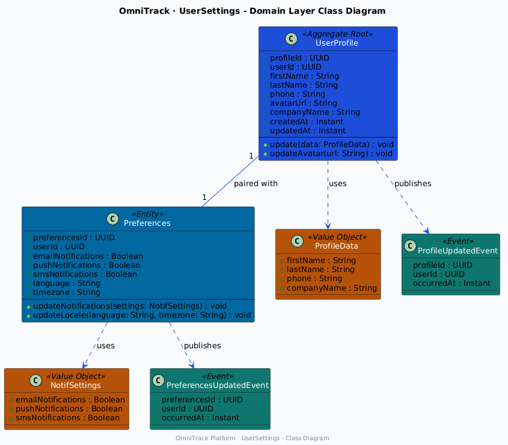

##### 4.2.7.6.2. Bounded Context Database Design Diagram

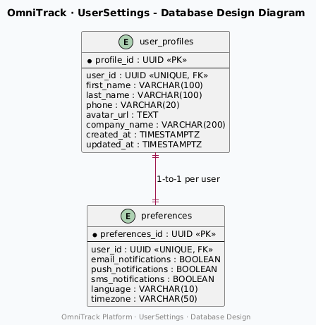
### 4.2.8. Bounded Context: InsightsDash
#### 4.2.8.1. Domain Layer
_Entidades Principales_

**Dashboard (Aggregate Root)**

- **Propósito**: Representa un panel de visualización personalizado que agrupa métricas e indicadores de rendimiento para un usuario o empresa.
- **Atributos principales**: `dashboardId`, `ownerId`, `name`, `charts`, `filters`, `createdAt`, `updatedAt`.
- **Métodos principales**: creación mediante `CreateDashboardCommand`; `addChart(chart)`, `removeChart(chartId)`, `applyFilter(filter)`.

**AnalyticsReport (Entity)**

- **Propósito**: Genera un reporte consolidado de eventos, incidentes y métricas de temperatura sobre un periodo determinado.
- **Atributos principales**: `reportId`, `generatedBy`, `period`, `tripSummaries`, `incidentSummaries`, `temperatureStats`, `generatedAt`.
- **Métodos principales**: creación mediante `GenerateReportCommand`.

**Chart (Value Object)**

- **Propósito**: Configuración de una visualización individual dentro de un dashboard.
- **Atributos principales**: `chartId`, `type` (LINE, BAR, PIE, MAP), `dataSource`, `title`, `config`.

_Commands_

- `CreateDashboardCommand`
- `UpdateDashboardCommand`
- `AddChartCommand`
- `RemoveChartCommand`
- `GenerateReportCommand`

_Queries_

- `GetDashboardByIdQuery`
- `GetDashboardsByOwnerQuery`
- `GetAnalyticsReportQuery`
- `GetTripAnalyticsQuery`
- `GetIncidentAnalyticsQuery`
- `GetTemperatureAnalyticsQuery`

_Events_

- `DashboardCreatedEvent`
- `ReportGeneratedEvent`

#### 4.2.8.2. Interface Layer
**DashboardController**

- `POST /api/v1/dashboards` — Crea un nuevo dashboard personalizado.
- `GET /api/v1/dashboards/owner/{ownerId}` — Lista los dashboards de un usuario.
- `GET /api/v1/dashboards/{dashboardId}` — Obtiene el detalle de un dashboard.
- `PUT /api/v1/dashboards/{dashboardId}` — Actualiza la configuración de un dashboard.

**ReportsController**

- `POST /api/v1/reports/generate` — Genera un reporte analítico para un periodo dado.
- `GET /api/v1/reports/{reportId}` — Obtiene un reporte generado.
- `GET /api/v1/reports/trips` — Retorna estadísticas consolidadas de viajes.
- `GET /api/v1/reports/incidents` — Retorna estadísticas de incidentes por periodo.
- `GET /api/v1/reports/temperature` — Retorna historial y estadísticas de temperatura.

#### 4.2.8.3. Application Layer
**Command Services**

- **DashboardCommandService**: crea y actualiza dashboards; gestiona la adición y eliminación de charts.
- **ReportCommandService**: genera reportes consolidados consultando datos de otros bounded contexts (LiveTracking, EventWatch, RouteControl); publica `ReportGeneratedEvent`.

**Query Services**

- **DashboardQueryService**: recupera dashboards por ID o propietario.
- **AnalyticsQueryService**: agrega y retorna estadísticas de viajes, incidentes y telemetría de temperatura por periodos definidos.

#### 4.2.8.4. Infrastructure Layer
**Repositories**

- **DashboardRepository**: persistencia de dashboards y su configuración de charts (`findByOwnerId`).
- **AnalyticsReportRepository**: almacenamiento de reportes generados (`findByGeneratedBy`, `findByPeriod`).

**Persistence & Configuration**

- **Base de datos**: PostgreSQL — almacena dashboards, configuración de charts y reportes analíticos.
- **Datos agregados**: consultas a las tablas de telemetría, viajes e incidentes para consolidar métricas.
- **Variables de entorno**: `DB_URL`, `ANALYTICS_DATA_SOURCE_URL`.

#### InsightsDash – Component Level Diagrams

##### Backend

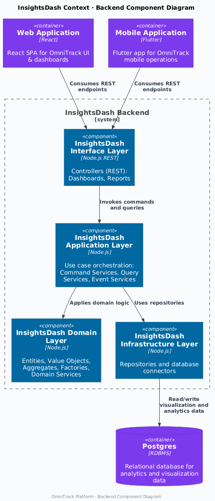

##### Mobile Application

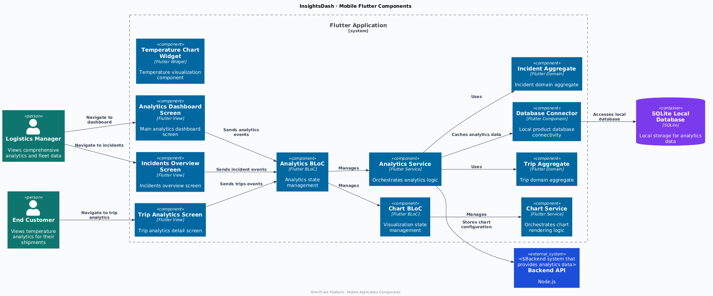

##### Web Application

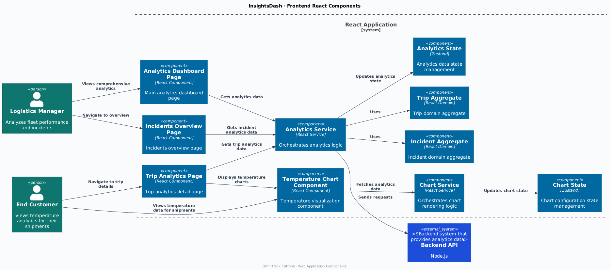

#### 4.2.8.6. Bounded Context Software Architecture Code Level Diagrams
##### 4.2.8.6.1. Bounded Context Domain Layer Class Diagrams

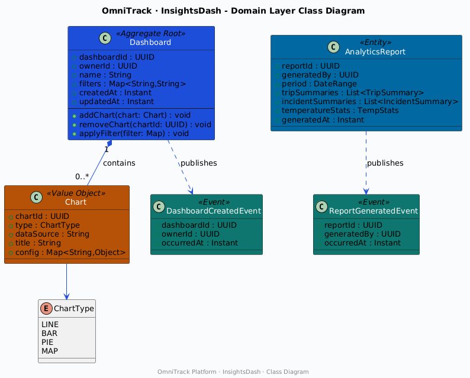

##### 4.2.8.6.2. Bounded Context Database Design Diagram

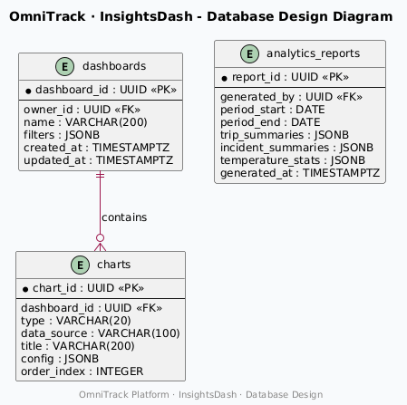
### 4.2.9. Bounded Context: PartnerHub
#### 4.2.9.1. Domain Layer
_Entidades Principales_

**MerchantProfile (Aggregate Root)**

- **Propósito**: Representa a una empresa o comercio registrado en OmniTrack como cliente de la plataforma, con su información de contacto y configuración.
- **Atributos principales**: `merchantId`, `companyName`, `taxId`, `contactEmail`, `contactPhone`, `status` (ACTIVE, SUSPENDED, INACTIVE), `createdAt`.
- **Métodos principales**: creación mediante `CreateMerchantCommand`; `suspend()`, `activate()`, `updateContact(data)`.

**Location (Entity)**

- **Propósito**: Representa una sede, almacén o punto de operación perteneciente a un merchant.
- **Atributos principales**: `locationId`, `merchantId`, `name`, `address`, `latitude`, `longitude`, `isPrimary`.
- **Métodos principales**: creación mediante `AddLocationCommand`; `setPrimary()`, `update(data)`.

**Contract (Entity)**

- **Propósito**: Formaliza el acuerdo comercial entre el merchant y OmniTrack, incluyendo el plan contratado y vigencia.
- **Atributos principales**: `contractId`, `merchantId`, `planId`, `startDate`, `endDate`, `status` (ACTIVE, EXPIRED, TERMINATED), `terms`.
- **Métodos principales**: creación mediante `CreateContractCommand`; `terminate(reason)`, `renew(newEndDate)`.

_Commands_

- `CreateMerchantCommand`
- `UpdateMerchantCommand`
- `SuspendMerchantCommand`
- `AddLocationCommand`
- `UpdateLocationCommand`
- `CreateContractCommand`
- `TerminateContractCommand`

_Queries_

- `GetMerchantByIdQuery`
- `GetAllMerchantsQuery`
- `GetLocationsByMerchantQuery`
- `GetContractsByMerchantQuery`
- `GetActiveContractQuery`

_Events_

- `MerchantCreatedEvent`
- `ContractCreatedEvent`
- `ContractTerminatedEvent`

#### 4.2.9.2. Interface Layer
**MerchantController**

- `POST /api/v1/merchants` — Registra un nuevo merchant en la plataforma.
- `GET /api/v1/merchants` — Lista todos los merchants con filtros por estado.
- `GET /api/v1/merchants/{merchantId}` — Obtiene el perfil completo de un merchant.
- `PUT /api/v1/merchants/{merchantId}` — Actualiza los datos de contacto de un merchant.
- `PATCH /api/v1/merchants/{merchantId}/suspend` — Suspende la cuenta de un merchant.

**LocationController**

- `POST /api/v1/merchants/{merchantId}/locations` — Añade una sede al merchant.
- `GET /api/v1/merchants/{merchantId}/locations` — Lista las sedes de un merchant.
- `PUT /api/v1/locations/{locationId}` — Actualiza los datos de una sede.

**ContractController**

- `POST /api/v1/contracts` — Crea un contrato entre un merchant y OmniTrack.
- `GET /api/v1/merchants/{merchantId}/contracts` — Lista los contratos de un merchant.
- `PATCH /api/v1/contracts/{contractId}/terminate` — Termina un contrato activo.

#### 4.2.9.3. Application Layer
**Command Services**

- **MerchantCommandService**: registra y actualiza merchants; gestiona suspensión y activación; valida unicidad de `taxId`; publica `MerchantCreatedEvent`.
- **LocationCommandService**: añade y actualiza sedes de merchants; gestiona la sede primaria.
- **ContractCommandService**: crea y termina contratos; valida que el plan referenciado exista; publica `ContractCreatedEvent` y `ContractTerminatedEvent`.

**Query Services**

- **MerchantQueryService**: recupera merchants por ID o estado; lista todos con paginación.
- **LocationQueryService**: lista las sedes de un merchant; recupera por ID.
- **ContractQueryService**: recupera contratos por merchant; obtiene el contrato activo vigente.

#### 4.2.9.4. Infrastructure Layer
**Repositories**

- **MerchantRepository**: persistencia de merchants (`findByTaxId`, `findByStatus`, `existsByTaxId`).
- **LocationRepository**: gestión de sedes (`findByMerchantId`, `findPrimaryByMerchantId`).
- **ContractRepository**: almacenamiento de contratos (`findByMerchantId`, `findActiveByMerchantId`).

**Persistence & Configuration**

- **Base de datos**: PostgreSQL — almacena perfiles de merchants, sedes y contratos.
- **Integración externa**: adaptador de pasarela de pagos (preparado para integración con Stripe) para procesamiento de pagos asociados a contratos.
- **Variables de entorno**: `DB_URL`, `STRIPE_SECRET_KEY`, `STRIPE_WEBHOOK_SECRET`.

#### PartnerHub – Component Level Diagrams

##### Backend

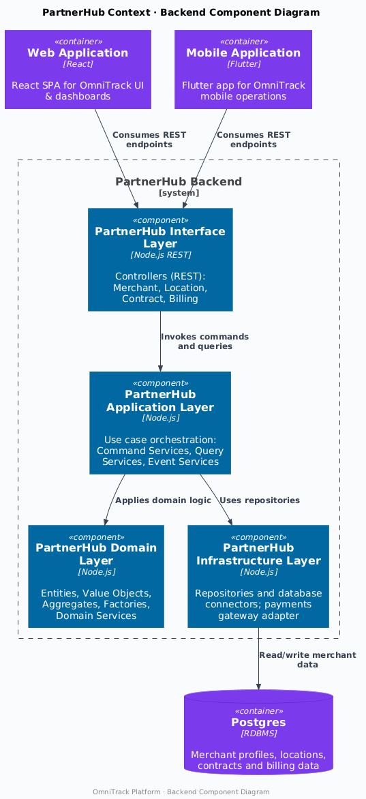

##### Mobile Application

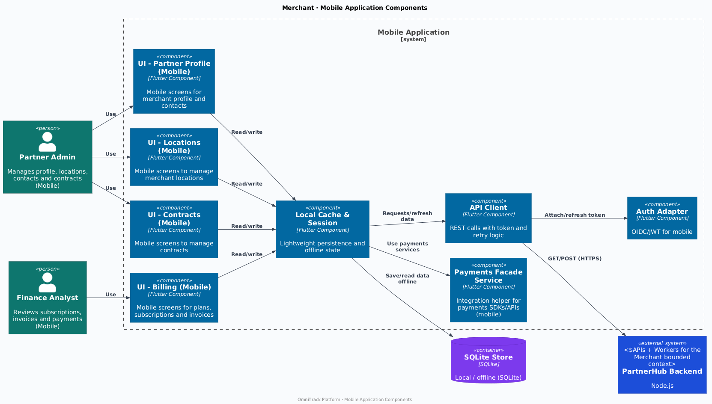

##### Web Application

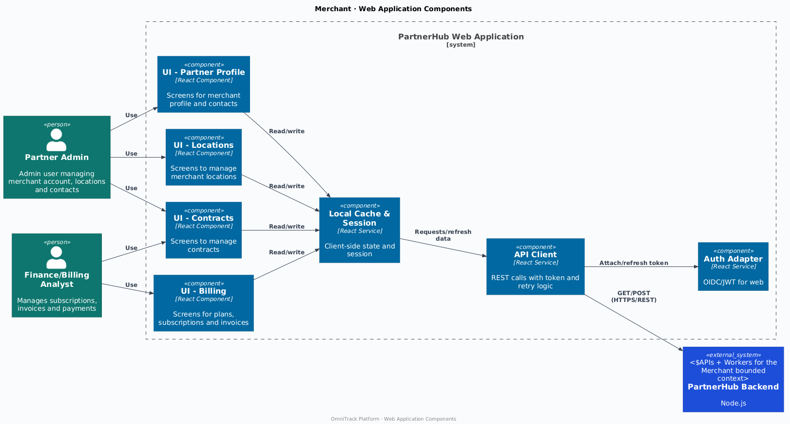

#### 4.2.9.6. Bounded Context Software Architecture Code Level Diagrams
##### 4.2.9.6.1. Bounded Context Domain Layer Class Diagrams

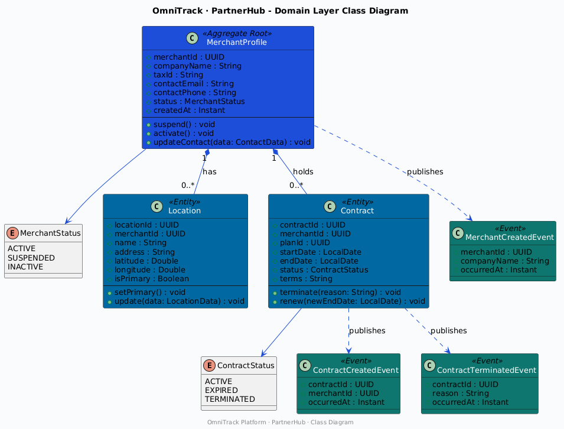

##### 4.2.9.6.2. Bounded Context Database Design Diagram

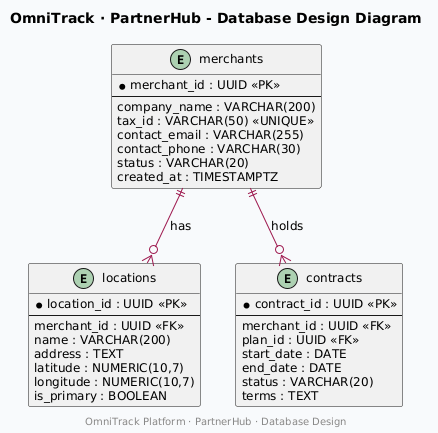
