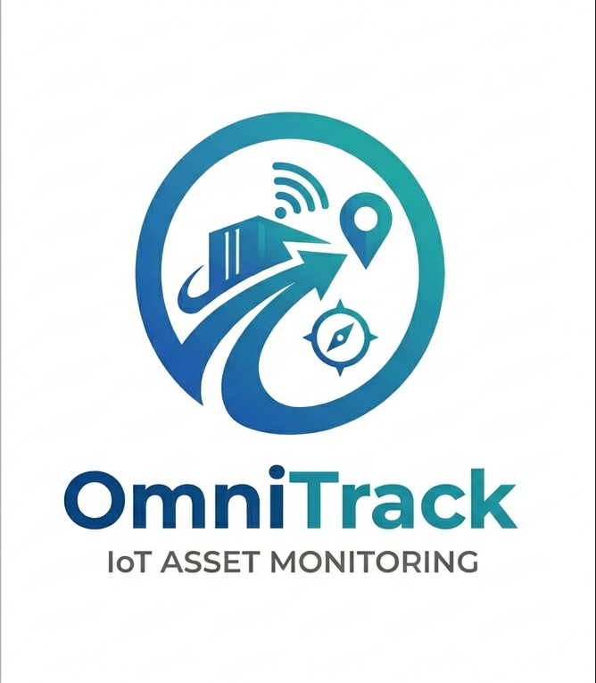
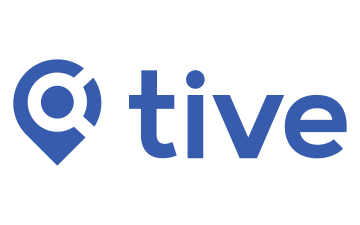

  

     
    
     
    <strong>Universidad Peruana de Ciencias Aplicadas</strong>
      
    <strong>Carrera de Ingeniería de Software</strong>
      
    <strong>Ciclo 202610</strong>
      
    1ASI0572 - Desarrollo de Soluciones IOT
      
    <strong>NRC:</strong> 6770   
    <strong>Profesor:</strong> Prudencio Vidal, Javier Antonio   
    <strong>Informe de TB1</strong>
  

  

    

      <strong>Startup:</strong> LogicNodes 
       
      <strong>Producto:</strong> OmniTrack
    

  

      <strong>Relación de integrantes</strong>
        
      <table style="width: 60%; margin: 0 auto;   text-align: left">
        <thead>
          <tr>
            <th>Código</th>
            <th>Nombre</th>
          </tr>
        </thead>
        <tbody>
          <tr>
            <td>u202216698 </td>
            <td> Rodrigo Alonso, Alcántara Cruz, </td>
          </tr>
          <tr>
            <td> u20191e562 </td>
            <td> Paulo Percy, Quincho Gamarra </td>
          </tr>
          <tr>
            <td> u202210334 </td>
            <td> Adrian Emanuel, Valerio Garcia  </td>
          </tr>
          <tr>
            <td> U202011431 </td>
            <td> Luiggi Jeremy Jouvenel, Antonio Loayza </td>
          </tr>
          <tr>
            <td> u202313397 </td>
            <td> Alejandro Daniel, Oroncoy Almeyda </td>
          </tr>
        </tbody>
      </table>
      

         
        <strong>Abril 2026</strong>
      

    

  

| Versión | Fecha | Autor | Descripción de modificación |
| :--- | :--- | :--- | :--- |
|  1.0    |              |              |                    |
|  1.0.1  |              |               |                   |
|  1.0.2  |              |              |                    |
|  1.0.3    |              |              |                    |

# Project Report Collaboration Insights

En esta seccion se registra la colaboración de todo el equipo durante el desarrollo del informe del proyecto, se adjunta el enlace del repositorio 

| Repository Name | Link |
| :--- | :--- |
| **logic-nodes-report** | [https://github.com/Logic-Nodes/logic-nodes-report](https://github.com/Logic-Nodes/logic-nodes-report) |

# Contenido

_Tabla de contenidos_

- [Student Outcome]
- [Capítulo I: Introducción]
  - [1.1. Startup Profile]
    - [1.1.1. Descripción de la Startup]
    - [1.1.2. Perfiles de integrantes del equipo]
  - [1.2. Solution Profile]
    - [1.2.1. Antecedentes y problemática]
    - [1.2.2. Lean UX Process]
      - [1.2.2.1. Lean UX Problem Statements]
      - [1.2.2.2. Lean UX Assumptions]
      - [1.2.2.3. Lean UX Hypothesis Statements]
      - [1.2.2.4. Lean UX Canvas]
  - [1.3. Segmentos objetivo]
- [Capítulo II: Requirements Elicitation \& Analysis]
  - [2.1. Competidores]
    - [2.1.1. Análisis competitivo]
    - [2.1.2. Estrategias y tácticas frente a competidores]
  - [2.2. Entrevistas]
    - [2.2.1. Diseño de entrevistas]
    - [2.2.2. Registro de entrevistas]
    - [2.2.3. Análisis de entrevistas]
  - [2.3. Needfinding]
    - [2.3.1. User Personas]
    - [2.3.2. User Task Matrix]
    - [2.3.3. User Journey Mapping]
    - [2.3.4. Empathy Mapping]
  - [2.4. Big Picture EventStorming]
  - [2.5. Ubiquitous Language]
- [Capítulo III: Requirements Specification]
  - [3.1. User Stories]
  - [3.2. Impact Mapping]
  - [3.3. Product Backlog]
- [Capítulo IV: Solution Software Design]
  - [4.1. Strategic-Level Domain-Driven Design]
    - [4.1.1. Design-Level EventStorming]
      - [4.1.1.1 Candidate Context Discovery]
      - [4.1.1.2. Domain Message Flows Modeling]
      - [4.1.1.3. Bounded Context Canvases]
    - [4.1.2. Context Mapping]
    - [4.1.3. Software Architecture]
      - [4.1.3.1. Software Architecture System Landscape Diagram]
      - [4.1.3.2. Software Architecture Context Level Diagrams]
      - [4.1.3.2. Software Architecture Container Level Diagrams]
      - [4.1.3.3. Software Architecture Deployment Diagrams]
  - [4.2. Tactical-Level Domain-Driven Design]
    - [4.2.1. Bounded Context: Identity and Access Management]
      - [4.2.1.1. Domain Layer]
      - [4.2.1.2. Interface Layer]
      - [4.2.1.3. Application Layer]
      - [4.2.1.4. Infrastructure Layer]
      - [4.2.1.5. Bounded Context Software Architecture Component Level Diagrams]
      - [4.2.1.6. Bounded Context Software Architecture Code Level Diagrams]
        - [4.2.1.6.1. Bounded Context Domain Layer Class Diagrams]
        - [4.2.1.6.2. Bounded Context Database Design Diagram]
    - [4.2.2. Bounded Context: _Subscriptions and Billing_]
      - [4.2.2.1. Domain Layer]
      - [4.2.2.2. Interface Layer]
      - [4.2.2.3. Application Layer]
      - [4.2.2.4. Infrastructure Layer]
      - [4.2.2.5. Bounded Context Software Architecture Component Level Diagrams]
      - [4.2.2.6. Bounded Context Software Architecture Code Level Diagrams]
        - [4.2.2.6.1. Bounded Context Domain Layer Class Diagrams]
        - [4.2.2.6.2. Bounded Context Database Design Diagram]
    - [4.2.3. Bounded Context: _Alerts \& Resolution_]
      - [4.2.3.1. Domain Layer]
      - [4.2.3.2. Interface Layer]
      - [4.2.3.3. Application Layer]
      - [4.2.3.4. Infrastructure Layer]
      - [4.2.3.5. Bounded Context Software Architecture Component Level Diagrams]
      - [4.2.3.6. Bounded Context Software Architecture Code Level Diagrams]
        - [4.2.3.6.1. Bounded Context Domain Layer Class Diagrams]
        - [4.2.3.6.2. Bounded Context Database Design Diagram]
    - [4.2.4. Bounded Context: _Real-Time Monitoring_]
      - [4.2.4.1. Domain Layer.]
      - [4.2.4.2. Interface Layer.]
      - [4.2.4.3. Application Layer.]
      - [4.2.4.4. Infrastructure Layer.]
      - [4.2.4.5. Bounded Context Software Architecture Component Level Diagrams]
      - [4.2.4.6. Bounded Context Software Architecture Code Level Diagrams]
        - [4.2.4.6.1. Bounded Context Domain Layer Class Diagrams]
        - [4.2.4.6.2. Bounded Context Database Design Diagram]
    - [4.2.5. Bounded Context: _Trip management_]
      - [4.2.5.1. Domain Layer.]
      - [4.2.5.2. Interface Layer.]
      - [4.2.5.3. Application Layer.]
      - [4.2.5.4. Infrastructure Layer.]
      - [4.2.5.5. Bounded Context Software Architecture Component Level Diagrams.]
      - [4.2.5.6. Bounded Context Software Architecture Code Level Diagrams.]
        - [4.2.5.6.1. Bounded Context Domain Layer Class Diagrams.]
        - [4.2.5.6.2. Bounded Context Database Design Diagram.]
    - [4.2.6. Bounded Context: Fleet Management]
      - [4.2.6.1. Domain Layer]
      - [4.2.6.2. Interface Layer]
      - [Controllers principales (HTTP REST)]
      - [4.2.6.3. Application Layer]
      - [4.2.6.4. Infrastructure Layer]
      - [4.2.6.5. Bounded Context Software Architecture Component Level Diagrams.]
      - [4.2.5.6. Bounded Context Software Architecture Code Level Diagrams.]
        - [4.2.5.6.1. Bounded Context Domain Layer Class Diagrams.]
        - [4.2.5.6.2. Bounded Context Database Design Diagram.]
    - [4.2.7. Bounded Context: Profile and Preferences Management]
      - [4.2.7.1. Domain Layer.]
      - [4.2.7.2. Interface Layer.]
      - [4.2.7.3. Application Layer.]
      - [4.2.7.4. Infrastructure Layer.]
      - [4.2.7.5. Bounded Context Software Architecture Component Level Diagrams.]
      - [4.2.7.6. Bounded Context Software Architecture Code Level Diagrams.]
        - [4.2.7.6.1. Bounded Context Domain Layer Class Diagrams.]
        - [4.2.7.6.2. Bounded Context Database Design Diagram]
    - [4.2.8. Bounded Context: Visualization Analytics]
      - [4.2.8.1. Domain Layer]
      - [4.2.8.2. Interface Layer]
      - [4.2.8.3. Application Layer]
      - [4.2.8.4. Infrastructure Layer]
      - [4.2.8.5. Bounded Context Software Architecture Component Level Diagrams]
      - [4.2.8.6. Bounded Context Software Architecture Code Level Diagrams]
        - [4.2.8.6.1. Bounded Context Domain Layer Class Diagrams]
        - [4.2.8.6.2. Bounded Context Database Design Diagram]
    - [4.2.9. Bounded Context: Merchant]
      - [4.2.9.1. Domain Layer]
      - [4.2.9.2. Interface Layer]
      - [4.2.9.3. Application Layer]
      - [4.2.9.4. Infrastructure Layer]
      - [4.2.9.5. Bounded Context Software Architecture Component Level Diagrams]
      - [4.2.9.6. Bounded Context Software Architecture Code Level Diagrams]
        - [4.2.9.6.1. Bounded Context Domain Layer Class Diagrams]
        - [4.2.9.6.2. Bounded Context Database Design Diagram]

# Student Outcome

El curso cumple de manera directa el cumplimiento del Student Outcome 5 definido por ABET - EAC, asegurando que los integrantes logren alcanzar las competencias establecidas

Criterio: La capacidad de funcionar efectivamente en un
equipo cuyos miembros juntos proporcionan liderazgo, crean un entorno de
colaboración e inclusivo, establecen objetivos, planifican tareas y cumplen objetivos.

| Criterio específico | Acciones realizadas | Conclusiones |
| :--- | :--- | :--- |
| **Trabaja en equipo para proporcionar liderazgo en forma conjunta** | **Alcantara Cruz, Rodrigo Alonso**   **AV1:** [Acción]   **TB1:** [Acción]   **AV2:** [Acción]   **TB2:** [Acción]    **Quincho Gamarra, Paulo Percy**   **AV1:** [Acción]   **TB1:** [Acción]   **AV2:** [Acción]   **TB2:** [Acción]    **Valerio Garcia, Adrian Emanuel**   **AV1:** [Acción]   **TB1:** [Acción]   **AV2:** [Acción]   **TB2:** [Acción]    **Antonio Loayza, Luiggi Jeremy Jouvenel**   **AV1:** [Acción]   **TB1:** [Acción]   **AV2:** [Acción]   **TB2:** [Acción]    **Oroncoy Almeyda, Alejandro Daniel**   **AV1:** [Acción]   **TB1:** [Acción]   **AV2:** [Acción]   **TB2:** [Acción] | [pending...] |
| **Crea un entorno colaborativo e inclusivo, establece metas, planifica tareas y cumple objetivos.** | **Alcantara Cruz, Rodrigo Alonso**   **AV1:** [Acción]   **TB1:** [Acción]   **AV2:** [Acción]   **TB2:** [Acción]    **Quincho Gamarra, Paulo Percy**   **AV1:** [Acción]   **TB1:** [Acción]   **AV2:** [Acción]   **TB2:** [Acción]    **Valerio Garcia, Adrian Emanuel**   **AV1:** [Acción]   **TB1:** [Acción]   **AV2:** [Acción]   **TB2:** [Acción]    **Antonio Loayza, Luiggi Jeremy Jouvenel**   **AV1:** [Acción]   **TB1:** [Acción]   **AV2:** [Acción]   **TB2:** [Acción]    **Oroncoy Almeyda, Alejandro Daniel**   **AV1:** [Acción]   **TB1:** [Acción]   **AV2:** [Acción]   **TB2:** [Acción] | [pending...] |

# Capítulo I: Introducción
## 1.1. Startup Profile
### 1.1.1. Descripción de la Startup
### 1.1.2. Perfiles de integrantes del equipo
## 1.2. Solution Profile
### 1.2.1. Antecedentes y problemática
### 1.2.2. Lean UX Process
#### 1.2.2.1. Lean UX Problem Statements
#### 1.2.2.2. Lean UX Assumptions
#### 1.2.2.3. Lean UX Hypothesis Statements
#### 1.2.2.4. Lean UX Canvas
## 1.3. Segmentos objetivo
# Capítulo II: Requirements Elicitation & Analysis
## 2.1. Competidores
### 2.1.1. Análisis competitivo

<table>
  <!-- Título -->
  <tr>
    <th colspan="6" valign="top"><b>Competitive Analysis Landscape</b></th>
  </tr>

  <!-- Motivación del análisis -->
  <tr>
    <td rowspan="2" colspan="1" valign="top"><b>¿Por qué llevar a cabo este análisis?</b></td>
    <td colspan="5" valign="top">
      Realizar este análisis competitivo nos permite identificar las fortalezas, debilidades y estrategias de las soluciones existentes en el mercado de monitoreo IoT para carga sensible. De esta forma, podemos entender mejor las expectativas de los clientes, detectar oportunidades de diferenciación y definir con claridad la ventaja competitiva que OmniTruck debe ofrecer para destacar frente a otras alternativas, especialmente en el contexto latinoamericano donde predominan las medianas empresas de transporte.
    </td>
  </tr>
  <tr></tr>

  <!-- Cabeceras de competidores -->
  <tr>
    <td colspan="2" valign="top"></td>
    <td align="center" valign="top">
       
      <b>Logic Nodes / Omnitruck</b>
    </td>
    <td align="center" valign="top">
       
      <b>Tive</b>
    </td>
    <td align="center" valign="top">
       
      <b>Roambee</b>
    </td>
    <td align="center" valign="top">
       
      <b>Samsara</b>
    </td>
  </tr>

  <!-- PERFIL -->
  <tr>
    <td rowspan="2" valign="top"><b>Perfil</b></td>
    <td valign="top">Overview</td>
    <td valign="top">Plataforma IoT latinoamericana enfocada en monitoreo multi-parámetro (temperatura, humedad, vibración, GPS y detección de volcado) con alertas en tiempo real y modelo de suscripción accesible.</td>
    <td valign="top">Plataforma global de trackers en tiempo real con sensores multi-parámetro para envíos de alto valor.</td>
    <td valign="top">Plataforma de visibilidad supply chain con sensores IoT y analítica predictiva.</td>
    <td valign="top">Plataforma completa de operaciones de flota con monitoreo de temperatura y telemática vehicular.</td>
  </tr>
  <tr>
    <td valign="top">¿Qué valor ofrece a los clientes?</td>
    <td valign="top">Propuesta accesible que asegura la conservación de productos, con Dashboards intuitivos y notificaciones.</td>
    <td valign="top">Alertas instantáneas y alta precisión en condiciones críticas (especialmente pharma y alimentos premium).</td>
    <td valign="top">Analítica predictiva avanzada y visibilidad end-to-end muy robusta.</td>
    <td valign="top">Integración total con gestión de flota (cámaras, seguridad del conductor y eficiencia operativa).</td>
  </tr>

  <!-- MARKETING -->
  <tr>
    <td rowspan="2" valign="top"><b>Perfil de Marketing</b></td>
    <td valign="top">Mercado objetivo</td>
    <td valign="top">Empresas de transporte, agroexportadores medianos y fármacos.</td>
    <td valign="top">Grandes shippers de pharma, alimentos premium y carga de alto valor a nivel global.</td>
    <td valign="top">Empresas grandes de logística y supply chain con operaciones internacionales.</td>
    <td valign="top">Flotas grandes de transporte y distribución que necesitan control vehicular integral.</td>
  </tr>
  <tr>
    <td valign="top">Estrategias de marketing</td>
    <td valign="top">Marketing digital formando alianzas con programas de suscripción y cámaras de seguridad.</td>
    <td valign="top">Marketing global B2B, casos de éxito en pharma y presencia en ferias internacionales.</td>
    <td valign="top">Marketing basado en datos y ROI, campañas de "visibilidad predictiva".</td>
    <td valign="top">Marketing amplio en transporte pesado, énfasis en seguridad y eficiencia de flota.</td>
  </tr>

  <!-- PRODUCTO -->
  <tr>
    <td rowspan="3" valign="top"><b>Perfil de Producto</b></td>
    <td valign="top">Productos & Servicios</td>
    <td valign="top">Sensores IoT, aplicación web y móvil, dashboards con métricas importantes y alertas en tiempo real para mayor seguridad.</td>
    <td valign="top">Trackers reutilizables con sensores de temperatura, humedad, shock y luz + plataforma en la nube.</td>
    <td valign="top">Sensores IoT + plataforma de visibilidad con IA predictiva.</td>
    <td valign="top">Dispositivos telemáticos, sensores de temperatura, cámaras y software de gestión de flota completa.</td>
  </tr>
  <tr>
    <td valign="top">Precios y costos</td>
    <td valign="top">Suscripciones y costo bajo por equipo.</td>
    <td valign="top">Precio premium por tracker + suscripción anual.</td>
    <td valign="top">Suscripción basada en volumen de envíos.</td>
    <td valign="top">Suscripción por vehículo/flota (más costosa para operaciones pequeñas).</td>
  </tr>
  <tr>
    <td valign="top">Canales de distribución</td>
    <td valign="top">Venta directa, alianzas con cámaras de seguridad y distribuidores de logística.</td>
    <td valign="top">Web + App móvil.</td>
    <td valign="top">Plataforma web principal + integraciones móviles.</td>
    <td valign="top">Web + App móvil + integración con sistemas de flota.</td>
  </tr>

  <!-- SWOT -->
  <tr>
    <td rowspan="4" valign="top"><b>Análisis SWOT</b></td>
    <td valign="top">Fortalezas</td>
    <td valign="top">• Accesibilidad y escalabilidad • Enfoque en empresas de transporte • Software amigable</td>
    <td valign="top">• Alta precisión y reputación en pharma y alimentos premium</td>
    <td valign="top">• Analítica predictiva muy avanzada</td>
    <td valign="top">• Plataforma muy completa de flota (no solo monitoreo de carga)</td>
  </tr>
  <tr>
    <td valign="top">Debilidades</td>
    <td valign="top">• Respaldo de marca frente a multinacionales • Mercado nicho especializado</td>
    <td valign="top">• Precio elevado para medianas empresas</td>
    <td valign="top">• Enfoque más corporativo y menos accesible para PYMEs</td>
    <td valign="top">• Solución más orientada a flotas grandes que a monitoreo específico de carga sensible</td>
  </tr>
  <tr>
    <td valign="top">Oportunidades</td>
    <td valign="top">• Expansión en LATAM donde grandes competidores no tienen presencia fuerte • Crecimiento del e-commerce y transporte</td>
    <td valign="top">—</td>
    <td valign="top">—</td>
    <td valign="top">—</td>
  </tr>
  <tr>
    <td valign="top">Amenazas</td>
    <td valign="top">• Fácil de replicar el modelo por competidores grandes o locales</td>
    <td valign="top">—</td>
    <td valign="top">—</td>
    <td valign="top">—</td>
  </tr>
</table>

### 2.1.2. Estrategias y tácticas frente a competidores
## 2.2. Entrevistas
### 2.2.1. Diseño de entrevistas

### 1. Preguntas generales

¿Cuál es tu nombre y cuál es tu cargo actual?

¿Qué edad tienes?

¿En qué sector o industria trabajas? (alimentos, farmacéutica, logística, entre otros)

### 2. Preguntas — Segmento: Empresa (Gestores de transporte)

¿Cómo controlas actualmente la temperatura de tus productos durante el transporte?

¿Qué dispositivos o sistemas utilizas para el monitoreo de la cadena de frío? ¿Por qué los elegiste?

¿Cómo organizas y registras los viajes de transporte? ¿Qué información consideras más importante registrar?

¿Qué dificultades enfrentas cuando se rompe la cadena de frío? ¿Cómo afecta esto a tus costos y tiempos de operación?

¿Cómo te das cuenta cuando ocurre un problema de temperatura? ¿Qué tan rápido puedes reaccionar ante este tipo de situaciones?

¿Qué tipo de reportes necesitas preparar para tus clientes o para las autoridades regulatorias?

¿Cuál ha sido tu experiencia al gestionar el mantenimiento y configuración de sensores o dispositivos de monitoreo? ¿Qué dificultades has encontrado?

Si pudieras diseñar la plataforma ideal para tu trabajo, ¿qué funciones serían absolutamente necesarias para ti?

¿Qué modelo de pago preferirías para este tipo de servicio? ¿Qué factores influyen en esa decisión?

### 3. Preguntas — Segmento: Clientes Finales (Consumidores finales)

¿Cómo verificas actualmente que los productos que recibes llegaron en las condiciones de temperatura adecuadas?

¿Qué nivel de confianza tienes en los reportes de temperatura que te entregan tus proveedores? ¿Qué elementos aumentarían o reducirían esa confianza?

¿Qué tipo de información te resulta más útil conocer sobre el transporte de tus productos? ¿Cómo te ayudaría esa información en tu día a día?

¿Puedes compartir alguna experiencia en la que hayas tenido que rechazar productos por problemas relacionados con la cadena de frío? ¿Cómo detectaste el problema y qué impacto tuvo?

¿Cómo prefieres recibir y consultar la información sobre tus pedidos? ¿Qué canales o métodos de comunicación te resultan más prácticos?

¿Qué tipo de notificaciones durante el transporte de tus productos serían más útiles para ti y en qué momentos te gustaría recibirlas?

¿Qué tan importante es para ti que la información técnica se presente de forma clara y fácil de entender? ¿Qué características valoras en las interfaces que utilizas?

¿Qué funcionalidades crees que aportarían mayor valor a tu proceso de recepción y validación de productos?

¿Qué beneficios esperas obtener de un sistema de monitoreo basado en IoT para tus compras de productos sensibles a la temperatura? ¿Qué preocupaciones o dudas tienes al respecto?

### 2.2.2. Registro de entrevistas
### 2.2.3. Análisis de entrevistas
## 2.3. Needfinding
### 2.3.1. User Personas
### 2.3.2. User Task Matrix
### 2.3.3. User Journey Mapping
### 2.3.4. Empathy Mapping
## 2.4. Big Picture EventStorming
## 2.5. Ubiquitous Language
# Capítulo III: Requirements Specification
## 3.1. User Stories
## 3.2. Impact Mapping
## 3.3. Product Backlog
# Capítulo IV: Solution Software Design
## 4.1. Strategic-Level Domain-Driven Design
### 4.1.1. Design-Level EventStorming
#### 4.1.1.1 Candidate Context Discovery
#### 4.1.1.2. Domain Message Flows Modeling
#### 4.1.1.3. Bounded Context Canvases
### 4.1.2. Context Mapping
### 4.1.3. Software Architecture
#### 4.1.3.1. Software Architecture System Landscape Diagram
#### 4.1.3.2. Software Architecture Context Level Diagrams
#### 4.1.3.2. Software Architecture Container Level Diagrams
#### 4.1.3.3. Software Architecture Deployment Diagrams
## 4.2. Tactical-Level Domain-Driven Design
### 4.2.1. Bounded Context: Identity and Access Management
#### 4.2.1.1. Domain Layer
#### 4.2.1.2. Interface Layer
#### 4.2.1.3. Application Layer
#### 4.2.1.4. Infrastructure Layer
#### 4.2.1.5. Bounded Context Software Architecture Component Level Diagrams
#### 4.2.1.6. Bounded Context Software Architecture Code Level Diagrams
##### 4.2.1.6.1. Bounded Context Domain Layer Class Diagrams
##### 4.2.1.6.2. Bounded Context Database Design Diagram
### 4.2.2. Bounded Context: Subscriptions and Billing
#### 4.2.2.1. Domain Layer
#### 4.2.2.2. Interface Layer
#### 4.2.2.3. Application Layer
#### 4.2.2.4. Infrastructure Layer
#### 4.2.2.5. Bounded Context Software Architecture Component Level Diagrams
#### 4.2.2.6. Bounded Context Software Architecture Code Level Diagrams
#### 4.2.2.6.1. Bounded Context Domain Layer Class Diagrams
#### 4.2.2.6.2. Bounded Context Database Design Diagram
### 4.2.3. Bounded Context: Alerts & Resolution
#### 4.2.3.1. Domain Layer
#### 4.2.3.2. Interface Layer
#### 4.2.3.3. Application Layer
#### 4.2.3.4. Infrastructure Layer
#### 4.2.3.5. Bounded Context Software Architecture Component Level Diagrams
#### 4.2.3.6. Bounded Context Software Architecture Code Level Diagrams
##### 4.2.3.6.1. Bounded Context Domain Layer Class Diagrams
##### 4.2.3.6.2. Bounded Context Database Design Diagram
### 4.2.4. Bounded Context: Real-Time Monitoring
#### 4.2.4.1. Domain Layer.
#### 4.2.4.2. Interface Layer.
#### 4.2.4.3. Application Layer.
#### 4.2.4.4. Infrastructure Layer.
#### 4.2.4.5. Bounded Context Software Architecture Component Level Diagrams
#### 4.2.4.6. Bounded Context Software Architecture Code Level Diagrams
##### 4.2.4.6.1. Bounded Context Domain Layer Class Diagrams
##### 4.2.4.6.2. Bounded Context Database Design Diagram
### 4.2.5. Bounded Context: Trip management
#### 4.2.5.1. Domain Layer.
#### 4.2.5.2. Interface Layer.
#### 4.2.5.3. Application Layer.
#### 4.2.5.4. Infrastructure Layer.
#### 4.2.5.5. Bounded Context Software Architecture Component Level Diagrams.
#### 4.2.5.6. Bounded Context Software Architecture Code Level Diagrams.
##### 4.2.5.6.1. Bounded Context Domain Layer Class Diagrams.
##### 4.2.5.6.2. Bounded Context Database Design Diagram.
### 4.2.6. Bounded Context: Fleet Management
#### 4.2.6.1. Domain Layer
#### 4.2.6.2. Interface Layer
#### 4.2.6.3. Application Layer
#### 4.2.6.4. Infrastructure Layer
#### 4.2.6.5. Bounded Context Software Architecture Component Level Diagrams.
#### 4.2.5.6. Bounded Context Software Architecture Code Level Diagrams.
##### 4.2.5.6.1. Bounded Context Domain Layer Class Diagrams.
##### 4.2.5.6.2. Bounded Context Database Design Diagram.
### 4.2.7. Bounded Context: Profile and Preferences Management
#### 4.2.7.1. Domain Layer.
#### 4.2.7.2. Interface Layer.
#### 4.2.7.3. Application Layer.
#### 4.2.7.4. Infrastructure Layer.
#### 4.2.7.5. Bounded Context Software Architecture Component Level Diagrams.
#### 4.2.7.6. Bounded Context Software Architecture Code Level Diagrams.
##### 4.2.7.6.1. Bounded Context Domain Layer Class Diagrams.
##### 4.2.7.6.2. Bounded Context Database Design Diagram
### 4.2.8. Bounded Context: Visualization Analytics
#### 4.2.8.1. Domain Layer
#### 4.2.8.2. Interface Layer
#### 4.2.8.3. Application Layer
#### 4.2.8.4. Infrastructure Layer
#### 4.2.8.5. Bounded Context Software Architecture Component Level Diagrams
#### 4.2.8.6. Bounded Context Software Architecture Code Level Diagrams
##### 4.2.8.6.1. Bounded Context Domain Layer Class Diagrams
##### 4.2.8.6.2. Bounded Context Database Design Diagram
### 4.2.9. Bounded Context: Merchant
#### 4.2.9.1. Domain Layer
#### 4.2.9.2. Interface Layer
#### 4.2.9.3. Application Layer
#### 4.2.9.4. Infrastructure Layer
#### 4.2.9.5. Bounded Context Software Architecture Component Level Diagrams
#### 4.2.9.6. Bounded Context Software Architecture Code Level Diagrams
##### 4.2.9.6.1. Bounded Context Domain Layer Class Diagrams
##### 4.2.9.6.2. Bounded Context Database Design Diagram
